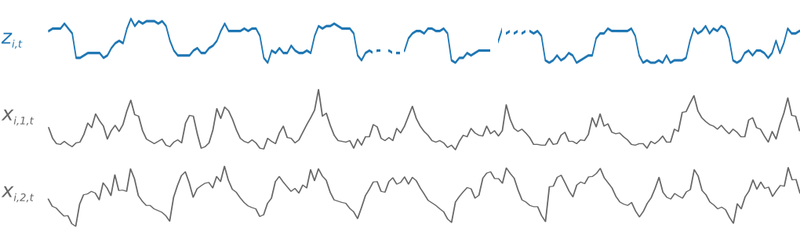
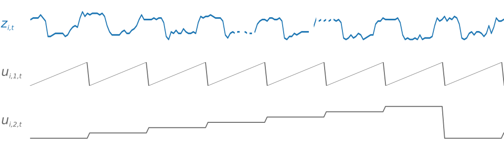
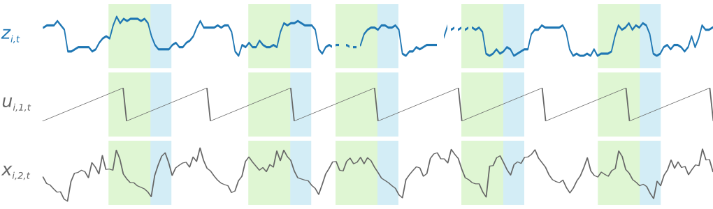
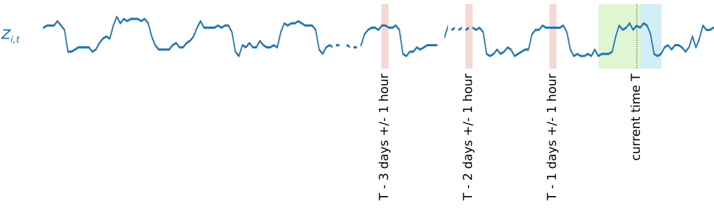

# How the DeepAR Algorithm Works

During training, DeepAR accepts a training dataset and an optional test dataset. It
uses the test dataset to evaluate the trained model. In general, the datasets don't have
to contain the same set of time series. You can use a model trained on a given training
set to generate forecasts for the future of the time series in the training set, and for
other time series. Both the training and the test datasets consist of one or,
preferably, more target time series. Each target time series can optionally be
associated with a vector of feature time series and a vector of categorical features.
For more information, see [Input/Output Interface for the DeepAR
Algorithm](deepar.md#deepar-inputoutput "deepar.md#deepar-inputoutput").

For example, the following is an element of a training set indexed by
_i_ which consists of a target time series,
_Zi,t_, and two associated feature
time series, _Xi,1,t_ and
_Xi,2,t_:

The target time series might contain missing values, which are represented by line
breaks in the time series.
DeepAR
supports only feature time series that are known in the future. This
allows you to run "what if?" scenarios. What happens, for example, if I change the price
of a product in some way?

Each target time series can also be associated with a number of categorical features.
You can use these features to encode which groupings a time series belongs to.
Categorical features allow the model to learn typical behavior for groups, which it can
use to increase model accuracy. DeepAR implements this by learning an embedding vector
for each group that captures the common properties of all time series in the group.

## How Feature Time Series Work in the DeepAR

Algorithm

To facilitate learning time-dependent patterns, such as spikes during weekends,
DeepAR automatically creates feature time series based on the frequency of the
target time series. It uses these derived feature time series with the custom
feature time series that you provide during training and inference. The following
figure shows two of these derived time series features:
_ui,1,t_ represents the hour of
the day and _ui,2,t_ the day of the
week.

The DeepAR algorithm automatically generates these feature time series. The
following table lists the derived features for the supported basic time
frequencies.

| Frequency of the Time Series | Derived Features                                                                    |
| ---------------------------- | ----------------------------------------------------------------------------------- |
| `Minute`                     | `minute-of-hour`, `hour-of-day`, `day-of-week`, `day-of-month`, `day-of-year` |
| `Hour`                       | `hour-of-day`, `day-of-week`, `day-of-month`, `day-of-year`                      |
| `Day`                        | `day-of-week`, `day-of-month`, `day-of-year`                                     |
| `Week`                       | `day-of-month`, `week-of-year`                                                      |
| `Month`                      | month-of-year                                                                       |

DeepAR trains a model by randomly sampling several training examples from each of
the time series in the training dataset. Each training example consists of a pair of
adjacent context and prediction windows with fixed predefined lengths. The
`context_length` hyperparameter controls how far in the past the
network can see, and the `prediction_length` hyperparameter controls how
far in the future predictions can be made. During training, the algorithm ignores
training set elements containing time series that are shorter than a specified
prediction length. The following figure represents five samples with context lengths
of 12 hours and prediction lengths of 6 hours drawn from element
_i_. For brevity, we've omitted the feature time series
_xi,1,t_ and
_ui,2,t_.

To capture seasonality patterns, DeepAR also automatically feeds lagged values
from the target time series. In the example with hourly frequency, for each time
index, _t = T_, the model exposes the
_zi,t_ values, which occurred
approximately one, two, and three days in the past.

For inference, the trained model takes as input target time series, which might or
might not have been used during training, and forecasts a probability distribution
for the next `prediction_length` values. Because DeepAR is trained on the
entire dataset, the forecast takes into account patterns learned from similar time
series.

For information on the mathematics behind DeepAR, see [DeepAR: Probabilistic Forecasting with
Autoregressive Recurrent Networks](https://arxiv.org/abs/1704.04110 "https://arxiv.org/abs/1704.04110").
