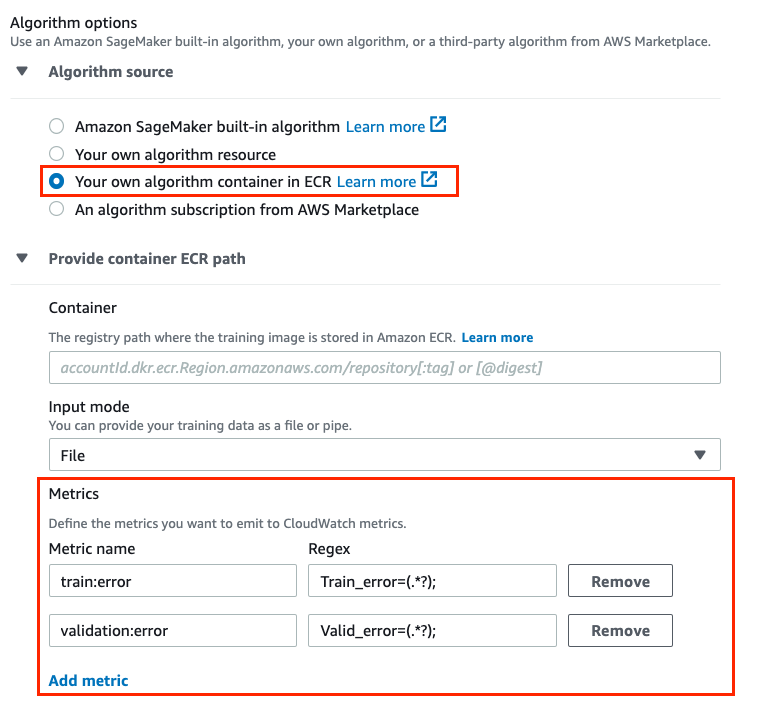

# Define Training Metrics

SageMaker AI automatically parses training job logs and sends training metrics to CloudWatch. By
default, SageMaker AI sends system resource utilization metrics listed in [SageMaker AI Jobs and Endpoint Metrics](monitoring-cloudwatch.md#cloudwatch-metrics-jobs "monitoring-cloudwatch.md#cloudwatch-metrics-jobs"). If you want SageMaker AI to parse logs and
send custom metrics from a training job of your own algorithm to CloudWatch, you need to
specify metrics definitions by passing the name of metrics and regular expressions when
you configure a SageMaker AI training job request.

You can specify the metrics that you want to track using the SageMaker AI console, the [SageMaker AI Python SDK](https://github.com/aws/sagemaker-python-sdk "https://github.com/aws/sagemaker-python-sdk"), or the
low-level SageMaker AI API.

If you are using your own algorithm, do the following:

- Make sure that the algorithm writes the metrics that you want to capture to
  logs.
- Define a regular expression that accurately searches the logs to capture the
  values of the metrics that you want to send to CloudWatch.
  For example, suppose your algorithm emits the following metrics for training error and
  validation error:

```
Train_error=0.138318;  Valid_error=0.324557;
```

If you want to monitor both of those metrics in CloudWatch, the dictionary for the metric
definitions should look like the following example:

```
[
    {
        "Name": "train:error",
        "Regex": "Train_error=(.*?);"
    },
    {
        "Name": "validation:error",
        "Regex": "Valid_error=(.*?);"
    }
]
```

In the regex for the `train:error` metric defined in the preceding example,
the first part of the regex finds the exact text "Train_error=", and the expression
`(.*?);` captures any characters until the first semicolon character
appears. In this expression, the parenthesis tell the regex to capture what is inside
them, `.` means any character, `*` means zero or more, and
`?` means capture only until the first instance of the `;`
character.

## Define Metrics Using the SageMaker AI Python

SDK

Define the metrics that you want to send to CloudWatch by specifying a list of metric
names and regular expressions as the `metric_definitions` argument when
you initialize an `Estimator` object. For example, if you want to monitor
both the `train:error` and `validation:error` metrics in CloudWatch,
your `Estimator` initialization would look like the following
example:

```
import sagemaker
from sagemaker.estimator import Estimator

estimator = Estimator(
    image_uri="`your-own-image-uri`",
    role=sagemaker.get_execution_role(),
    sagemaker_session=sagemaker.Session(),
    instance_count=`1`,
    instance_type='`ml.c4.xlarge`',
    metric_definitions=[
       {'Name': 'train:error', 'Regex': 'Train_error=(.*?);'},
       {'Name': 'validation:error', 'Regex': 'Valid_error=(.*?);'}
    ]
)
```

For more information about training by using [Amazon SageMaker Python SDK](https://sagemaker.readthedocs.io/en/stable "https://sagemaker.readthedocs.io/en/stable") estimators,
see[Sagemaker Python SDK](https://github.com/aws/sagemaker-python-sdk#sagemaker-python-sdk-overview "https://github.com/aws/sagemaker-python-sdk#sagemaker-python-sdk-overview") on GitHub.

## Define Metrics Using the SageMaker AI

Console

If you choose the **Your own algorithm container in
ECR** option as your algorithm source in the SageMaker AI console when you
create a training job, add the metric definitions in the **Metrics** section. The following screenshot shows how it should look
after you add the example metric names and the corresponding regular
expressions.



## Define Metrics Using the Low-level SageMaker AI

API

Define the metrics that you want to send to CloudWatch by specifying a list of metric
names and regular expressions in the `MetricDefinitions` field of the
[`AlgorithmSpecification`](../APIReference/API_AlgorithmSpecification.md "../APIReference/API_AlgorithmSpecification.md") input parameter that you pass to the
[`CreateTrainingJob`](../APIReference/API_CreateTrainingJob.md "../APIReference/API_CreateTrainingJob.md") operation. For example, if you want
to monitor both the `train:error` and `validation:error`
metrics in CloudWatch, your `AlgorithmSpecification` would look like the
following example:

```
"AlgorithmSpecification": {
    "TrainingImage": `your-own-image-uri`,
    "TrainingInputMode": "File",
    "MetricDefinitions" : [
        {
            "Name": "train:error",
            "Regex": "Train_error=(.*?);"
        },
        {
            "Name": "validation:error",
            "Regex": "Valid_error=(.*?);"
        }
    ]
}
```

For more information about defining and running a training job by using the
low-level SageMaker AI API, see [`CreateTrainingJob`](../APIReference/API_CreateTrainingJob.md "../APIReference/API_CreateTrainingJob.md").
