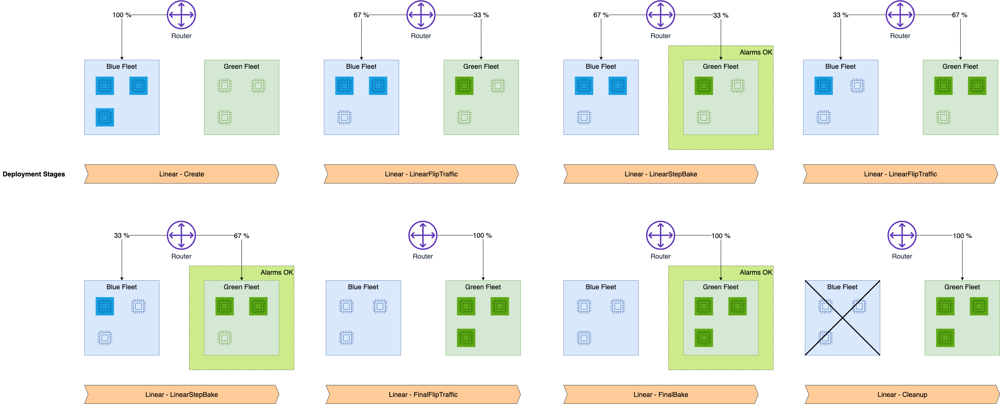

# Use linear traffic shifting

Linear traffic shifting enables you to gradually shift traffic from your old fleet (blue
fleet) to your new fleet (green fleet). With linear traffic shifting, you can shift traffic
in multiple steps, minimizing the chance of a disruption to your endpoint. This blue/green
deployment option gives you the most granular control over traffic shifting.

You can choose either the number of instances or the percentage of the green fleet’s capacity
to activate during each step. Each linear step should only be between 10-50% of the green
fleet's capacity. For each step, there is a baking period during which your pre-specified
Amazon CloudWatch alarms monitor metrics on the green fleet. Once the baking period finishes and no
alarms trip, the active portion of your green fleet continues receiving traffic and a new
step begins. If alarms trip during any of the baking periods, 100% of the endpoint traffic
rolls back to the blue fleet.

The following diagram shows how linear traffic shifting routes traffic to the blue and green
fleets.


Once SageMaker AI provisions the new fleet, the first portion of the green fleet turns on and
receives traffic. SageMaker AI deactivates the same size portion of the blue fleet, and the baking
period begins. If any alarms trip, all of the endpoint traffic rolls back to the blue fleet.
If the baking period finishes, then the next step begins. Another portion of the green fleet
activates and receives traffic, part of the blue fleet deactivates, and another baking
period begins. The same process repeats until the blue fleet is fully deactivated and the
green fleet is fully active and receiving all traffic. If an alarm goes off at any point,
SageMaker AI terminates the shifting process and 100% of the traffic rolls back to the blue
fleet.

## Prerequisites

Before setting up a deployment with linear traffic shifting, you must create CloudWatch alarms to
monitor metrics from your endpoint. The alarms are active during the baking period, and if any
alarms trip, then all endpoint traffic rolls back to the blue fleet. To learn how to set up CloudWatch
alarms on an endpoint, see the prerequisite page [Auto-Rollback Configuration and
Monitoring](deployment-guardrails-configuration.md "deployment-guardrails-configuration.md"). To learn more about CloudWatch alarms, see [Using
Amazon CloudWatch alarms](../../../AmazonCloudWatch/latest/monitoring/AlarmThatSendsEmail.md "../../../AmazonCloudWatch/latest/monitoring/AlarmThatSendsEmail.md") in the _Amazon CloudWatch User Guide_.

## Configure Linear Traffic Shifting

Once you are ready for your deployment and have set up CloudWatch alarms for your endpoint, you
can use either the Amazon SageMaker AI [UpdateEndpoint](../APIReference/API_UpdateEndpoint.md "../APIReference/API_UpdateEndpoint.md") API or the
[update-endpoint](../../../cli/latest/reference/sagemaker/update-endpoint.md "../../../cli/latest/reference/sagemaker/update-endpoint.md") command in the AWS CLI to initiate the deployment.

###### Topics

- [How to update an endpoint (API)](#deployment-guardrails-blue-green-linear-configure-api-update "#deployment-guardrails-blue-green-linear-configure-api-update")
- [How to update an endpoint with an existing blue/green update policy (API)](#deployment-guardrails-blue-green-linear-configure-api-existing "#deployment-guardrails-blue-green-linear-configure-api-existing")
- [How to update an endpoint (CLI)](#deployment-guardrails-blue-green-canary-configure-cli-update "#deployment-guardrails-blue-green-canary-configure-cli-update")

### How to update an endpoint (API)

The following example of the [UpdateEndpoint](../APIReference/API_UpdateEndpoint.md "../APIReference/API_UpdateEndpoint.md") API shows
how you can update an endpoint with linear traffic shifting.

```
import boto3
client = boto3.client("sagemaker")

response = client.update_endpoint(
    EndpointName="`<your-endpoint-name>`",
    EndpointConfigName="`<your-config-name>`",
    DeploymentConfig={
        "BlueGreenUpdatePolicy": {
            "TrafficRoutingConfiguration": {
                "Type": "LINEAR",
                "LinearStepSize": {
                    "Type": "CAPACITY_PERCENT",
                    "Value": 20
                },
                "WaitIntervalInSeconds": 300
            },
            "TerminationWaitInSeconds": 300,
            "MaximumExecutionTimeoutInSeconds": 3600
        },
        "AutoRollbackConfiguration": {
            "Alarms": [
                {
                    "AlarmName": "`<your-cw-alarm>`"
                }
            ]
        }
    }
)
```

To configure the linear traffic shifting option, do the following:

- For `EndpointName`, use the name of the existing endpoint you want to update.
- For `EndpointConfigName`, use the name of the endpoint configuration you want to use.
- Under `DeploymentConfig` and `BlueGreenUpdatePolicy`, in
  `TrafficRoutingConfiguration`, set the `Type` parameter to
  `LINEAR`. This specifies that the deployment uses linear traffic shifting.
- In the `LinearStepSize` field, you can change the size of the steps by modifying
  the `Type` and `Value` parameters. For
  `Type`, use `CAPACITY_PERCENT`, meaning the
  percentage of your green fleet you want to use as the step size, and then
  set `Value` to `20`. In this example, you turn on 20%
  of the green fleet’s capacity for each traffic shifting step. Note that when
  customizing your linear step size, you should only use steps that are 10-50%
  of the green fleet's capacity.
- For `WaitIntervalInSeconds`, use `300`. The parameter tells SageMaker AI to wait
  for the specified amount of time (in seconds) between each traffic shift.
  This interval is the duration of the baking period between each linear step.
  In the preceding example, SageMaker AI waits for 5 minutes between each traffic
  shift.
- For `TerminationWaitInSeconds`, use `300`. This parameter tells SageMaker AI to
  wait for the specified amount of time (in seconds) after your green fleet is fully active
  before terminating the instances in the blue fleet. In this example, SageMaker AI waits for 5 minutes
  after the final baking period before terminating the blue fleet.
- For `MaximumExecutionTimeoutInSeconds`, use `3600`. This parameter sets
  the maximum amount of time that the deployment can run before it times out.
  In the preceding example, your deployment has a limit of 1 hour to
  finish.
- In `AutoRollbackConfiguration`, within the `Alarms` field, you can add
  your CloudWatch alarms by name. Create one `AlarmName:
`<your-cw-alarm>`` entry for each alarm you want to
  use.

### How to update an endpoint with an existing blue/green update policy (API)

When you use the [CreateEndpoint](../APIReference/API_CreateEndpoint.md "../APIReference/API_CreateEndpoint.md") API to create an endpoint, you can optionally specify a
deployment configuration to reuse for future endpoint updates. You can use the same
`DeploymentConfig` options as the previous UpdateEndpoint API
example. There are no changes to the CreateEndpoint API behavior. Specifying the
deployment configuration does not automatically perform a blue/green update on your
endpoint.

The option to use a previous deployment configuration happens when using the [UpdateEndpoint](../APIReference/API_UpdateEndpoint.md "../APIReference/API_UpdateEndpoint.md") API to update your endpoint. When updating your endpoint, you can use
the `RetainDeploymentConfig` option to keep the deployment configuration you
specified when you created the endpoint.

When calling the [UpdateEndpoint](../APIReference/API_UpdateEndpoint.md "../APIReference/API_UpdateEndpoint.md") API, set
`RetainDeploymentConfig` to `True` to keep the
`DeploymentConfig` options from your original endpoint configuration.

```
response = client.update_endpoint(
    EndpointName="`<your-endpoint-name>`",
    EndpointConfigName="`<your-config-name>`",
    RetainDeploymentConfig=True
)
```

### How to update an endpoint (CLI)

If you are using the AWS CLI, the following example shows how to start a blue/green linear
deployment using the [update-endpoint](../../../cli/latest/reference/sagemaker/update-endpoint.md "../../../cli/latest/reference/sagemaker/update-endpoint.md")
command.

```
update-endpoint
--endpoint-name `<your-endpoint-name>`--endpoint-config-name `<your-config-name>`
--deployment-config '{"BlueGreenUpdatePolicy": {"TrafficRoutingConfiguration": {"Type": "LINEAR",
    "LinearStepSize": {"Type": "CAPACITY_PERCENT", "Value": 20}, "WaitIntervalInSeconds": 300},
    "TerminationWaitInSeconds": 300, "MaximumExecutionTimeoutInSeconds": 3600},
    "AutoRollbackConfiguration": {"Alarms": [{"AlarmName": "`<your-alarm>`"}]}'
```

To configure the linear traffic shifting option, do the following:

- For `endpoint-name`, use the name of the endpoint you want to update.
- For `endpoint-config-name`, use the name of the endpoint configuration you want to use.
- For `deployment-config`, use a [BlueGreenUpdatePolicy](../APIReference/API_BlueGreenUpdatePolicy.md "../APIReference/API_BlueGreenUpdatePolicy.md") JSON object.

###### Note

If you would rather save your JSON object in a file, see [Generating AWS CLI skeleton and input parameters](../../../cli/latest/userguide/cli-usage-skeleton.md "../../../cli/latest/userguide/cli-usage-skeleton.md") in the _AWS CLI User Guide_.
