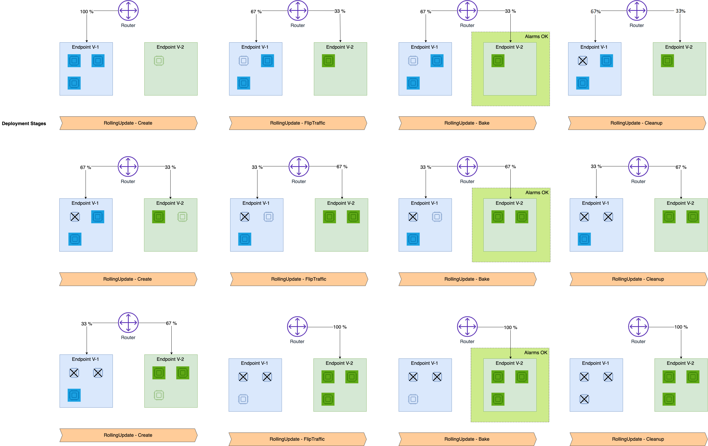

# Use rolling deployments

When you update your endpoint, you can specify a rolling deployment to gradually shift
traffic from your old fleet to a new fleet. You can control the size of the traffic shifting
steps, as well as specify an evaluation period to monitor the new instances for issues
before terminating instances from the old fleet. With rolling deployments, instances on the
old fleet are cleaned up after each traffic shift to the new fleet, reducing the amount of
additional instances needed to update your endpoint. This is useful especially for
accelerated instances that are in high demand.

Rolling deployments gradually replace the previous deployment of your model version with
the new version by updating your endpoint in configurable batch sizes. The traffic shifting
behavior of rolling deployments is similar to the [linear traffic
shifting mode](deployment-guardrails-blue-green-linear.md "deployment-guardrails-blue-green-linear.md") in blue/green deployments, but rolling deployments provide you
with the benefit of reduced capacity requirements when compared to blue/green deployments.
With rolling deployments, fewer instances are active at a time, and you have more granular
control over how many instances you want to update in the new fleet. You should consider
using a rolling deployment instead of a blue/green deployment if you have large models or a
large endpoint with many instances.

The following list describes the key features of rolling deployments in Amazon SageMaker AI:

- **Baking period.** The baking period is a set amount
  of time to monitor the new fleet before proceeding to the next deployment stage. If
  any of the pre-specified alarms trip during any baking period, then all endpoint
  traffic rolls back to the old fleet. The baking period helps you to build confidence
  in your update before making the traffic shift permanent.
- **Rolling batch size.** You have granular control
  over the size of each batch for traffic shifting, or the number of instances you
  want to update in each batch. This number can range for 5–50% of the size of
  your fleet. You can specify the batch size as a number of instances or as the
  overall percentage of your fleet.
- **Auto-rollbacks.** You can specify Amazon CloudWatch alarms
  that SageMaker AI uses to monitor the new fleet. If an issue with the updated code trips any
  of the alarms, SageMaker AI initiates an auto-rollback to the old fleet in order to maintain
  availability, thereby minimizing risk.

###### Note

If your endpoint uses any of the features listed in the [Exclusions](deployment-guardrails-exclusions.md "deployment-guardrails-exclusions.md")
page, you cannot use rolling deployments.

## How it works

During a rolling deployment, SageMaker AI provides the infrastructure to shift traffic from
the old fleet to the new fleet without having to provision all of the new instances at
once. SageMaker AI uses the following steps to shift traffic:

1. SageMaker AI provisions the first batch of instances in the new fleet.
2. A portion of traffic is shifted from the old instances to the first batch of
   new instances.
3. After the baking period, if no Amazon CloudWatch alarms are tripped, then SageMaker AI cleans
   up a batch of old instances.
4. SageMaker AI continues to provision, shift, and clean up instances in batches until
   the deployment is complete.

If an alarm is tripped during one of the baking periods, then traffic is rolled back
to the old fleet in batches of a size that you specify. Alternatively, you can specify
the rolling deployment to shift 100% of the traffic back to the old fleet if an alarm is
tripped.

The following diagram shows the progression of a successful rolling deployment, as
described in the previous steps.



To create a rolling deployment, you only have to specify your desired deployment
configuration. Then SageMaker AI handles provisioning new instances, terminating old instances,
and shifting traffic for you. You can create and manage your deployment through the
existing [UpdateEndpoint](../APIReference/API_UpdateEndpoint.md "../APIReference/API_UpdateEndpoint.md")
and [CreateEndpoint](../APIReference/API_CreateEndpoint.md "../APIReference/API_CreateEndpoint.md")
SageMaker API and AWS Command Line Interface commands.

## Prerequisites

Before setting up a rolling deployment, you must create Amazon CloudWatch alarms to watch
metrics from your endpoint. If any of the alarms trip during the baking period, then the
traffic begins rolling back to your old fleet. To learn how to set up CloudWatch alarms on an
endpoint, see the prerequisite page [Auto-Rollback
Configuration and Monitoring](deployment-guardrails-configuration.md "deployment-guardrails-configuration.md"). To learn more about CloudWatch alarms, see [Using Amazon CloudWatch
alarms](../../../AmazonCloudWatch/latest/monitoring/AlarmThatSendsEmail.md "../../../AmazonCloudWatch/latest/monitoring/AlarmThatSendsEmail.md") in the _Amazon CloudWatch User Guide_.

Also, review the [Exclusions](deployment-guardrails-exclusions.md "deployment-guardrails-exclusions.md")
page to make sure that your endpoint meets the requirements for a rolling
deployment.

## Determine the rolling batch

size

Before updating your endpoint, determine the batch size that you want to use for
incrementally shifting traffic to the new fleet.

For rolling deployments, you can specify a batch size that is 5–50% of the
capacity of your fleet. If you choose a large batch size, the deployment completes more
quickly. However, keep in mind that the endpoint requires more capacity while updating,
roughly the batch size overhead. If you choose a smaller batch size, the deployment
takes longer, but you use less capacity during the deployment.

## Configure a rolling

deployment

Once you are ready for your deployment and have set up CloudWatch alarms for your endpoint,
you can use the SageMaker AI [UpdateEndpoint](../APIReference/API_UpdateEndpoint.md "../APIReference/API_UpdateEndpoint.md")
API or the [update-endpoint](../../../cli/latest/reference/sagemaker/update-endpoint.md "../../../cli/latest/reference/sagemaker/update-endpoint.md")
command in the AWS Command Line Interface to initiate the deployment.

**How to update an endpoint**

The following example shows how you can update your endpoint with a rolling deployment
using the [update_endpoint](https://boto3.amazonaws.com/v1/documentation/api/latest/reference/services/sagemaker/client/update_endpoint.html "https://boto3.amazonaws.com/v1/documentation/api/latest/reference/services/sagemaker/client/update_endpoint.html") method of the Boto3 SageMaker AI client.

To configure a rolling deployment, use the following example and fields:

- For `EndpointName`, use the name of the existing endpoint you want
  to update.
- For `EndpointConfigName`, use the name of the endpoint
  configuration you want to use.
- In the `AutoRollbackConfiguration` object, within the
  `Alarms` field, you can add your CloudWatch alarms by name. Create one
  `AlarmName: <your-cw-alarm>` entry for each alarm you want
  to use.
- Under `DeploymentConfig`, for the `RollingUpdatePolicy`
  object, specify the following fields:
  - `MaximumExecutionTimeoutInSeconds` — The time limit
    for the total deployment. Exceeding this limit causes a timeout. The
    maximum value you can specify for this field is 28800 seconds, or 8
    hours.
  - `WaitIntervalInSeconds` — The length of the baking
    period, during which SageMaker AI monitors alarms for each batch on the new
    fleet.
  - `MaximumBatchSize` — Specify the `Type`
    of batch you want to use (either instance count or overall percentage of
    your fleet) and the `Value`, or the size of each
    batch.
  - `RollbackMaximumBatchSize` — Use this object to
    specify the rollback strategy in case an alarm trips. Specify the
    `Type` of batch you want to use (either instance count or
    overall percentage of your fleet), and the `Value`, or the
    size of each batch. If you don’t specify these fields, or if you set the
    value to 100% of your endpoint, then SageMaker AI uses a blue/green rollback
    strategy and rolls all traffic back to the old fleet when an alarm
    trips.

```
import boto3
client = boto3.client("sagemaker")

response = client.update_endpoint(
    EndpointName="`<your-endpoint-name>`",
    EndpointConfigName="`<your-config-name>`",
    DeploymentConfig={
        "AutoRollbackConfiguration": {
            "Alarms": [
                {
                    "AlarmName": "`<your-cw-alarm>`"
                },
            ]
        },
        "RollingUpdatePolicy": {
            "MaximumExecutionTimeoutInSeconds": number,
            "WaitIntervalInSeconds": number,
            "MaximumBatchSize": {
                "Type": "INSTANCE_COUNT" | "CAPACITY_PERCENTAGE" (default),
                "Value": number
            },
            "RollbackMaximumBatchSize": {
                "Type": "INSTANCE_COUNT" | "CAPACITY_PERCENTAGE" (default),
                "Value": number
            },
        }
    }
)
```

After updating your endpoint, you might want to check the status of your rolling
deployment and check the health of your endpoint. You can review your endpoint’s status
in the SageMaker AI console, or you can review the status of your endpoint by using the [DescribeEndpoint](../APIReference/API_DescribeEndpoint.md "../APIReference/API_DescribeEndpoint.md") API.

In the `VariantStatus` object returned by the `DescribeEndpoint`
API, the `Status` field tells you the current deployment or operational
status of your endpoint. For more information about the possible statuses and what they
mean, see [ProductionVariantStatus](../APIReference/API_ProductionVariantStatus.md "../APIReference/API_ProductionVariantStatus.md").

If you attempted to do a rolling deployment and the status of your endpoint is
`UpdateRollbackFailed`, see the following section for troubleshooting
help.

## Failure handling

If your rolling deployments fails and the auto-rollback fails as well, your endpoint
can be left with a status of `UpdateRollbackFailed`. This status means that
different endpoint configurations are deployed to the instances behind your endpoint,
and your endpoint is in service with a mix of old and new endpoint
configurations.

You can make another call to the [UpdateEndpoint](../APIReference/API_UpdateEndpoint.md "../APIReference/API_UpdateEndpoint.md")
API to return your endpoint to a healthy state. Specify your desired endpoint
configuration and deployment configuration (either as a rolling deployment, a blue/green
deployment, or neither) to update your endpoint.

You can call the [DescribeEndpoint](../APIReference/API_DescribeEndpoint.md "../APIReference/API_DescribeEndpoint.md") API to check the health of your endpoint again, which is
returned in the `VariantStatus` object as the `Status` field. If
your update is successful, your endpoint’s `Status` returns to
`InService`.
