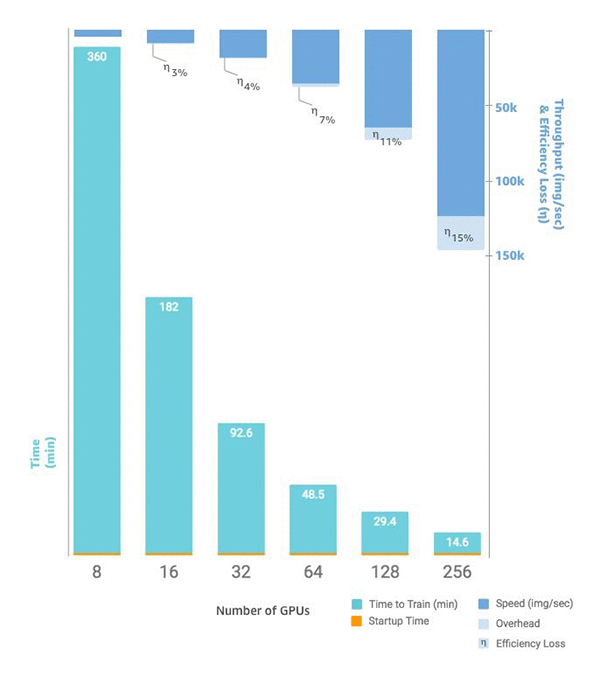

# Scaling training

The following sections cover scenarios in which you may want to scale up training, and how
you can do so using AWS resources. You may want to scale training in one of the following
situations:

- Scaling from a single GPU to many GPUs
- Scaling from a single instance to multiple instances
- Using custom training scripts

## Scaling from a single GPU to many GPUs

The amount of data or the size of the model used in machine learning can create
situations in which the time to train a model is longer that you are willing to wait.
Sometimes, the training doesn’t work at all because the model or the training data is too
large. One solution is to increase the number of GPUs you use for training. On an instance
with multiple GPUs, like a `p3.16xlarge` that has eight GPUs, the data and
processing is split across the eight GPUs. When you use distributed training libraries, this
can result in a near-linear speedup in the time it takes to train your model. It takes
slightly over 1/8 the time it would have taken on `p3.2xlarge` with one
GPU.

| Instance type | GPUs |
| ------------- | ---- |
| p3.2xlarge    | 1    |
| p3.8xlarge    | 4    |
| p3.16xlarge   | 8    |
| p3dn.24xlarge | 8    |

###### Note

The ml instance types used by SageMaker training have the same number of GPUs as the
corresponding p3 instance types. For example, `ml.p3.8xlarge` has the same
number of GPUs as `p3.8xlarge` - 4.

## Scaling from a single instance to multiple

instances

If you want to scale your training even further, you can use more instances. However,
you should choose a larger instance type before you add more instances. Review the previous
table to see how many GPUs are in each p3 instance type.

If you have made the jump from a single GPU on a `p3.2xlarge` to four GPUs on
a `p3.8xlarge`, but decide that you require more processing power, you may see
better performance and incur lower costs if you choose a `p3.16xlarge` before
trying to increase instance count. Depending on the libraries you use, when you keep your
training on a single instance, performance is better and costs are lower than a scenario
where you use multiple instances.

When you are ready to scale the number of instances, you can do this with SageMaker AI Python
SDK `estimator` function by setting your `instance_count`. For
example, you can set `instance_type = p3.16xlarge` and   `instance_count =
 2`. Instead of the eight GPUs on a single `p3.16xlarge`, you have 16 GPUs
across two identical instances. The following chart shows [scaling and throughput starting with eight GPUs](https://aws.amazon.com/blogs/machine-learning/scalable-multi-node-training-with-tensorflow/ "https://aws.amazon.com/blogs/machine-learning/scalable-multi-node-training-with-tensorflow/") on a single instance and
increasing to 64 instances for a total of 256 GPUs.

## Custom training scripts

While SageMaker AI makes it simple to deploy and scale the number of instances and GPUs,
depending on your framework of choice, managing the data and results can be very
challenging, which is why external supporting libraries are often used. This most basic form
of distributed training requires modification of your training script to manage the data
distribution.

SageMaker AI also supports Horovod and implementations of distributed training native to each
major deep learning framework. If you choose to use examples from these frameworks, you can
follow SageMaker AI’s [container guide](docker-containers.md "docker-containers.md") for Deep Learning Containers, and various [example notebooks](https://sagemaker-examples.readthedocs.io/en/latest/training/bring_your_own_container.html "https://sagemaker-examples.readthedocs.io/en/latest/training/bring_your_own_container.html") that demonstrate implementations.
