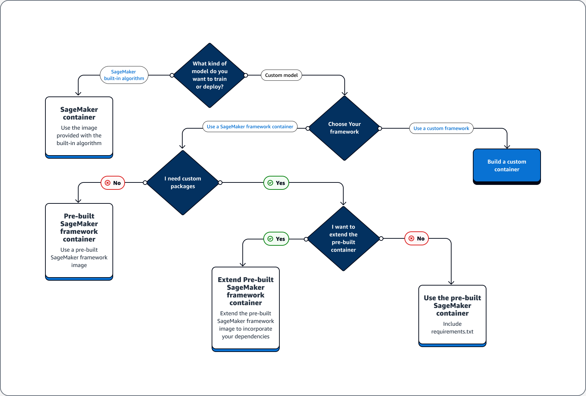

# Docker containers for training and deploying models

Amazon SageMaker AI makes extensive use of _Docker containers_ for build and
runtime tasks. SageMaker AI provides pre-built Docker images for its built-in algorithms and the
supported deep learning frameworks used for training and inference. Using containers, you
can train machine learning algorithms and deploy models quickly and reliably at any scale.
The topics in this section show how to deploy these containers for your own use cases. For
information about how to bring your own containers for use with Amazon SageMaker Studio Classic, see [Custom Images in Amazon SageMaker Studio Classic](studio-byoi.md "studio-byoi.md").

###### Topics

- [Scenarios for Running Scripts, Training
  Algorithms, or Deploying Models with SageMaker AI](#container-scenarios "#container-scenarios")
- [Docker container basics](docker-basics.md "docker-basics.md")
- [Pre-built SageMaker AI Docker images](docker-containers-prebuilt.md "docker-containers-prebuilt.md")
- [Custom Docker containers with SageMaker AI](docker-containers-adapt-your-own.md "docker-containers-adapt-your-own.md")
- [Container creation with your own algorithms
  and models](docker-containers-create.md "docker-containers-create.md")
- [Examples and More Information: Use Your Own
  Algorithm or Model](docker-containers-notebooks.md "docker-containers-notebooks.md")
- [Troubleshooting your Docker containers and deployments](#docker-containers-troubleshooting "#docker-containers-troubleshooting")

## Scenarios for Running Scripts, Training

Algorithms, or Deploying Models with SageMaker AI

Amazon SageMaker AI always uses Docker containers when running scripts, training algorithms, and
deploying models. Your level of engagement with containers depends on your use case.

The following decision tree illustrates three main scenarios: **Use cases for using pre-built Docker containers with SageMaker AI**; **Use cases for extending a pre-built Docker container**;
**Use case for building your own container**.



###### Topics

- [Use cases for using pre-built
  Docker containers with SageMaker AI](#container-scenarios-use-prebuilt "#container-scenarios-use-prebuilt")
- [Use cases for extending a pre-built
  Docker container](#container-scenarios-extend-prebuilt "#container-scenarios-extend-prebuilt")
- [Use case for building your own
  container](#container-scenarios-byoc "#container-scenarios-byoc")

### Use cases for using pre-built

Docker containers with SageMaker AI

Consider the following use cases when using containers with SageMaker AI:

- **Pre-built SageMaker AI algorithm** – Use the
  image that comes with the built-in algorithm. See [Use Amazon SageMaker AI
  Built-in Algorithms or Pre-trained Models](algos.md "algos.md") for more
  information.
- **Custom model with pre-built SageMaker AI
  container** – If you train or deploy a custom model, but
  use a framework that has a pre-built SageMaker AI container including TensorFlow and
  PyTorch, choose one of the following options:
  - If you don't need a custom package, and the container already
    includes all required packages: Use the pre-built Docker image
    associated with your framework. For more information, see [Pre-built SageMaker AI Docker images](docker-containers-prebuilt.md "docker-containers-prebuilt.md").
  - If you need a custom package installed into one of the pre-built
    containers: Confirm that the pre-built Docker image allows a
    requirements.txt file, or extend the pre-built container based on
    the following use cases.

### Use cases for extending a pre-built

Docker container

The following are use cases for extending a pre-built Docker container:

- **You can't import the dependencies**
  – Extend the pre-built Docker image associated with your framework.
  See [Extend a Pre-built
  Container](prebuilt-containers-extend.md "prebuilt-containers-extend.md") for more
  information.
- **You can't import the dependencies in the pre-built
  container and the pre-built container supports
  requirements.txt** – Add all the required dependencies
  in requirements.txt. The following frameworks support using
  requirements.txt.
  - [TensorFlow](https://sagemaker.readthedocs.io/en/v2.18.0/frameworks/tensorflow/using_tf.html "https://sagemaker.readthedocs.io/en/v2.18.0/frameworks/tensorflow/using_tf.html")
  - [Chainer](https://sagemaker.readthedocs.io/en/v2.18.0/frameworks/chainer/using_chainer.html?highlight=requirements.txt "https://sagemaker.readthedocs.io/en/v2.18.0/frameworks/chainer/using_chainer.html?highlight=requirements.txt")
  - [Sci-kit learn](https://sagemaker.readthedocs.io/en/stable/frameworks/sklearn/using_sklearn.html?highlight=requirements.txt "https://sagemaker.readthedocs.io/en/stable/frameworks/sklearn/using_sklearn.html?highlight=requirements.txt")
  - [PyTorch](https://sagemaker.readthedocs.io/en/v2.18.0/frameworks/pytorch/using_pytorch.html?highlight=requirements.txt "https://sagemaker.readthedocs.io/en/v2.18.0/frameworks/pytorch/using_pytorch.html?highlight=requirements.txt")
  - [Apache MXNet](https://sagemaker.readthedocs.io/en/v2.18.0/frameworks/mxnet/using_mxnet.html?highlight=requirements.txt "https://sagemaker.readthedocs.io/en/v2.18.0/frameworks/mxnet/using_mxnet.html?highlight=requirements.txt")

### Use case for building your own

container

If you build or train a custom model and require custom framework that does not
have a pre-built image, build a custom container.

As an example use case of training and deploying a TensorFlow model, the following
guide shows how to determine which option from the previous sections of **Use cases** fits to the case.

Assume that you have the following requirements for training and deploying a
TensorFlow model.

- A TensorFlow model is a custom model.
- Because a TensorFlow model is going to be built in the TensorFlow framework,
  use the TensorFlow pre-built framework container to train and host the
  model.
- If you require custom packages in either your [entrypoint](https://sagemaker.readthedocs.io/en/stable/frameworks/tensorflow/using_tf.html#train-a-model-with-tensorflow "https://sagemaker.readthedocs.io/en/stable/frameworks/tensorflow/using_tf.html#train-a-model-with-tensorflow") script or [inference script, either extend the pre-built container or use a
  requirements.txt file to install dependencies at runtime.](https://sagemaker.readthedocs.io/en/stable/frameworks/tensorflow/deploying_tensorflow_serving.html#how-to-implement-the-pre-and-or-post-processing-handler-s "https://sagemaker.readthedocs.io/en/stable/frameworks/tensorflow/deploying_tensorflow_serving.html#how-to-implement-the-pre-and-or-post-processing-handler-s")

After you determine the type of container that you need, the following list provides
details about the previously listed options.

- **Use a built-in SageMaker AI algorithm or framework**.
  For most use cases, you can use the built-in algorithms and frameworks without
  worrying about containers. You can train and deploy these algorithms from the
  SageMaker AI console, the AWS Command Line Interface (AWS CLI), a Python notebook, or the
  [Amazon SageMaker Python SDK](https://sagemaker.readthedocs.io/en/stable "https://sagemaker.readthedocs.io/en/stable"). You can do that by specifying the algorithm or framework
  version when creating your Estimator. The available built-in algorithms are
  itemized and described in the [Built-in algorithms and pretrained models in Amazon SageMaker](algos.md "algos.md")
  topic. For more information about the available frameworks, see [ML Frameworks and Languages](frameworks.md "frameworks.md"). For an example of
  how to train and deploy a built-in algorithm using a Jupyter notebook running in
  a SageMaker notebook instance, see the [Guide to getting set up with Amazon SageMaker AI](gs.md "gs.md") topic.
- **Use pre-built SageMaker AI container images**.
  Alternatively, you can use the built-in algorithms and frameworks using Docker
  containers. SageMaker AI provides containers for its built-in algorithms and pre-built
  Docker images for some of the most common machine learning frameworks, such as
  Apache MXNet, TensorFlow, PyTorch, and Chainer. For a full list of the available
  SageMaker Images, see [Available Deep Learning Containers Images](https://github.com/aws/deep-learning-containers/blob/master/available_images.md "https://github.com/aws/deep-learning-containers/blob/master/available_images.md"). It also supports machine
  learning libraries such as scikit-learn and SparkML. If you use the
  [Amazon SageMaker Python SDK](https://sagemaker.readthedocs.io/en/stable "https://sagemaker.readthedocs.io/en/stable"), you can deploy the containers by passing the full
  container URI to their respective SageMaker SDK `Estimator` class. For the
  full list of deep learning frameworks that are currently supported by SageMaker AI, see
  [Prebuilt SageMaker AI Docker images
  for deep learning](pre-built-containers-frameworks-deep-learning.md "pre-built-containers-frameworks-deep-learning.md"). For
  information about the scikit-learn and SparkML pre-built container images, see
  [Accessing Docker
  Images for Scikit-learn and Spark ML](pre-built-docker-containers-scikit-learn-spark.md "pre-built-docker-containers-scikit-learn-spark.md"). For more
  information about using frameworks with the [Amazon SageMaker Python SDK](https://sagemaker.readthedocs.io/en/stable "https://sagemaker.readthedocs.io/en/stable"), see their
  respective topics in [Machine Learning Frameworks and Languages](frameworks.md "frameworks.md").
- **Extend a pre-built SageMaker AI container image**. If
  you would like to extend a pre-built SageMaker AI algorithm or model Docker image, you
  can modify the SageMaker image to satisfy your needs. For an example, see [Extending our PyTorch containers](https://github.com/aws/amazon-sagemaker-examples-community/blob/215215eb25b40eadaf126d055dbb718a245d7603/bring-your-own-container/pytorch_extending_our_containers/pytorch_extending_our_containers.ipynb "https://github.com/aws/amazon-sagemaker-examples-community/blob/215215eb25b40eadaf126d055dbb718a245d7603/bring-your-own-container/pytorch_extending_our_containers/pytorch_extending_our_containers.ipynb").
- **Adapt an existing container image**: If you
  would like to adapt a pre-existing container image to work with SageMaker AI, you must
  modify the Docker container to enable either the SageMaker Training or Inference
  toolkit. For an example that shows how to build your own containers to train and
  host an algorithm, see [Bring Your Own R Algorithm](https://github.com/aws/amazon-sagemaker-examples/blob/main/advanced_functionality/scikit_bring_your_own/scikit_bring_your_own.ipynb "https://github.com/aws/amazon-sagemaker-examples/blob/main/advanced_functionality/scikit_bring_your_own/scikit_bring_your_own.ipynb").

## Troubleshooting your Docker containers and deployments

The following are common errors that you might run into when using Docker containers with
SageMaker AI. Each error is followed by a solution to the error.

- **Error: SageMaker AI has lost the Docker daemon.**

To fix this error, restart Docker using the following command.

```
sudo service docker restart
```

- **Error: The `/tmp` directory of your Docker container has run out of space.**

Docker containers use the `/` and `/tmp` partitions to store
code. These partitions can fill up easily when using large code modules in local mode. The SageMaker AI
Python SDK supports specifying a custom temp directory for your local mode root
directory to avoid this issue.

To specify the custom temp directory in the Amazon Elastic Block Store volume storage, create a file at
the following path `~/.sagemaker/config.yaml` and add the following
configuration. The directory that you specify as `container_root` must already exist. The SageMaker AI
Python SDK will not try to create it.

```
local:
  container_root: /home/ec2-user/SageMaker/temp
```

With this configuration, local mode uses the `/temp` directory and not the default `/tmp` directory.

- **Low space errors on SageMaker notebook instances**

A Docker container that runs on SageMaker notebook instances uses the root Amazon EBS volume of
the notebook instance by default. To resolve low space errors, provide the path of the Amazon EBS volume attached to the notebook instance as part of the volume parameter of Docker commands.

```
docker run -v `EBS-volume-path`:`container-path`
```
