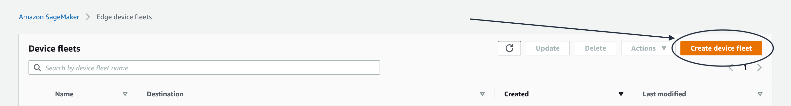
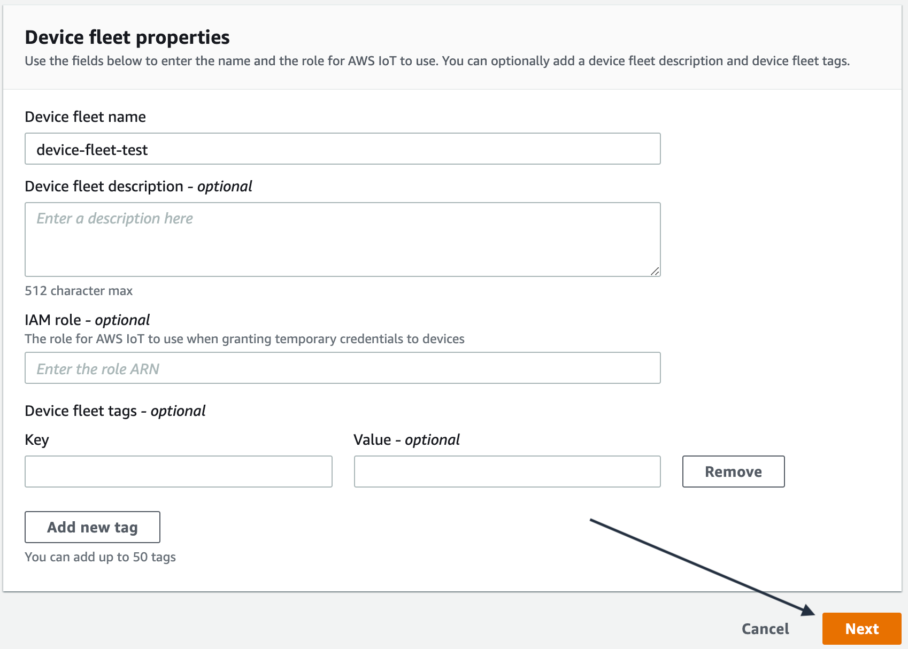
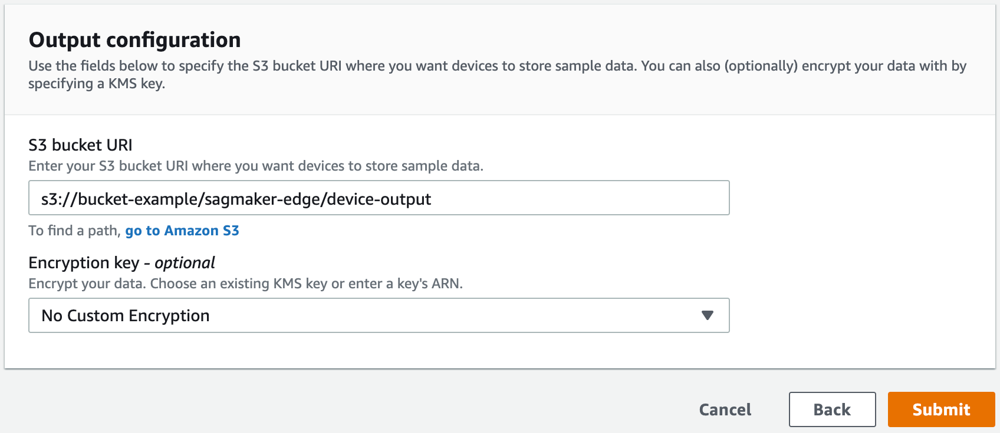

# Create a Fleet

You can create a fleet programmatically with the AWS SDK for Python (Boto3) or through the SageMaker AI console
[https://console.aws.amazon.com/sagemaker](https://console.aws.amazon.com/sagemaker/ "https://console.aws.amazon.com/sagemaker/").

## Create a Fleet (Boto3)

Use the `CreateDeviceFleet` API to create a fleet. Specify a name for
the fleet, your AWS IoT Role ARN for the `RoleArn` field, as well as
an Amazon S3 URI where you want the device to store sampled data.

You can optionally include a description of the fleet, tags, and an AWS KMS Key
ID.

```
import boto3

# Create SageMaker client so you can interact and manage SageMaker resources
sagemaker_client = boto3.client("sagemaker", region_name="aws-region")

sagemaker_client.create_device_fleet(
    DeviceFleetName=`"sample-fleet-name"`,
    RoleArn=`"arn:aws:iam::999999999:role/rolename"`, # IoT Role ARN
    Description=`"fleet description"`,
    OutputConfig={
        S3OutputLocation=`"s3://bucket/"`,
        KMSKeyId: `"1234abcd-12ab-34cd-56ef-1234567890ab"`,
    },
        Tags=[
        {
            "Key": `"string"`,
            "Value" : `"string"`
         }
     ],
)
```

An AWS IoT Role Alias is created for you when you create a device fleet. The AWS IoT
role alias provides a mechanism for connected devices to authenticate to AWS IoT using
X.509 certificates and then obtain short-lived AWS credentials from an IAM role
that is associated with the AWS IoT role alias.

Use `DescribeDeviceFleet` to get the role alias name and ARN.

```
# Print Amazon Resource Name (ARN) and alias that has access
# to AWS Internet of Things (IoT).
sagemaker_client.describe_device_fleet(DeviceFleetName=device_fleet_name)['IotRoleAlias']
```

Use `DescribeDeviceFleet` API to get a description of
fleets you created.

```
sagemaker_client.describe_device_fleet(
    DeviceFleetName="sample-fleet-name"
)
```

By default, it returns the name of the fleet, the device fleet ARN, the Amazon S3
bucket URI, the IAM role, the role alias created in AWS IoT, a timestamp of when the
fleet was created, and a timestamp of when the fleet was last modified.

```
{ "DeviceFleetName": "sample-fleet-name",
  "DeviceFleetArn": "arn:aws:sagemaker:us-west-2:9999999999:device-fleet/sample-fleet-name",
  "IAMRole": "arn:aws:iam::999999999:role/rolename",
  "Description": "this is a sample fleet",
  "IoTRoleAlias": "arn:aws:iot:us-west-2:9999999999:rolealias/SagemakerEdge-sample-fleet-name"
  "OutputConfig": {
              "S3OutputLocation": "s3://bucket/folder",
              "KMSKeyId": "1234abcd-12ab-34cd-56ef-1234567890ab"
   },
   "CreationTime": "1600977370",
   "LastModifiedTime": "1600977370"}
```

## Create a Fleet (Console)

You can create a Edge Manager packaging job using the Amazon SageMaker AI console at
[https://console.aws.amazon.com/sagemaker](https://console.aws.amazon.com/sagemaker/ "https://console.aws.amazon.com/sagemaker/").

1. In the SageMaker AI console, choose **Edge Manager** and then choose **Edge
   device fleets**.
2. Choose **Create device fleet**.

 3. Enter a name for the device fleet in the **Device fleet name** field. Choose
**Next**.

 4. On the **Output configuration** page, specify the Amazon S3 bucket URI where you
want to store sample data from your device fleet. You can optionally add an
encryption key as well by electing an existing AWS KMS key from the dropdown list
or by entering a key’s ARN. Choose **Submit**.

 5. Choose the name of your device fleet to be redirected to the device fleet details. This page
displays the name of the device fleet, ARN, description (if you provided one),
date the fleet was created, last time the fleet was modified, Amazon S3 bucket URI,
AWS KMS key ID (if provided), AWS IoT alias (if provided), and IAM role. If you
added tags, they appear in the **Device fleet tags**
section.
