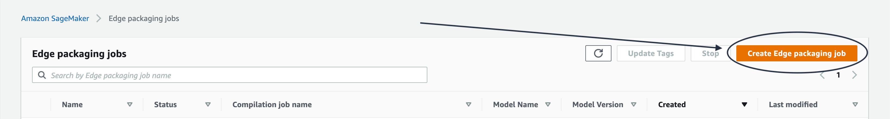
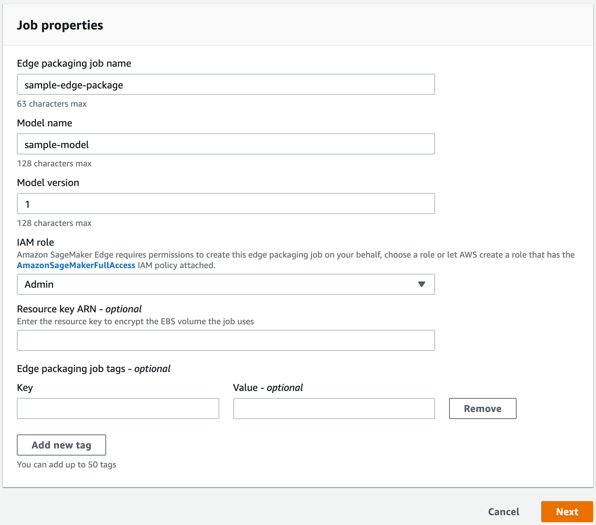
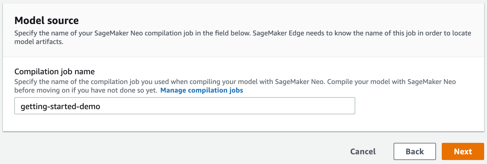

# Package a Model (Amazon SageMaker AI

Console)

You can create a SageMaker Edge Manager packaging job using the SageMaker AI console at
[https://console.aws.amazon.com/sagemaker/](https://console.aws.amazon.com/sagemaker/ "https://console.aws.amazon.com/sagemaker/"). Before
continuing, make sure you have satisfied the
[Complete prerequisites](edge-packaging-job-prerequisites.md "edge-packaging-job-prerequisites.md").

1. In the SageMaker AI console, choose **Edge Inference** and then
   choose **Create edge packaging jobs**, as shown in the following
   image.

 2. On the **Job properties** page, enter a name for your
packaging job under **Edge packaging job name**.
Note that Edge Manager packaging job names are case-sensitive. Name your
model and give it a version: enter this under **Model name**
and **Model version**, respectively. 3. Next, select an **IAM role**. You can chose a role or let
AWS create a role for you. You can optionally specify a **resource key
ARN** and **job tags**. 4. Choose **Next**.

 5. Specify the name of the compilation job you used when compiling your model
with SageMaker Neo in the **Compilation job name** field. Choose
**Next**.

 6. On the **Output configuration** page, enter the Amazon S3 bucket
URI in which you want to store the output of the packaging job.

The **Status** column on the **Edge
packaging** jobs page should read **IN PROGRESS**.
Once the packaging job is complete, the status updates to
**COMPLETED**.

Selecting a packaging job directs you to that job's settings. The
**Job settings** section displays the job name, ARN,
status, creation time, last modified time, duration of the packaging job, and
role ARN.

The **Input configuration** section displays the location of
the model artifacts, the data input configuration, and the machine learning
framework of the model.

The **Output configuration** section displays the output
location of the packaging job, the target device for which the model was
compiled, and any tags you created. 7. Choose the name of your device fleet to be redirected to the device fleet details. This page
displays the name of the device fleet, ARN, description (if you provided one),
date the fleet was created, last time the fleet was modified, Amazon S3 bucket URI,
AWS KMS key ID (if provided), AWS IoT alias (if provided), and IAM role. If you
added tags, they appear in the **Device fleet tags**
section.
