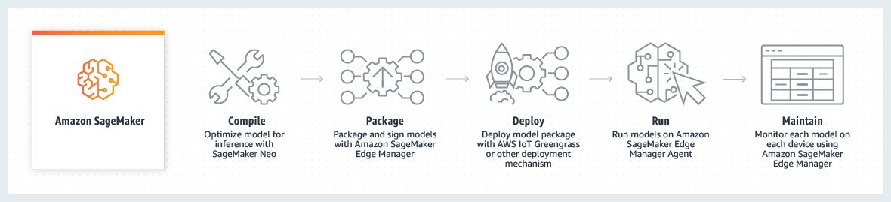

# Model deployment at the edge with SageMaker Edge Manager

###### Warning

SageMaker Edge Manager is being discontinued on April 26th, 2024. For more information about
continuing to deploy your models to edge devices, see [SageMaker Edge Manager end of life](edge-eol.md "edge-eol.md").

Amazon SageMaker Edge Manager provides model management for
edge devices so you can optimize, secure, monitor, and maintain
machine learning models on fleets of edge devices such as smart
cameras, robots, personal computers, and mobile devices.

## Why Use Edge Manager?

Many machine learning (ML) use cases require running ML models on a fleet of edge
devices, which allows you to get predictions in real-time, preserves the privacy of the
end users, and lowers the cost of network connectivity. With the increasing availability
of low-power edge hardware designed for ML, it is now possible to run multiple complex
neural network models on edge devices.

However, operating ML models on edge devices is challenging, because devices, unlike
cloud instances, have limited compute, memory, and connectivity. After the model is
deployed, you need to continuously monitor the models, because model drift can cause the
quality of model to decay overtime. Monitoring models across your device fleets is
difficult because you need to write custom code to collect data samples from your device
and recognize skew in predictions. In addition, models are often hard-coded into the
application. To update the model, you must rebuild and update the entire application or
device firmware, which can disrupt your operations.

With SageMaker Edge Manager, you can optimize, run, monitor, and update machine learning
models across fleets of devices at the edge.

## How Does it Work?

At a high level, there are five main components in the SageMaker Edge Manager workflow:
compiling models with SageMaker Neo, packaging Neo-compiled models, deploying models to your
devices, running models on the SageMaker AI inference engine (Edge Manager agent), and
maintaining models on the devices.

SageMaker Edge Manager uses SageMaker Neo to optimize your models for the target hardware in one
click, then to cryptographically sign your models before deployment. Using
SageMaker Edge Manager, you can sample model input and output data from edge devices and send
it to the cloud for monitoring and analysis, and view a dashboard that tracks and
visually reports on the operation of the deployed models within the SageMaker AI console.

SageMaker Edge Manager extends capabilities that were previously only available in the cloud
to the edge, so developers can continuously improve model quality by using Amazon SageMaker Model Monitor for
drift detection, then relabel the data with SageMaker AI Ground Truth and retrain the models in
SageMaker AI.

## How Do I Use SageMaker Edge Manager?

If you are a first time user of SageMaker Edge Manager, we recommend that you do the following:

1. **Read the [Getting Started](edge-manager-getting-started.md "edge-manager-getting-started.md") section** - This
   section walks you through setting up your first edge packaging job and creating
   your first fleet.
2. **Explore Edge Manager Jupyter notebook examples** - Example notebooks are stored in the [amazon-sagemaker-examples](https://github.com/aws/amazon-sagemaker-examples "https://github.com/aws/amazon-sagemaker-examples") GitHub repository in the [sagemaker_edge_manager](https://github.com/aws/amazon-sagemaker-examples/tree/master/sagemaker_edge_manager "https://github.com/aws/amazon-sagemaker-examples/tree/master/sagemaker_edge_manager") folder.
