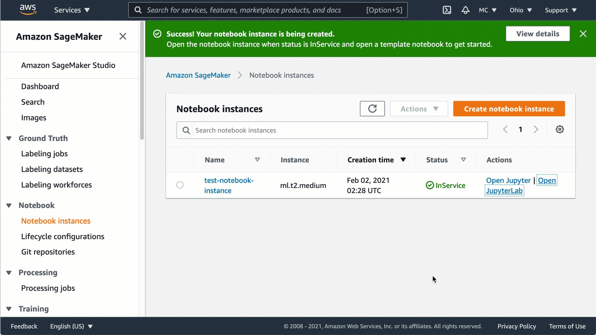

# Create a Jupyter notebook in the SageMaker notebook

instance

###### Important

Custom IAM policies that allow Amazon SageMaker Studio or Amazon SageMaker Studio Classic to create Amazon SageMaker
resources must also grant permissions to add tags to those resources. The permission to
add tags to resources is required because Studio and Studio Classic automatically tag
any resources they create. If an IAM policy allows Studio and Studio Classic to
create resources but does not allow tagging, "AccessDenied" errors can occur when
trying to create resources. For more information, see [Provide permissions for tagging SageMaker AI
resources](security_iam_id-based-policy-examples.md#grant-tagging-permissions "security_iam_id-based-policy-examples.md#grant-tagging-permissions").

[AWS managed policies for Amazon SageMaker AI](security-iam-awsmanpol.md "security-iam-awsmanpol.md")
that give permissions to create SageMaker resources already include permissions to add tags
while creating those resources.

To start scripting for training and deploying your model, create a Jupyter notebook in the
SageMaker notebook instance. Using the Jupyter notebook, you can run machine learning (ML)
experiments for training and inference while using SageMaker AI features and the AWS
infrastructure.

###### To create a Jupyter notebook

1. Open the notebook instance as follows:
   1. Sign in to the SageMaker AI console at [https://console.aws.amazon.com/sagemaker/](https://console.aws.amazon.com/sagemaker/ "https://console.aws.amazon.com/sagemaker/").
   2. On the **Notebook instances** page, open your notebook
      instance by choosing either:
      - **Open JupyterLab** for the JupyterLab
        interface
      - **Open Jupyter** for the classic Jupyter
        view

   ###### Note

   If the notebook instance status shows **Pending** in the
   **Status** column, your notebook instance is still
   being created. The status will change to **InService**
   when the notebook instance is ready to use.

2. Create a notebook as follows:
   - If you opened the notebook in the JupyterLab view, on the
     **File** menu, choose **New**, and
     then choose **Notebook**. For **Select
     Kernel**, choose **conda_python3**. This
     preinstalled environment includes the default Anaconda installation and
     Python 3.
   - If you opened the notebook in the classic Jupyter view, on the
     **Files** tab, choose **New**, and
     then choose **conda_python3**. This preinstalled
     environment includes the default Anaconda installation and Python 3.

3. Save the notebooks as follows:
   - In the JupyterLab view, choose **File**, choose
     **Save Notebook As...**, and then rename the
     notebook.
   - In the Jupyter classic view, choose **File**, choose
     **Save as...**, and then rename the notebook.
