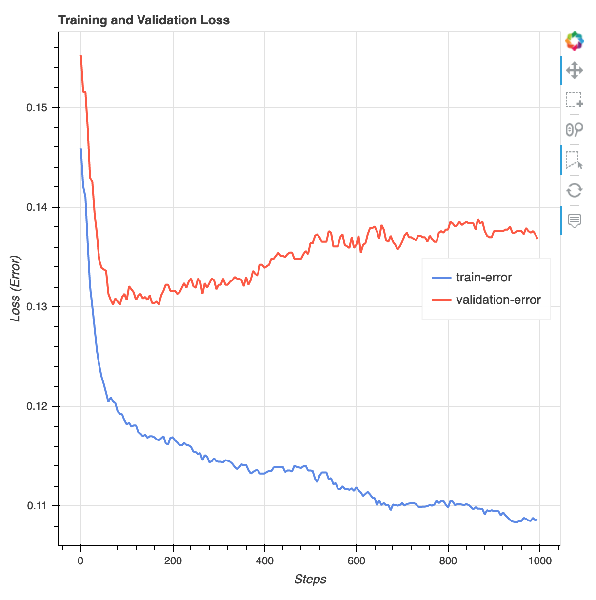

# Train a Model

In this step, you choose a training algorithm and run a training job for the model. The
[Amazon SageMaker Python SDK](https://sagemaker.readthedocs.io/en/stable "https://sagemaker.readthedocs.io/en/stable") provides classes to train your
model while orchestrating the machine learning (ML) lifecycle accessing the SageMaker AI features
for training and the AWS infrastructures, such as Amazon Elastic Container Registry (Amazon ECR), Amazon Elastic Compute Cloud (Amazon EC2),
Amazon Simple Storage Service (Amazon S3). For more information about
built-in algorithms, see [Built-in algorithms and pretrained models in Amazon SageMaker](algos.md "algos.md").

###### Topics

- [Choose the Training Algorithm](#ex1-train-model-select-algorithm "#ex1-train-model-select-algorithm")
- [Create and Run a Training Job](#ex1-train-model-sdk "#ex1-train-model-sdk")

## Choose the Training Algorithm

To choose the right algorithm for your dataset, you typically need to evaluate
different models to find the most suitable models to your data. For simplicity, the SageMaker AI
[XGBoost algorithm with Amazon SageMaker AI](xgboost.md "xgboost.md") built-in algorithm is used
throughout this tutorial without the pre-evaluation of models.

###### Tip

If you want SageMaker AI to find an appropriate model for your tabular dataset, use Amazon SageMaker Autopilot that
automates a machine learning solution. For more information, see [SageMaker Autopilot](autopilot-automate-model-development.md "autopilot-automate-model-development.md").

## Create and Run a Training Job

After you figured out which model to use, start constructing a training job. This tutorial uses the XGBoost built-in algorithm.

###### To run a model training job

1. Import the [Amazon SageMaker Python SDK](https://sagemaker.readthedocs.io/en/stable "https://sagemaker.readthedocs.io/en/stable") and start by retrieving the basic information
   from your current SageMaker AI session.

```
from sagemaker.core.helper.session_helper import Session, get_execution_role

sagemaker_session = Session()
region = sagemaker_session.boto_region_name
print(f"AWS Region: {region}")

role = get_execution_role()
print(f"RoleArn: {role}")
```

###### Note

Check the SageMaker Python SDK version by running
`sagemaker.__version__`. This tutorial is based on
`sagemaker>=3.0`. If the SDK is outdated, install the latest
version by running the following command:

```
! pip install -qU sagemaker
```

If you run this installation in your exiting SageMaker Studio or notebook
instances, you need to manually refresh the kernel to finish applying the
version update.

This returns the following information:

    * `region` – The current AWS Region where the SageMaker AI
     notebook instance is running.
    * `role` – The IAM role used by the notebook
     instance.

2. Create a training configuration and set hyperparameters for the XGBoost algorithm.

Create a `ModelTrainer` using the
`sagemaker.train.ModelTrainer` class with hyperparameters
passed directly in the constructor. In the following example
code, the ModelTrainer is named `xgb_model_trainer`.

```
from sagemaker.train import ModelTrainer
from sagemaker.train.configs import Compute, OutputDataConfig
from sagemaker.core import image_uris

s3_output_location='s3://{}/{}/{}'.format(bucket, prefix, 'xgboost_model')

container = image_uris.retrieve("xgboost", region, "1.2-1")
print(container)

compute = Compute(
    instance_type='ml.m4.xlarge',
    instance_count=1,
    volume_size_in_gb=5
)

xgb_model_trainer = ModelTrainer(
    training_image=container,
    role=role,
    compute=compute,
    output_data_config=OutputDataConfig(s3_output_path=s3_output_location),
    hyperparameters={
        "max_depth": "5",
        "eta": "0.2",
        "gamma": "4",
        "min_child_weight": "6",
        "subsample": "0.7",
        "objective": "binary:logistic",
        "num_round": "1000"
    }
)
```

To construct the SageMaker AI `ModelTrainer`, specify the following parameters:

    * `training_image` – Specify the training container image
     URI. In this example, the SageMaker AI XGBoost training container URI is
     specified using `image_uris.retrieve`.
    * `role` – The AWS Identity and Access Management (IAM) role that SageMaker AI uses
     to perform tasks on your behalf (for example, reading training results,
     call model artifacts from Amazon S3, and writing training results to Amazon S3).
    * `compute` –
     A `Compute` configuration object that specifies the type and number of Amazon EC2 ML compute instances to use for model
     training. For this training exercise, you use a single
     `ml.m4.xlarge` instance, which has 4 CPUs, 16 GB of
     memory, an Amazon Elastic Block Store (Amazon EBS) storage, and a high network performance.
     For more information about EC2 compute instance types, see [Amazon EC2 Instance
     Types](https://aws.amazon.com/ec2/instance-types/ "https://aws.amazon.com/ec2/instance-types/"). For more information about billing, see [Amazon SageMaker pricing](https://aws.amazon.com/sagemaker/pricing/ "https://aws.amazon.com/sagemaker/pricing/").
    * `hyperparameters` – A dictionary of hyperparameters
     for the training algorithm. All values must be strings.

###### Tip

If you want to run distributed training of large sized deep learning
models, such as convolutional neural networks (CNN) and natural language
processing (NLP) models, use SageMaker AI Distributed for data parallelism or model
parallelism. For more information, see [Distributed training in Amazon SageMaker AI](distributed-training.md "distributed-training.md").

###### Tip

You can also tune the hyperparameters using the SageMaker AI hyperparameter
optimization feature. For more information, see [Automatic model tuning with SageMaker AI](automatic-model-tuning.md "automatic-model-tuning.md"). 3. Configure the data input for training.

Use the `InputData` class to configure a data input flow for
training. The following example code shows how to configure
`InputData` objects to use the training and validation
datasets you uploaded to Amazon S3 in the [Split the Dataset into Train, Validation, and Test Datasets](ex1-preprocess-data.md#ex1-preprocess-data-transform "ex1-preprocess-data.md#ex1-preprocess-data-transform") section.

```
from sagemaker.train.configs import InputData

train_input = InputData(
    channel_name="train",
    data_source="s3://{}/{}/{}".format(bucket, prefix, "data/train.csv")
)
validation_input = InputData(
    channel_name="validation",
    data_source="s3://{}/{}/{}".format(bucket, prefix, "data/validation.csv")
)
```

4. Start model training.

To start model training, call the trainer's `train` method with the
training and validation datasets. By default, the
`train` method displays progress logs and waits until training is
complete.

```
xgb_model_trainer.train(input_data_config=[train_input, validation_input])
```

For more information about model training, see [Train a Model with Amazon SageMaker](how-it-works-training.md "how-it-works-training.md").
This tutorial training job might take up to 10 minutes.

After the training job has done, you can download an XGBoost training report
and a profiling report generated by SageMaker Debugger. The XGBoost training report
offers you insights into the training progress and results, such as the loss
function with respect to iteration, feature importance, confusion matrix,
accuracy curves, and other statistical results of training. For example, you can
find the following loss curve from the XGBoost training report which clearly
indicates that there is an overfitting problem.



Run the following code to specify the S3 bucket URI where the Debugger training
reports are generated and check if the reports exist.

```
training_job = xgb_model_trainer._latest_training_job
rule_output_path = training_job.output_data_config.s3_output_path + "/" + training_job.training_job_name + "/rule-output"
! aws s3 ls {rule_output_path} --recursive
```

Download the Debugger XGBoost training and profiling reports to the current
workspace:

```
! aws s3 cp {rule_output_path} ./ --recursive
```

Run the following IPython script to get the file link of the XGBoost training
report:

```
from IPython.display import FileLink, FileLinks
display("Click link below to view the XGBoost Training report", FileLink("CreateXgboostReport/xgboost_report.html"))
```

The following IPython script returns the file link of the Debugger profiling
report that shows summaries and details of the EC2 instance resource
utilization, system bottleneck detection results, and python operation profiling
results:

```
# Note: In V3, debugger rule outputs can be accessed via the SageMaker console
# or the boto3 DescribeTrainingJob API (DebugRuleEvaluationStatuses field).
# Example using boto3:
# import boto3
# sm = boto3.client("sagemaker")
# resp = sm.describe_training_job(TrainingJobName=training_job.training_job_name)
# rule_statuses = resp["DebugRuleEvaluationStatuses"]
profiler_report_name = "ProfilerReport-1234567890"
display("Click link below to view the profiler report", FileLink(profiler_report_name+"/profiler-output/profiler-report.html"))
```

###### Tip

If the HTML reports do not render plots in the JupyterLab view, you must
choose **Trust HTML** at the top of the reports.

To identify training issues, such as overfitting, vanishing gradients, and
other problems that prevents your model from converging, use SageMaker Debugger and
take automated actions while prototyping and training your ML models. For
more information, see [Amazon SageMaker Debugger](train-debugger.md "train-debugger.md"). To find a complete analysis of model
parameters, see the [Explainability with Amazon SageMaker Debugger](https://sagemaker-examples.readthedocs.io/en/latest/sagemaker-debugger/xgboost_census_explanations/xgboost-census-debugger-rules.html#Explainability-with-Amazon-SageMaker-Debugger "https://sagemaker-examples.readthedocs.io/en/latest/sagemaker-debugger/xgboost_census_explanations/xgboost-census-debugger-rules.html#Explainability-with-Amazon-SageMaker-Debugger") example notebook.

You now have a trained XGBoost model. SageMaker AI stores the model artifact in your S3 bucket. To
find the location of the model artifact, run the following code to print the
`model_data` attribute:

```
xgb_model_trainer._latest_training_job.model_artifacts.s3_model_artifacts
```

###### Tip

To measure biases that can occur during each stage of the ML lifecycle (data collection, model
training and tuning, and monitoring of ML models deployed for prediction), use
SageMaker Clarify. For more information, see [Model Explainability](clarify-model-explainability.md "clarify-model-explainability.md").
For an end-to-end example, see the [Fairness and Explainability with SageMaker Clarify](https://sagemaker-examples.readthedocs.io/en/latest/sagemaker-clarify/fairness_and_explainability/fairness_and_explainability.html "https://sagemaker-examples.readthedocs.io/en/latest/sagemaker-clarify/fairness_and_explainability/fairness_and_explainability.html") example
notebook.
