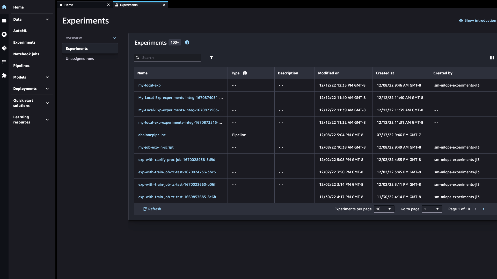
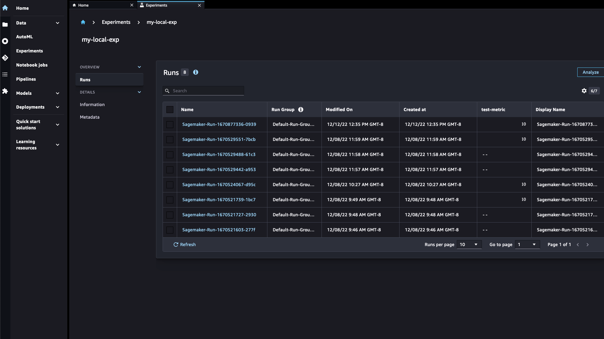

# View experiments and runs

Amazon SageMaker Studio Classic provides an experiments browser that you can use to view lists of
experiments and runs. You can choose one of these entities to view detailed information about
the entity or choose multiple entities for comparison. You can filter the list of experiments
by entity name, type, and tags.

###### To view experiments and runs

1. To view the experiment in Studio Classic, in the left sidebar, choose
   **Experiments**.

Select the name of the experiment to view all associated runs. You can search
experiments by typing directly into the **Search** bar or filtering for
experiment type. You can also choose which columns to display in your experiment or run
list.

It might take a moment for the list to refresh and display a new experiment or
experiment run. You can click **Refresh** to update the page. Your
experiment list should look similar to the following:

 2. In the experiments list, double-click an experiment to display a list of the runs in
the experiment.

###### Note

Experiment runs that are automatically created by SageMaker AI jobs and containers are
visible in the Experiments Studio Classic UI by default. To hide runs created by SageMaker AI jobs
for a given experiment, choose the settings icon (

) and toggle **Show jobs**.

 3. Double-click a run to display information about a specific run.

In the **Overview** pane, choose any of the following headings to see
available information about each run:

    * **Metrics** – Metrics that are logged during a run.
    * **Charts** – Build your own charts to compare runs.
    * **Output artifacts** – Any resulting artifacts of the
     experiment run and the artifact locations in Amazon S3.
    * **Bias reports** – Pre-training or post-training bias
     reports generated using Clarify.
    * **Explainability**– Explainability reports generated
     using Clarify.
    * **Debugs** – A list of debugger rules and any issues
     found.
