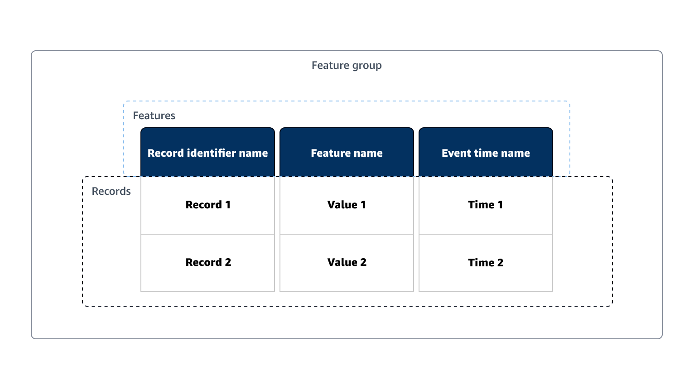
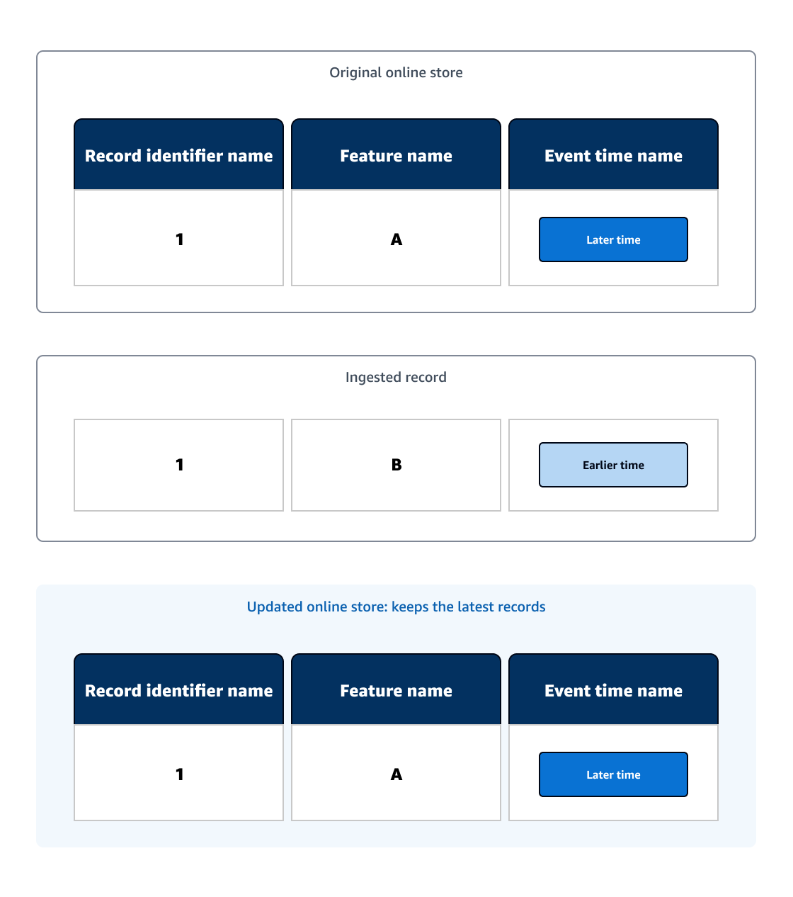
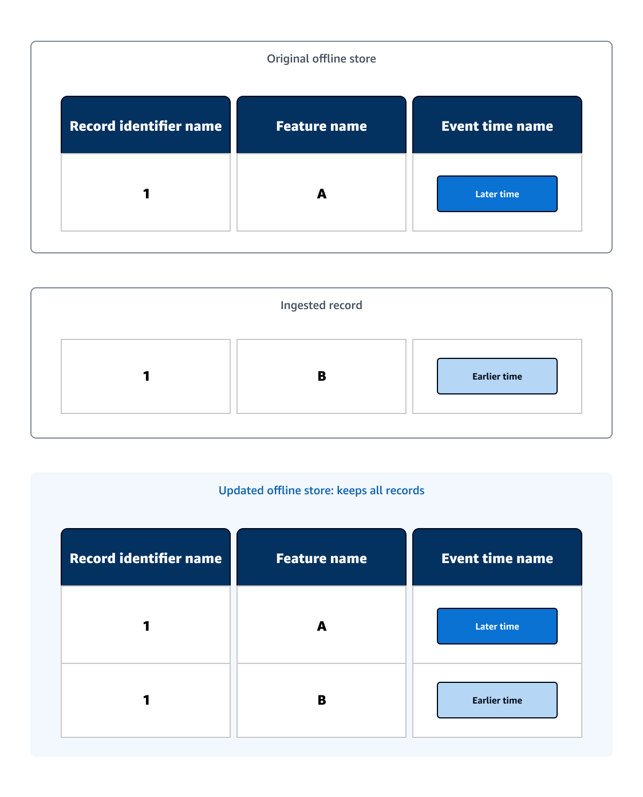

# Feature Store concepts

We list common terms used in Amazon SageMaker Feature Store, followed by example diagrams to visualize a few
concepts:

- **Feature Store**: Storage and data management layer for machine learning
  (ML) features. Serves as the single source of truth to store, retrieve, remove, track, share,
  discover, and control access to features. In the following example diagram, the Feature Store is a store
  for your feature groups, which contains your ML data, and provides additional services.
- **Online store**: Low latency, high availability store for a
  feature group that enables real-time lookup of records. The online store allows quick access to
  the latest record via the `GetRecord` API.
- **Offline store**: Stores historical data in your Amazon S3 bucket.
  The offline store is used when low (sub-second) latency reads are not needed. For example, the
  offline store can be used when you want to store and serve features for exploration, model
  training, and batch inference.
- **Feature group**: The main resource of Feature Store that contains the data
  and metadata used for training or predicting with a ML model. A feature group is a logical
  grouping of features used to describe records. In the following example diagram, a feature group
  contains your ML data.
- **Feature**: A property that is used as one of the inputs to train
  or predict using your ML model. In the Feature Store API a feature is an attribute of a record. In the
  following example diagram, a feature describes a column in your ML data table.
- **Feature definition**: Consists of a name and one of the data
  types: integral, string or fractional. A feature group contains a list of feature definitions.
  For more information on Feature Store data types, see [Data types](feature-store-quotas.md#feature-store-data-types "feature-store-quotas.md#feature-store-data-types").
- **Record**: Collection of values for features for a single record
  identifier. A combination of record identifier and event time values uniquely identify a record
  within a feature group. In the following example diagram, a record is a row in your ML data
  table.
- **Record identifier name**: The record identifier name is the name
  of the feature that identifies the records. It must refer to one of the names of a feature
  defined in the feature group's feature definitions. Each feature group is defined with a record
  identifier name.
- **Event time**: Timestamp that you provide corresponding to when
  the record event occurred. All records in a feature group must have a corresponding event time.
  The online store only contains the record corresponding to the latest event time, whereas the
  offline store contains all historic records. For more information on event time formats, see
  [Data types](feature-store-quotas.md#feature-store-data-types "feature-store-quotas.md#feature-store-data-types").
- **Ingestion**: Adding new records to a feature group. Ingestion is
  typically achieved via the `PutRecord` API.

###### Topics

- [Concepts overview diagram](#feature-store-concepts-overview "#feature-store-concepts-overview")
- [Ingestion diagrams](#feature-store-concepts-ingestion "#feature-store-concepts-ingestion")

## Concepts overview diagram

The following example diagram conceptualizes a few Feature Store concepts:

The Feature Store contains your feature groups and a feature group contains your ML data. In the
example diagram, the original feature group contains a data table that has three features (each
describing a column) and two records (rows).

- A feature's definition describes the feature name and data type of the feature values that
  are associated with records.
- A record contains the feature values and is uniquely identified by its record identifier
  and must include the event time.

## Ingestion diagrams

Ingestion is the action of adding a record or records to an existing feature group. The
online and offline stores are updated differently for different storage use cases.

**Ingestion to the online store example**

The online store acts as a real-time look-up of records and only keeps the most up-to-date
records. Once a record is ingested into an existing online store, the updated online store will
only keep the record with the latest event time.

In the following example diagram, the original online store contains a ML data table with
one record. A record is ingested with the same record identifier name as the original record, and
the ingested record has an earlier event time than the original record. As the updated online
store only keeps the record with the latest event time, the updated online store contains the
original record.

**Ingestion to the offline store example**

The offline store acts as a historical look-up of records and keeps all records. After a new
record is ingested into an existing offline store, the updated offline store will keep the new
record.

In the following example diagram, the original offline store contains a ML data table with
one record. A record is ingested with the same record identifier name as the original record, and
the ingested record has an event time earlier than the original record. As the updated offline
store keeps all of the records, the updated offline store contains both records.

