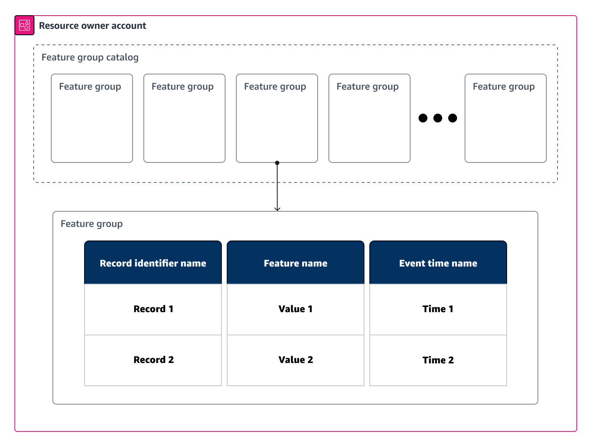

# Cross account feature group discoverability and

access

Data scientists and data engineers can benefit from exploring and accessing features that
span multiple accounts, in order to promote data consistency, streamline collaboration, and reduce
duplication of effort.

With Amazon SageMaker Feature Store, you can share feature group resources across accounts. The resources that can
be shared in Feature Store are feature group entities or the feature group catalog, where the feature group
catalog contains all of the feature group entities on your account. The resource owner account
shares resources with the resource consumer accounts. There are two distinct categories of
permissions associated with sharing resources:

- **Discoverability permission**: _Discoverability_ means being able to see feature group names and metadata. When you
  share the feature group catalog and grant the discoverability permission, all feature group
  entities in the account that you share from (resource owner account) become discoverable by the
  accounts that you are sharing with (resource consumer account). For example, if you make the
  feature group catalog in the resource owner account discoverable to a resource consumer account,
  then principals of the resource consumer account can see all feature groups contained in the
  resource owner account. It means discoverability is “all or nothing” at the account level
  (regionalized). This permission is granted to resource consumer accounts by using the feature
  group catalog resource type.
- **Access permissions**: When you grant an access permission,
  you do so at a feature group resource level (not at account level). This gives you more granular
  control over granting access to data. The type of access permissions that can be granted are:
  read-only, read-write, and admin. For example, you can select only certain feature groups from
  the resource owner account to be accessible by principals of the resource consumer account,
  depending on your business needs. This permission is granted to resource consumer accounts by
  using the feature group resource type and specifying feature group entities.
  The distinction between discoverability and access is important to keep in mind when you set
  up cross account sharing. Also, the methods of sharing resources differ depending on whether you
  are sharing online or offline feature groups. For information about online and offline feature
  groups, see [Feature Store concepts](feature-store-concepts.md "feature-store-concepts.md"). In
  the following topics, you can learn how to apply discoverability and access permissions to your
  shared resources.

The following example diagram visualizes the feature group catalog resource versus a feature
group resource entity. The feature group catalog contains _all_
of your feature group entities and can be shared using the discoverability permission. When
granted a discoverability permission, the resource consumer account can search and discover
_all_ feature group entities within the resource owner account.
A feature group entity contains your machine learning data and can be shared using the access
permission. When granted an access permission, the resource consumer account can access the
feature group data, with access determined by the relevant access permission.

###### Topics

- [Enabling cross account
  discoverability](feature-store-cross-account-discoverability.md "feature-store-cross-account-discoverability.md")
- [Enabling cross account access](feature-store-cross-account-access.md "feature-store-cross-account-access.md")
