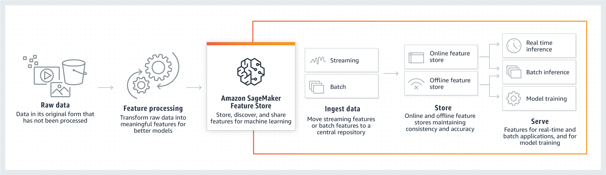

# Create, store, and share features with Feature Store

The machine learning (ML) development process includes extracting raw data, transforming it
into _features_ (meaningful inputs for your ML model). Those
features are then stored in a serviceable way for data exploration, ML training, and ML
inference. Amazon SageMaker Feature Store simplifies how you create, store, share, and manage features. This is done
by providing feature store options and reducing repetitive data processing and curation
work.

Among other things, with Feature Store you can:

- Simplify feature processing, storing, retrieving, and sharing features for ML
  development across accounts or in an organization.
- Track your feature processing code development, apply your feature processor to the raw
  data, and ingest your features into Feature Store in a consistent way. This reduces training-serving
  skew, a common issue in ML where the difference between performance during training and
  serving can impact the accuracy of your ML model.
- Store your features and associated metadata in feature groups, so features can be easily
  discovered and reused. Feature groups are mutable and can evolve their schema after
  creation.
- Create feature groups that can be configured to include an online or offline store, or
  both, to manage your features and automate how features are stored for your ML tasks.

      + The online store retains only the latest records for your features. This is
       primarily designed for supporting real-time predictions that need low millisecond
       latency reads and high throughput writes.
      + The offline store keeps all records for your features as a historical database. This
       is primarily intended for data exploration, model training, and batch
       predictions.

  The following diagram shows how you can use Feature Store as part of your ML pipeline. Once you read
  in your raw data, you can use Feature Store to transform the raw data into features and ingest them into
  your feature group. The features can be ingested via streaming or batches to the feature group's
  online and offline stores. The features can then be served for data exploration, model training,
  and real-time or batch inference.

## How Feature Store works

In Feature Store, features are stored in a collection called a _feature
group_. You can visualize a feature group as a table in which each column is a
feature, with a unique identifier for each row. In principle, a feature group is composed of
features and values specific to each feature. A `Record` is a collection of values
for features that correspond to a unique `RecordIdentifier`. Altogether, a
`FeatureGroup` is a group of features defined in your `FeatureStore`
to describe a `Record`. 

You can use Feature Store in the following modes: 

- **Online** – In online mode, features are read with
  low latency (milliseconds) reads and used for high throughput predictions. This mode
  requires a feature group to be stored in an online store.
- **Offline** – In offline mode, large streams of data
  are fed to an offline store, which can be used for training and batch inference. This mode
  requires a feature group to be stored in an offline store. The offline store uses your S3
  bucket for storage and can also fetch data using Athena queries.
- **Online and Offline** – This includes both online and
  offline modes.

You can ingest data into feature groups in Feature Store in two ways: streaming or in batches. When
you ingest data through streaming, a collection of records are pushed to Feature Store by calling a
synchronous `PutRecord` API call. This API enables you to maintain the latest
feature values in Feature Store and to push new feature values as soon an update is detected.

Alternatively, Feature Store can process and ingest data in batches. For example, you can author
features using Amazon SageMaker Data Wrangler and export a notebook from Data Wrangler. The notebook can be a SageMaker Processing
job that ingests the features in batches to a Feature Store feature group. This mode allows for batch
ingestion into the offline store. It also supports ingestion into the online store if the
feature group is configured for both online and offline use. 

## Create feature groups

To ingest features into Feature Store, you must first define the feature group and the feature
definitions (feature name and data type) for all features that belong to the feature group.
After they are created, feature groups are mutable and can evolve their schema. Feature group
names are unique within an AWS Region and AWS account. When creating a feature group, you
can also create the metadata for the feature group. The metadata can contain a short
description, storage configuration, features for identifying each record, and the event time.
Furthermore, the metadata can include tags to store information such as the author, data
source, version, and more.

###### Important

`FeatureGroup` names or associated metadata such as description or tags
should not contain any personal identifiable information (PII) or confidential information.

## Find, discover, and share features

After you create a feature group in Feature Store, other authorized users of the feature store can
share and discover it. Users can browse through a list of all feature groups in Feature Store or
discover existing feature groups by searching by feature group name, description, record
identifier name, creation date, and tags. 

## Real-time inference for features stored in the online

store

With Feature Store, you can enrich your features stored in the online store in real time with data
from a streaming source (clean stream data from another application) and serve the features
with low millisecond latency for real-time inference. 

You can also perform joins across different `FeatureGroups` for real-time
inference by querying two different `FeatureGroups` in the client application. 

## Offline store for model training and batch

inference

Feature Store provides offline storage for feature values in your S3 bucket. Your data is stored in
your S3 bucket using a prefixing scheme based on event time. The offline store is an
append-only store, enabling Feature Store to maintain a historical record of all feature values. Data
is stored in the offline store in Parquet format for optimized storage and query
access.

You can query, explore, and visualize features using Data Wrangler from the console.  Feature Store supports
combining data to produce, train, validate, and test data sets, and allows you to extract data
at different points in time.

## Feature data ingestion

Feature generation pipelines can be created to process large batches (1 million rows of
data or more) or small batches, and to write feature data to the offline or online store.
Streaming sources such as Amazon Managed Streaming for Apache Kafka or Amazon Kinesis can also be used as data sources from which
features are extracted and directly fed to the online store for training, inference, or
feature creation. 

You can push records to Feature Store by calling the synchronous `PutRecord` API call.
Since this is a synchronous API call, it allows small batches of updates to be pushed in a
single API call. This enables you to maintain high freshness of the feature values and publish
values as soon as an update is detected. These are also called _streaming features_. 

When feature data is ingested and updated, Feature Store stores historical data for all features in
the offline store. For batch ingest, you can pull feature values from your S3 bucket or use
Athena to query. You can also use Data Wrangler to process and engineer new features that can then be
exported to a chosen S3 bucket to be accessed by Feature Store. For batch ingestion, you can configure
a processing job to batch ingest your data into Feature Store, or you can pull feature values from your
S3 bucket using Athena. 

To remove a `Record` from your online store, use the [`DeleteRecord`](../APIReference/API_feature_store_DeleteRecord.md "../APIReference/API_feature_store_DeleteRecord.md") API call. This will also add the deleted record to the
offline store.

## Resilience in Feature Store

Feature Store is distributed across multiple Availability Zones (AZs). An AZ is an isolated
location within an AWS Region. If some AZs fail, Feature Store can use other AZs. For more
information about AZs, see [Resilience in Amazon SageMaker AI](disaster-recovery-resiliency.md "disaster-recovery-resiliency.md").
