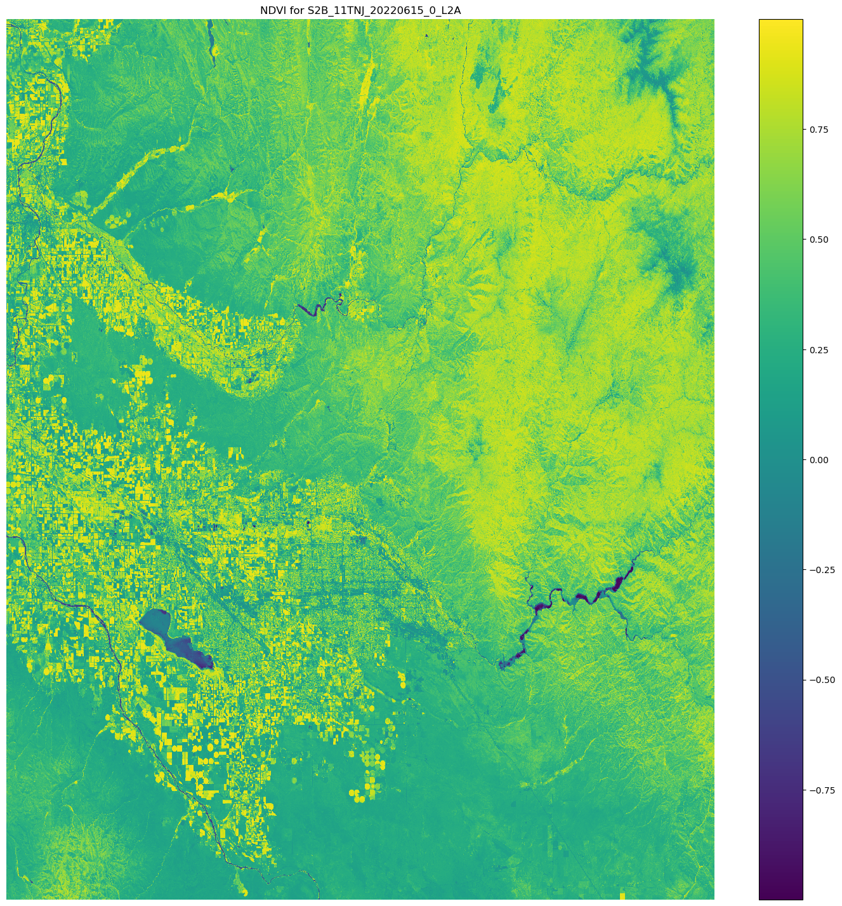

# Using `ScriptProcessor` to

calculate the Normalized Difference Vegetation Index (NDVI) using Sentinel-2
satellite data

The
following code samples show you how to calculate the normalized
difference vegetation index of a specific geographical area using the purpose-built
geospatial image within a Studio Classic notebook and run a large-scale workload with Amazon SageMaker Processing
using
[`ScriptProcessor`](https://sagemaker.readthedocs.io/en/stable/api/training/processing.html#sagemaker.processing.ScriptProcessor "https://sagemaker.readthedocs.io/en/stable/api/training/processing.html#sagemaker.processing.ScriptProcessor") from the SageMaker AI
Python
SDK.

This demo also uses an Amazon SageMaker Studio Classic notebook instance that uses the geospatial kernel and
instance type. To learn how to create a Studio Classic geospatial notebook instance, see
[Create an Amazon SageMaker Studio Classic notebook using the
geospatial image](geospatial-launch-notebook.md "geospatial-launch-notebook.md").

You can follow along with this demo in your own notebook instance by copying and
pasting the following code snippets:

1. [Use
   search_raster_data_collection to query a specific area of
   interest (AOI) over a given a time range using a specific raster data
   collection, Sentinel-2.](#geospatial-custom-operations-procedure-search "#geospatial-custom-operations-procedure-search")
2. [Create a manifest file
   that specifies what data will be processed during the processing
   job.](#geospatial-custom-operations-procedure-manifest "#geospatial-custom-operations-procedure-manifest")
3. [Write a data processing Python
   script calculating the NDVI.](#geospatial-custom-operations-script-mode "#geospatial-custom-operations-script-mode")
4. [Create a
   ScriptProcessor instance and start the Amazon SageMaker Processing
   job](#geospatial-custom-operations-create "#geospatial-custom-operations-create").
5. [Visualizing the results of
   your processing job](#geospatial-custom-operations-visual "#geospatial-custom-operations-visual").

## Query

the Sentinel-2 raster data collection using
`SearchRasterDataCollection`

With `search_raster_data_collection` you can query supported raster
data collections. This example uses data that's pulled from
Sentinel-2
satellites. The area of interest (`AreaOfInterest`) specified is rural
northern Iowa, and the time range (`TimeRangeFilter`) is January 1, 2022
to December 30, 2022. To see the available raster data collections in your
AWS Region use `list_raster_data_collections`. To see a code example
using this API, see [ListRasterDataCollections](geospatial-data-collections.md "geospatial-data-collections.md") in the
_Amazon SageMaker AI Developer Guide_.

In following code examples you
use
the ARN associated with Sentinel-2 raster data collection,
`arn:aws:sagemaker-geospatial:us-west-2:378778860802:raster-data-collection/public/nmqj48dcu3g7ayw8`.

A `search_raster_data_collection` API request requires two parameters:

- You need to specify an `Arn` parameter that corresponds to the raster data
  collection that you want to query.
- You also need to specify a `RasterDataCollectionQuery` parameter, which takes
  in a Python dictionary.

The following code example contains the necessary key-value pairs needed for the
`RasterDataCollectionQuery` parameter saved to the
`search_rdc_query` variable.

```
search_rdc_query = {
    "AreaOfInterest": {
        "AreaOfInterestGeometry": {
            "PolygonGeometry": {
                "Coordinates": [[
                    [
              -94.50938680498298,
              43.22487436936203
            ],
            [
              -94.50938680498298,
              42.843474642037194
            ],
            [
              -93.86520004156142,
              42.843474642037194
            ],
            [
              -93.86520004156142,
              43.22487436936203
            ],
            [
              -94.50938680498298,
              43.22487436936203
            ]
               ]]
            }
        }
    },
    "TimeRangeFilter": {"StartTime": "2022-01-01T00:00:00Z", "EndTime": "2022-12-30T23:59:59Z"}
}
```

To make the `search_raster_data_collection` request, you must specify
the ARN of the Sentinel-2 raster data collection:
`arn:aws:sagemaker-geospatial:us-west-2:378778860802:raster-data-collection/public/nmqj48dcu3g7ayw8`.
You also must
need
to pass in the
Python
dictionary that was defined previously, which
specifies
query parameters.

```
## Creates a SageMaker Geospatial client instance
sm_geo_client= session.create_client(service_name="sagemaker-geospatial")

search_rdc_response1 = sm_geo_client.search_raster_data_collection(
    Arn=`'arn:aws:sagemaker-geospatial:us-west-2:378778860802:raster-data-collection/public/nmqj48dcu3g7ayw8'`,
    RasterDataCollectionQuery=search_rdc_query
)
```

The results of this API can not be paginated. To collect all the satellite images returned
by the `search_raster_data_collection` operation, you can implement a
`while` loop. This checks for`NextToken` in the API
response:

```
## Holds the list of API responses from search_raster_data_collection
items_list = []
while search_rdc_response1.get('NextToken') and search_rdc_response1['NextToken'] != None:
    items_list.extend(search_rdc_response1['Items'])

    search_rdc_response1 = sm_geo_client.search_raster_data_collection(
    	Arn=`'arn:aws:sagemaker-geospatial:us-west-2:378778860802:raster-data-collection/public/nmqj48dcu3g7ayw8'`,
        RasterDataCollectionQuery=search_rdc_query,
        NextToken=search_rdc_response1['NextToken']
    )
```

The API response returns a list of URLs under the `Assets` key
corresponding to specific image bands. The following is a truncated version of the
API response. Some of the image bands were removed for clarity.

```
{
	'Assets': {
        'aot': {
            'Href': 'https://sentinel-cogs.s3.us-west-2.amazonaws.com/sentinel-s2-l2a-cogs/15/T/UH/2022/12/S2A_15TUH_20221230_0_L2A/AOT.tif'
        },
        'blue': {
            'Href': 'https://sentinel-cogs.s3.us-west-2.amazonaws.com/sentinel-s2-l2a-cogs/15/T/UH/2022/12/S2A_15TUH_20221230_0_L2A/B02.tif'
        },
        'swir22-jp2': {
            'Href': 's3://sentinel-s2-l2a/tiles/15/T/UH/2022/12/30/0/B12.jp2'
        },
        'visual-jp2': {
            'Href': 's3://sentinel-s2-l2a/tiles/15/T/UH/2022/12/30/0/TCI.jp2'
        },
        'wvp-jp2': {
            'Href': 's3://sentinel-s2-l2a/tiles/15/T/UH/2022/12/30/0/WVP.jp2'
        }
    },
    'DateTime': datetime.datetime(2022, 12, 30, 17, 21, 52, 469000, tzinfo = tzlocal()),
    'Geometry': {
        'Coordinates': [
            [
                [-95.46676936182894, 43.32623760511659],
                [-94.11293433656887, 43.347431265475954],
                [-94.09532154452742, 42.35884880571144],
                [-95.42776890002203, 42.3383710796791],
                [-95.46676936182894, 43.32623760511659]
            ]
        ],
        'Type': 'Polygon'
    },
    'Id': 'S2A_15TUH_20221230_0_L2A',
    'Properties': {
        'EoCloudCover': 62.384969,
        'Platform': 'sentinel-2a'
    }
}
```

In the [next
section](#geospatial-custom-operations-procedure-manifest "#geospatial-custom-operations-procedure-manifest"), you create a manifest file using the `'Id'` key from
the API response.

## Create an input

manifest file using the `Id` key from the
`search_raster_data_collection` API response

When you run a processing job, you must specify a data input from Amazon S3. The input
data type can either be a manifest file, which then points to the individual data
files. You can also add a
prefix
to each file that you want processed. The following code example
defines the folder where your manifest files will be generated.

Use SDK for Python (Boto3) to get the default bucket and the
ARN
of the execution role that is associated with your Studio Classic notebook
instance:

```
sm_session = sagemaker.session.Session()
s3 = boto3.resource('s3')
# Gets the default excution role associated with the notebook
execution_role_arn = sagemaker.get_execution_role()

# Gets the default bucket associated with the notebook
s3_bucket = sm_session.default_bucket()

# Can be replaced with any name
s3_folder = `"script-processor-input-manifest"`
```

Next, you
create
a manifest file. It will hold the URLs of the satellite images
that you wanted processed when you run your processing job later in step 4.

```
# Format of a manifest file
manifest_prefix = {}
manifest_prefix['prefix'] = 's3://' + s3_bucket + '/' + s3_folder + '/'
manifest = [manifest_prefix]

print(manifest)
```

The following code sample returns the S3 URI where your
manifest files will be created.

```
[{'prefix': 's3://sagemaker-us-west-2-111122223333/script-processor-input-manifest/'}]
```

All the response elements from the search_raster_data_collection response are not
needed to run the processing job.

The following code snippet removes the unnecessary elements
`'Properties'`, `'Geometry'`, and `'DateTime'`.
The `'Id'` key-value pair, `'Id': 'S2A_15TUH_20221230_0_L2A'`,
contains the year and the month. The following code example parses that data to
create new keys in the Python dictionary
`dict_month_items`. The values are the assets that are
returned from the `SearchRasterDataCollection` query.

```
# For each response get the month and year, and then remove the metadata not related to the satelite images.
dict_month_items = {}
for item in items_list:
    # Example ID being split: 'S2A_15TUH_20221230_0_L2A'
    yyyymm = item['Id'].split("_")[2][:6]
    if yyyymm not in dict_month_items:
        dict_month_items[yyyymm] = []

    # Removes uneeded metadata elements for this demo
    item.pop('Properties', None)
    item.pop('Geometry', None)
    item.pop('DateTime', None)

    # Appends the response from search_raster_data_collection to newly created key above
    dict_month_items[yyyymm].append(item)
```

This code example
uploads
the `dict_month_items` to Amazon S3 as a JSON object using
the [`.upload_file()`](https://boto3.amazonaws.com/v1/documentation/api/latest/reference/services/s3/client/upload_file.html "https://boto3.amazonaws.com/v1/documentation/api/latest/reference/services/s3/client/upload_file.html") API operation:

```
## key_ is the yyyymm timestamp formatted above
## value_ is the reference to all the satellite images collected via our searchRDC query
for key_, value_ in dict_month_items.items():
    filename = f'manifest_{key_}.json'
    with open(filename, 'w') as fp:
        json.dump(value_, fp)
    s3.meta.client.upload_file(filename, s3_bucket, s3_folder + '/' + filename)
    manifest.append(filename)
    os.remove(filename)
```

This code example uploads a parent `manifest.json` file that points to
all the other manifests uploaded to Amazon S3. It also saves the path to a local
variable: `s3_manifest_uri`. You'll use that variable again to
specify the source of the input data when you run the processing job in step 4.

```
with open('manifest.json', 'w') as fp:
    json.dump(manifest, fp)
s3.meta.client.upload_file('manifest.json', s3_bucket, s3_folder + '/' + 'manifest.json')
os.remove('manifest.json')

s3_manifest_uri = f's3://{s3_bucket}/{s3_folder}/manifest.json'
```

Now that you created the input manifest files and uploaded them, you can write a
script that processes your data in the processing job. It processes the data from
the satellite images, calculates the NDVI, and then returns the results to a
different Amazon S3 location.

## Write a script that

calculates the NDVI

Amazon SageMaker Studio Classic supports the use of the `%%writefile` cell magic
command. After running a cell with this command, its contents will be saved to your
local Studio Classic directory. This is code specific to calculating NDVI. However, the
following can be useful when you write your own script for a processing job:

- In your processing job container, the local paths inside the container
  must begin with `/opt/ml/processing/`. In this example,
  `input_data_path = '/opt/ml/processing/input_data/'` and `processed_data_path =
'/opt/ml/processing/output_data/'` are specified in that
  way.
- With Amazon SageMaker Processing,
  a
  script that a processing job runs can upload your
  processed data directly to Amazon S3. To do so, make sure that the execution role
  associated with your `ScriptProcessor` instance has the necessary
  requirements to access the S3 bucket. You can also specify an outputs
  parameter when you run your processing job. To learn more, see the [`.run()` API operation](https://sagemaker.readthedocs.io/en/stable/api/training/processing.html#sagemaker.processing.ScriptProcessor.run "https://sagemaker.readthedocs.io/en/stable/api/training/processing.html#sagemaker.processing.ScriptProcessor.run") in the
  _Amazon SageMaker Python SDK_. In this code example, the
  results of the data processing are uploaded directly to Amazon S3.
- To manage the size of the Amazon EBScontainer attached to your processing jobuse the
  `volume_size_in_gb` parameter. The containers's default size
  is 30 GB. You can aslo optionally use the Python library [Garbage
  Collector](https://docs.python.org/3/library/gc.html "https://docs.python.org/3/library/gc.html") to manage storage in your Amazon EBS container.

The following code example loads the arrays into the processing job
container. When arrays build up and fill in the memory, the processing job
crashes. To prevent this crash, the following example contains commands that
remove the arrays from the processing job’s
container.

```
%%writefile compute_ndvi.py

import os
import pickle
import sys
import subprocess
import json
import rioxarray

if __name__ == "__main__":
    print("Starting processing")

    input_data_path = '/opt/ml/processing/input_data/'
    input_files = []

    for current_path, sub_dirs, files in os.walk(input_data_path):
        for file in files:
            if file.endswith(".json"):
                input_files.append(os.path.join(current_path, file))

    print("Received {} input_files: {}".format(len(input_files), input_files))

    items = []
    for input_file in input_files:
        full_file_path = os.path.join(input_data_path, input_file)
        print(full_file_path)
        with open(full_file_path, 'r') as f:
            items.append(json.load(f))

    items = [item for sub_items in items for item in sub_items]

    for item in items:
        red_uri = item["Assets"]["red"]["Href"]
        nir_uri = item["Assets"]["nir"]["Href"]

        red = rioxarray.open_rasterio(red_uri, masked=True)
        nir = rioxarray.open_rasterio(nir_uri, masked=True)

        ndvi = (nir - red)/ (nir + red)

        file_name = 'ndvi_' + item["Id"] + '.tif'
        output_path = '/opt/ml/processing/output_data'
        output_file_path = f"{output_path}/{file_name}"

        ndvi.rio.to_raster(output_file_path)
        print("Written output:", output_file_path)
```

You now have a script that can calculate the NDVI. Next, you can create an
instance of the ScriptProcessor and run your Processing job.

## Creating an instance of the

`ScriptProcessor` class

This demo uses the [ScriptProcessor](https://sagemaker.readthedocs.io/en/stable/api/training/processing.html#sagemaker.processing.ScriptProcessor "https://sagemaker.readthedocs.io/en/stable/api/training/processing.html#sagemaker.processing.ScriptProcessor") class that is available via the Amazon SageMaker Python SDK.
First, you need to create an instance of the class, and then you can start your
Processing job by using the `.run()` method.

```
from sagemaker.processing import ScriptProcessor, ProcessingInput, ProcessingOutput

image_uri = `'081189585635.dkr.ecr.us-west-2.amazonaws.com/sagemaker-geospatial-v1-0:latest'`

processor = ScriptProcessor(
	command=['python3'],
	image_uri=image_uri,
	role=execution_role_arn,
	instance_count=4,
	instance_type='ml.m5.4xlarge',
	sagemaker_session=sm_session
)

print('Starting processing job.')
```

When you start your Processing job, you need to specify a [`ProcessingInput`](https://sagemaker.readthedocs.io/en/stable/api/training/processing.html#sagemaker.processing.ProcessingInput "https://sagemaker.readthedocs.io/en/stable/api/training/processing.html#sagemaker.processing.ProcessingInput") object. In that object, you specify
the following:

- The path to the manifest file that you created in step 2,
  `s3_manifest_uri`. This is the source of the input
  data to the container.
- The path to where you want the input data to be saved in the container.
  This must match the path that you specified in your script.
- Use the `s3_data_type` parameter to specify the input as
  `"ManifestFile"`.

```
s3_output_prefix_url = f"s3://{s3_bucket}/{s3_folder}/output"

processor.run(
    code='compute_ndvi.py',
    inputs=[
        ProcessingInput(
            source=s3_manifest_uri,
            destination='/opt/ml/processing/input_data/',
            s3_data_type="ManifestFile",
            s3_data_distribution_type="ShardedByS3Key"
        ),
    ],
    outputs=[
        ProcessingOutput(
            source='/opt/ml/processing/output_data/',
            destination=s3_output_prefix_url,
            s3_upload_mode="Continuous"
        )
    ]
)
```

The following code example uses the [`.describe()` method](https://sagemaker.readthedocs.io/en/stable/api/training/processing.html#sagemaker.processing.ProcessingJob.describe "https://sagemaker.readthedocs.io/en/stable/api/training/processing.html#sagemaker.processing.ProcessingJob.describe") to get details of your Processing
job.

```
preprocessing_job_descriptor = processor.jobs[-1].describe()
s3_output_uri = preprocessing_job_descriptor["ProcessingOutputConfig"]["Outputs"][0]["S3Output"]["S3Uri"]
print(s3_output_uri)
```

## Visualizing your results using

`matplotlib`

With the [Matplotlib](https://matplotlib.org/stable/index.html "https://matplotlib.org/stable/index.html") Python
library, you can plot raster data. Before you plot the data, you need to calculate
the NDVI using sample images from the Sentinel-2 satellites. The following code
example opens the image arrays using the `.open_rasterio()` API
operation, and then calculates the NDVI using the `nir` and
`red` image bands from the Sentinel-2 satellite data.

```
# Opens the python arrays
import rioxarray

red_uri = items[25]["Assets"]["red"]["Href"]
nir_uri = items[25]["Assets"]["nir"]["Href"]

red = rioxarray.open_rasterio(red_uri, masked=True)
nir = rioxarray.open_rasterio(nir_uri, masked=True)

# Calculates the NDVI
ndvi = (nir - red)/ (nir + red)

# Common plotting library in Python
import matplotlib.pyplot as plt

f, ax = plt.subplots(figsize=(18, 18))
ndvi.plot(cmap='viridis', ax=ax)
ax.set_title("NDVI for {}".format(items[25]["Id"]))
ax.set_axis_off()
plt.show()
```

The output of the preceding code example is a satellite image with the NDVI values overlaid
on it. An NDVI value near 1 indicates lots of vegetation is present, and values near
0 indicate no vegetation is presentation.



This completes the demo of using `ScriptProcessor`.
