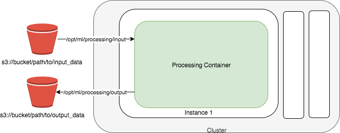

# Using a

processing
jobs for custom geospatial workloads

With [Amazon SageMaker Processing](processing-job.md "processing-job.md"), you can use a simplified, managed experience on SageMaker AI to run your data processing workloads with the purpose-built geospatial container.

The underlying infrastructure for a Amazon SageMaker Processing job is fully managed by SageMaker AI. During a processing
job, cluster resources are provisioned for the duration of your job, and cleaned up when a
job completes.

The preceding diagram shows how SageMaker AI spins up a geospatial processing job. SageMaker AI takes your geospatial workload script, copies your geospatial data from Amazon Simple Storage Service(Amazon S3), and then pulls the specified geospatial container. The underlying infrastructure for the processing job is fully managed by SageMaker AI. Cluster resources are provisioned for the duration of your job, and cleaned up when a job completes. The output of the processing job is stored in the bucket you specified.

###### Path naming constraints

The local paths inside a Processing jobs container must begin with
`/opt/ml/processing/`.

SageMaker geospatial provides a purpose-built container, `081189585635.dkr.ecr.us-west-2.amazonaws.com/sagemaker-geospatial-v1-0:latest` that can be specified when running a processing job.

###### Topics

- [Overview:
  Run processing jobs using ScriptProcessor and a SageMaker geospatial
  container](geospatial-custom-operations-overview.md "geospatial-custom-operations-overview.md")
- [Using ScriptProcessor to
  calculate the Normalized Difference Vegetation Index (NDVI) using Sentinel-2
  satellite data](geospatial-custom-operations-procedure.md "geospatial-custom-operations-procedure.md")
