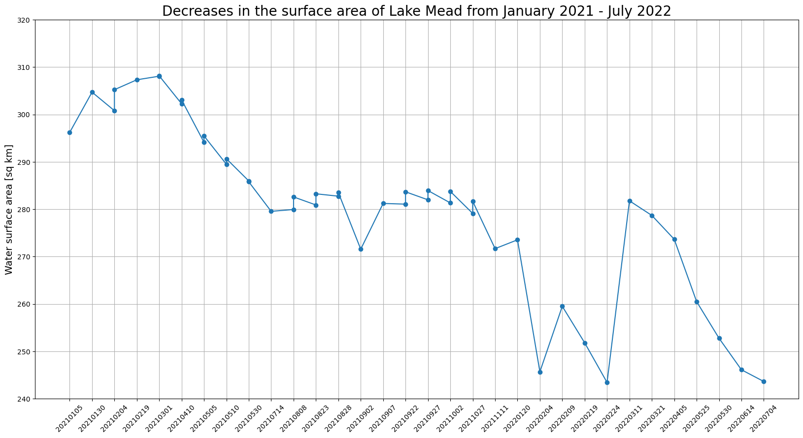

# Access the Sentinel-2 raster data collection and create an earth observation job to perform land segmentation

This Python-based tutorial uses the SDK for Python (Boto3) and an Amazon SageMaker Studio Classic notebook. To
complete this demo successfully, make sure that you have the required AWS Identity and Access Management (IAM)
permissions to use SageMaker geospatial and Studio Classic. SageMaker geospatial requires that you have a
user,
group, or role which can access
Studio Classic. You must also have a SageMaker AI execution role that specifies the SageMaker geospatial service
principal, `sagemaker-geospatial.amazonaws.com` in its trust policy.

To learn more about these requirements,
see
[SageMaker geospatial IAM
roles](sagemaker-geospatial-roles.md "sagemaker-geospatial-roles.md").

This tutorial shows you how to use SageMaker geospatial API to complete the following tasks:

- Find the available raster data collections with
  `list_raster_data_collections`.
- Search a specified raster data collection by using
  `search_raster_data_collection`.
- Create an earth observation job (EOJ) by using
  `start_earth_observation_job`.

## Using `list_raster_data_collections`

to find available data collections

SageMaker geospatial supports multiple raster data collections. To learn more about the available
data collections, see [Data collections](geospatial-data-collections.md "geospatial-data-collections.md").

This demo uses satellite data that's collected from [Sentinel-2
Cloud-Optimized
GeoTIFF](https://registry.opendata.aws/sentinel-2-l2a-cogs/ "https://registry.opendata.aws/sentinel-2-l2a-cogs/")
satellites. These satellites provide global coverage of Earth's land surface every
five days. In addition to collecting surface images of Earth, the Sentinel-2
satellites also collect data across a variety of spectralbands.

To search an area of interest (AOI), you
need
the ARN that's associated with the Sentinel-2 satellite data. To
find the available data collections and their associated ARNs in your AWS Region,
use the `list_raster_data_collections` API operation.

Because the response can be paginated, you must use the `get_paginator`
operation to return all of the relevant data:

```
import boto3
import sagemaker
import sagemaker_geospatial_map
import json

## SageMaker Geospatial  is currently only avaialable in US-WEST-2
session = boto3.Session(region_name='us-west-2')
execution_role = sagemaker.get_execution_role()

## Creates a SageMaker Geospatial client instance
geospatial_client = session.client(service_name="sagemaker-geospatial")

# Creates a resusable Paginator for the list_raster_data_collections API operation
paginator = geospatial_client.get_paginator("list_raster_data_collections")

# Create a PageIterator from the paginator class
page_iterator = paginator.paginate()

# Use the iterator to iterate throught the results of list_raster_data_collections
results = []
for page in page_iterator:
    results.append(page['RasterDataCollectionSummaries'])

print(results)
```

This is a sample JSON response from the `list_raster_data_collections`
API operation. It's truncated to include only the data collection
(Sentinel-2) that's used in
this
code example. For more details about
a specific raster data collection, use
`get_raster_data_collection`:

```
{
    "Arn": "arn:aws:sagemaker-geospatial:us-west-2:378778860802:raster-data-collection/public/nmqj48dcu3g7ayw8",
    "Description": "Sentinel-2a and Sentinel-2b imagery, processed to Level 2A (Surface Reflectance) and converted to Cloud-Optimized GeoTIFFs",
    "DescriptionPageUrl": "https://registry.opendata.aws/sentinel-2-l2a-cogs",
    "Name": "Sentinel 2 L2A COGs",
    "SupportedFilters": [
        {
            "Maximum": 100,
            "Minimum": 0,
            "Name": "EoCloudCover",
            "Type": "number"
        },
        {
            "Maximum": 90,
            "Minimum": 0,
            "Name": "ViewOffNadir",
            "Type": "number"
        },
        {
            "Name": "Platform",
            "Type": "string"
        }
    ],
    "Tags": {},
    "Type": "PUBLIC"
}
```

After running the previous code sample, you get the ARN of the Sentinel-2 raster
data collection,
`arn:aws:sagemaker-geospatial:us-west-2:378778860802:raster-data-collection/public/nmqj48dcu3g7ayw8`.
In the [next section](#demo-search-raster-data "#demo-search-raster-data"), you can query
the Sentinel-2 data collection using the `search_raster_data_collection`
API.

## Searching the Sentinel-2

raster data collection using `search_raster_data_collection`

In the preceding section, you used `list_raster_data_collections` to
get the ARN for the Sentinel-2 data collection. Now you can use that
ARN to search the data collection over a given area of interest (AOI), time range,
properties, and the available UV bands.

To call the `search_raster_data_collection` API you must pass in a
Python
dictionary
to the `RasterDataCollectionQuery` parameter. This
example uses `AreaOfInterest`, `TimeRangeFilter`,
`PropertyFilters`, and `BandFilter`. For ease, you can
specify the Python dictionary using the variable
`search_rdc_query` to hold the search query
parameters:

```
search_rdc_query = {
    "AreaOfInterest": {
        "AreaOfInterestGeometry": {
            "PolygonGeometry": {
                "Coordinates": [
                    [
                        # coordinates are input as longitute followed by latitude
                        `[-114.529, 36.142]`,
                        `[-114.373, 36.142]`,
                        `[-114.373, 36.411]`,
                        `[-114.529, 36.411]`,
                        `[-114.529, 36.142]`,
                    ]
                ]
            }
        }
    },
    "TimeRangeFilter": {
        "StartTime": `"2022-01-01T00:00:00Z"`,
        "EndTime": `"2022-07-10T23:59:59Z"`
    },
    "PropertyFilters": {
        "Properties": [
            {
                "Property": {
                    "EoCloudCover": {
                        "LowerBound": 0,
                        "UpperBound": 1
                    }
                }
            }
        ],
        "LogicalOperator": "AND"
    },
    "BandFilter": [
        `"visual"`
    ]
}
```

In this example, you query an `AreaOfInterest` that includes [Lake
Mead](https://en.wikipedia.org/wiki/Lake_Mead "https://en.wikipedia.org/wiki/Lake_Mead")
in Utah. Furthermore, Sentinel-2 supports multiple types of image bands. To measure
the change in the surface of the water, you only need the `visual`
band.

After you create the query parameters, you can use the
`search_raster_data_collection` API to make the request.

The following code sample implements a `search_raster_data_collection`
API request. This API does not support pagination using the
`get_paginator` API. To make sure that the full API response has been
gathered the code sample uses a `while` loop to check that
`NextToken` exists. The code sample then uses `.extend()`
to append the satellite image URLs and other response metadata to the
`items_list`.

To learn more about the `search_raster_data_collection`, see [SearchRasterDataCollection](../APIReference/API_geospatial_SearchRasterDataCollection.md "../APIReference/API_geospatial_SearchRasterDataCollection.md") in
the
_Amazon SageMaker AI API Reference_.

```
search_rdc_response = sm_geo_client.search_raster_data_collection(
    Arn='arn:aws:sagemaker-geospatial:us-west-2:378778860802:raster-data-collection/public/nmqj48dcu3g7ayw8',
    RasterDataCollectionQuery=search_rdc_query
)


## items_list is the response from the API request.
items_list = []

## Use the python .get() method to check that the 'NextToken' exists, if null returns None breaking the while loop
while search_rdc_response.get('NextToken'):
    items_list.extend(search_rdc_response['Items'])
    search_rdc_response = sm_geo_client.search_raster_data_collection(
        Arn='arn:aws:sagemaker-geospatial:us-west-2:378778860802:raster-data-collection/public/nmqj48dcu3g7ayw8',
        RasterDataCollectionQuery=search_rdc_query, NextToken=search_rdc_response['NextToken']
    )

## Print the number of observation return based on the query
print (len(items_list))
```

The following is a JSON response from your query. It has been truncated for
clarity. Only the `"BandFilter": ["visual"]` specified in the
request is returned in the `Assets` key-value pair:

```
{
    'Assets': {
        'visual': {
            'Href': 'https://sentinel-cogs.s3.us-west-2.amazonaws.com/sentinel-s2-l2a-cogs/15/T/UH/2022/6/S2A_15TUH_20220623_0_L2A/TCI.tif'
        }
    },
    'DateTime': datetime.datetime(2022, 6, 23, 17, 22, 5, 926000, tzinfo = tzlocal()),
    'Geometry': {
        'Coordinates': [
            [
                `[-114.529, 36.142]`,
                `[-114.373, 36.142]`,
                `[-114.373, 36.411]`,
                `[-114.529, 36.411]`,
                `[-114.529, 36.142]`,
            ]
        ],
        'Type': 'Polygon'
    },
    'Id': 'S2A_15TUH_20220623_0_L2A',
    'Properties': {
        'EoCloudCover': 0.046519,
        'Platform': 'sentinel-2a'
    }
}
```

Now that you have your query results, in the next section you can visualize the
results by using `matplotlib`. This is to verify that results are from
the correct geographical region.

## Visualizing your

`search_raster_data_collection` using
`matplotlib`

Before you start the earth observation job (EOJ), you can visualize a result from
our query
with`matplotlib`. The following code
sample takes the first item, `items_list[0]["Assets"]["visual"]["Href"]`,
from the `items_list` variable created in the previous code sample and
prints an image using `matplotlib`.

```
# Visualize an example image.
import os
from urllib import request
import tifffile
import matplotlib.pyplot as plt

image_dir = "./images/lake_mead"
os.makedirs(image_dir, exist_ok=True)

image_dir = "./images/lake_mead"
os.makedirs(image_dir, exist_ok=True)

image_url = items_list[0]["Assets"]["visual"]["Href"]
img_id = image_url.split("/")[-2]
path_to_image = image_dir + "/" + img_id + "_TCI.tif"
response = request.urlretrieve(image_url, path_to_image)
print("Downloaded image: " + img_id)

tci = tifffile.imread(path_to_image)
plt.figure(figsize=(6, 6))
plt.imshow(tci)
plt.show()
```

After checking that the results are in the correct geographical region, you can
start the Earth Observation Job (EOJ) in the next step. You use the EOJ to identify
the water bodies from the satellite images by using a process called land
segmentation.

## Starting an earth observation job (EOJ) that

performs land segmentation on a series of Satellite images

SageMaker geospatial provides multiple pre-trained models that you can use to process geospatial
data from raster data collections. To learn more about the available pre-trained
models and custom operations, see [Types of Operations](geospatial-eoj-models.md "geospatial-eoj-models.md").

To calculate the change in the water surface area, you need to
identify which pixels in the images correspond to water. Land cover segmentation is
a semantic segmentation model supported by the
`start_earth_observation_job` API. Semantic segmentation models
associate a label with every pixel in each image. In the results, each pixel is
assigned a label that's based on the class map for the model. The following is the
class map for the land segmentation model:

```
{
    0: "No_data",
    1: "Saturated_or_defective",
    2: "Dark_area_pixels",
    3: "Cloud_shadows",
    4: "Vegetation",
    5: "Not_vegetated",
    6: "Water",
    7: "Unclassified",
    8: "Cloud_medium_probability",
    9: "Cloud_high_probability",
    10: "Thin_cirrus",
    11: "Snow_ice"
}
```

To start an earth observation job, use the
`start_earth_observation_job` API. When you submit your request, you
must specify the following:

- `InputConfig` (_dict_) – Used to
  specify the coordinates of the area that you want to search, and other
  metadata that's associated with your search.
- `JobConfig` (_dict_) – Used to
  specify the type of EOJ operation that you performed on the data. This
  example uses `LandCoverSegmentationConfig`.
- `ExecutionRoleArn` (_string_) – The
  ARN of the SageMaker AI execution role with the necessary permissions to run the
  job.
- `Name` (_string_) –A name for the
  earth observation job.

The `InputConfig` is a Python dictionary.
Use
the following variable
`eoj_input_config` to hold the search query
parameters.
Use this variable when you make the `start_earth_observation_job` API
request. w.

```
# Perform land cover segmentation on images returned from the Sentinel-2 dataset.
eoj_input_config = {
    "RasterDataCollectionQuery": {
        "RasterDataCollectionArn": "arn:aws:sagemaker-geospatial:us-west-2:378778860802:raster-data-collection/public/nmqj48dcu3g7ayw8",
        "AreaOfInterest": {
            "AreaOfInterestGeometry": {
                "PolygonGeometry": {
                    "Coordinates":[
                        [
                            `[-114.529, 36.142]`,
                            `[-114.373, 36.142]`,
                            `[-114.373, 36.411]`,
                            `[-114.529, 36.411]`,
                            `[-114.529, 36.142]`,
                        ]
                    ]
                }
            }
        },
        "TimeRangeFilter": {
            "StartTime": `"2021-01-01T00:00:00Z"`,
            "EndTime": `"2022-07-10T23:59:59Z"`,
        },
        "PropertyFilters": {
            "Properties": [{"Property": {"EoCloudCover": {"LowerBound": 0, "UpperBound": 1}}}],
            "LogicalOperator": "AND",
        },
    }
}
```

The
`JobConfig` is a
Python
dictionary
that is used to specify the EOJ
operation that you want performed on your data:

```
eoj_config = {"LandCoverSegmentationConfig": {}}
```

With the dictionary elements now specified, you can submit your
`start_earth_observation_job`
API request using the following code sample:

```
# Gets the execution role arn associated with current notebook instance
execution_role_arn = sagemaker.get_execution_role()

# Starts an earth observation job
response = sm_geo_client.start_earth_observation_job(
    Name=`"lake-mead-landcover"`,
    InputConfig=eoj_input_config,
    JobConfig=eoj_config,
    ExecutionRoleArn=execution_role_arn,
)

print(response)
```

The start an earth observation job returns an ARN along with other
metadata.

To get a list of all ongoing and current earth observation jobs use the
`list_earth_observation_jobs` API. To monitor the status of a single
earth observation job use the `get_earth_observation_job` API. To make
this request, use
the
ARN created after submitting your EOJ request. To learn more, see
[GetEarthObservationJob](../APIReference/API_geospatial_GetEarthObservationJob.md "../APIReference/API_geospatial_GetEarthObservationJob.md") in the
_Amazon SageMaker AI API Reference_.

To find the ARNs associated with your EOJs use the
`list_earth_observation_jobs` API operation. To learn more, see
[ListEarthObservationJobs](../APIReference/API_geospatial_ListEarthObservationJobs.md "../APIReference/API_geospatial_ListEarthObservationJobs.md") in the
_Amazon SageMaker AI API Reference_.

```
# List all jobs in the account
sg_client.list_earth_observation_jobs()["EarthObservationJobSummaries"]
```

The following is an example JSON response:

```
{
    'Arn': 'arn:aws:sagemaker-geospatial:us-west-2:111122223333:earth-observation-job/futg3vuq935t',
    'CreationTime': datetime.datetime(2023, 10, 19, 4, 33, 54, 21481, tzinfo = tzlocal()),
    'DurationInSeconds': 3493,
    'Name': `'lake-mead-landcover'`,
    'OperationType': 'LAND_COVER_SEGMENTATION',
    'Status': 'COMPLETED',
    'Tags': {}
}, {
    'Arn': 'arn:aws:sagemaker-geospatial:us-west-2:111122223333:earth-observation-job/wu8j9x42zw3d',
    'CreationTime': datetime.datetime(2023, 10, 20, 0, 3, 27, 270920, tzinfo = tzlocal()),
    'DurationInSeconds': 1,
    'Name': `'mt-shasta-landcover'`,
    'OperationType': 'LAND_COVER_SEGMENTATION',
    'Status': 'INITIALIZING',
    'Tags': {}
}
```

After the status of your EOJ job changes to `COMPLETED`, proceed to the
next section to calculate the change in Lake Mead's surface
area.

## Calculating the change in the Lake

Mead surface area

To calculate the change in Lake
Mead's
surface area, first export the
results
of the EOJ to Amazon S3 by using `export_earth_observation_job`:

```
sagemaker_session = sagemaker.Session()
s3_bucket_name = sagemaker_session.default_bucket()  # Replace with your own bucket if needed
s3_bucket = session.resource("s3").Bucket(s3_bucket_name)
prefix = `"export-lake-mead-eoj"`  # Replace with the S3 prefix desired
export_bucket_and_key = f"s3://{s3_bucket_name}/{prefix}/"

eoj_output_config = {"S3Data": {"S3Uri": export_bucket_and_key}}
export_response = sm_geo_client.export_earth_observation_job(
    Arn=`"arn:aws:sagemaker-geospatial:us-west-2:111122223333:earth-observation-job/7xgwzijebynp`",
    ExecutionRoleArn=execution_role_arn,
    OutputConfig=eoj_output_config,
    ExportSourceImages=False,
)
```

To see the status of your export job, use
`get_earth_observation_job`:

```
export_job_details = sm_geo_client.get_earth_observation_job(Arn=export_response["Arn"])
```

To calculate the changes in Lake Mead's water level, download the land cover masks
to the local SageMaker notebook instance and download the source images from
our
previous query. In the class map for the land segmentation model, the water’s class
index is 6.

To extract the water mask from a Sentinel-2 image, follow these
steps.
First,
count the number of pixels marked as water (class index 6) in the image. Second,
multiply the count by the area that each pixel covers. Bands can differ in their
spatial resolution. For the land cover segmentation model all bands are down sampled
to a spatial resolution equal to 60
meters.

```
import os
from glob import glob
import cv2
import numpy as np
import tifffile
import matplotlib.pyplot as plt
from urllib.parse import urlparse
from botocore import UNSIGNED
from botocore.config import Config

# Download land cover masks
mask_dir = "./masks/lake_mead"
os.makedirs(mask_dir, exist_ok=True)
image_paths = []
for s3_object in s3_bucket.objects.filter(Prefix=prefix).all():
    path, filename = os.path.split(s3_object.key)
    if "output" in path:
        mask_name = mask_dir + "/" + filename
        s3_bucket.download_file(s3_object.key, mask_name)
        print("Downloaded mask: " + mask_name)

# Download source images for visualization
for tci_url in tci_urls:
    url_parts = urlparse(tci_url)
    img_id = url_parts.path.split("/")[-2]
    tci_download_path = image_dir + "/" + img_id + "_TCI.tif"
    cogs_bucket = session.resource(
        "s3", config=Config(signature_version=UNSIGNED, region_name="us-west-2")
    ).Bucket(url_parts.hostname.split(".")[0])
    cogs_bucket.download_file(url_parts.path[1:], tci_download_path)
    print("Downloaded image: " + img_id)

print("Downloads complete.")

image_files = glob("images/lake_mead/*.tif")
mask_files = glob("masks/lake_mead/*.tif")
image_files.sort(key=lambda x: x.split("SQA_")[1])
mask_files.sort(key=lambda x: x.split("SQA_")[1])
overlay_dir = "./masks/lake_mead_overlay"
os.makedirs(overlay_dir, exist_ok=True)
lake_areas = []
mask_dates = []

for image_file, mask_file in zip(image_files, mask_files):
    image_id = image_file.split("/")[-1].split("_TCI")[0]
    mask_id = mask_file.split("/")[-1].split(".tif")[0]
    mask_date = mask_id.split("_")[2]
    mask_dates.append(mask_date)
    assert image_id == mask_id
    image = tifffile.imread(image_file)
    image_ds = cv2.resize(image, (1830, 1830), interpolation=cv2.INTER_LINEAR)
    mask = tifffile.imread(mask_file)
    water_mask = np.isin(mask, [6]).astype(np.uint8)  # water has a class index 6
    lake_mask = water_mask[1000:, :1100]
    lake_area = lake_mask.sum() * 60 * 60 / (1000 * 1000)  # calculate the surface area
    lake_areas.append(lake_area)
    contour, _ = cv2.findContours(water_mask, cv2.RETR_TREE, cv2.CHAIN_APPROX_SIMPLE)
    combined = cv2.drawContours(image_ds, contour, -1, (255, 0, 0), 4)
    lake_crop = combined[1000:, :1100]
    cv2.putText(lake_crop, f"{mask_date}", (10,50), cv2.FONT_HERSHEY_SIMPLEX, 1.5, (0, 0, 0), 3, cv2.LINE_AA)
    cv2.putText(lake_crop, f"{lake_area} [sq km]", (10,100), cv2.FONT_HERSHEY_SIMPLEX, 1.5, (0, 0, 0), 3, cv2.LINE_AA)
    overlay_file = overlay_dir + '/' + mask_date + '.png'
    cv2.imwrite(overlay_file, cv2.cvtColor(lake_crop, cv2.COLOR_RGB2BGR))

# Plot water surface area vs. time.
plt.figure(figsize=(20,10))
plt.title('Lake Mead surface area for the 2021.02 - 2022.07 period.', fontsize=20)
plt.xticks(rotation=45)
plt.ylabel('Water surface area [sq km]', fontsize=14)
plt.plot(mask_dates, lake_areas, marker='o')
plt.grid('on')
plt.ylim(240, 320)
for i, v in enumerate(lake_areas):
    plt.text(i, v+2, "%d" %v, ha='center')
plt.show()
```

Using `matplotlib`, you can visualize the results with a graph. The
graph shows that the surface area of Lake Mead decreased
from
January 2021–July 2022.


