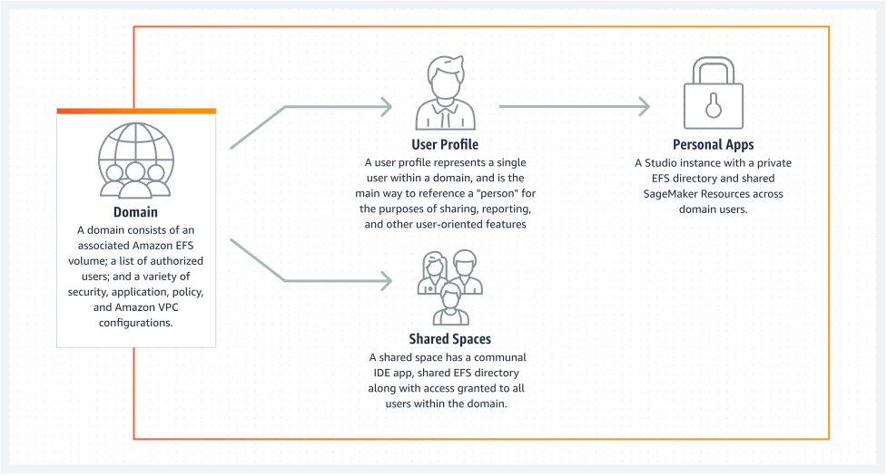

# Amazon SageMaker AI domain overview

Amazon SageMaker AI uses domains to organize user profiles, applications, and their associated
resources. An Amazon SageMaker AI domain consists of the following:

- An associated Amazon Elastic File System (Amazon EFS) volume
- A list of authorized users
- A variety of security, application, policy, and Amazon Virtual Private Cloud (Amazon VPC) configurations
  The following diagram provides an overview of private apps and shared spaces within each
  domain.

To have access to most Amazon SageMaker AI environments and resources, you must complete the
Amazon SageMaker AI domain onboarding process using the SageMaker AI console or the AWS CLI. For a guide describing
how to get started using SageMaker AI based on how you want to access SageMaker AI, and if necessary how to set
up a domain, see [Guide to getting set up with Amazon SageMaker AI](gs.md "gs.md").

###### Topics

- [Amazon SageMaker AI domain entities and statuses](sm-domain.md "sm-domain.md")
- [Choose an Amazon VPC](onboard-vpc.md "onboard-vpc.md")
