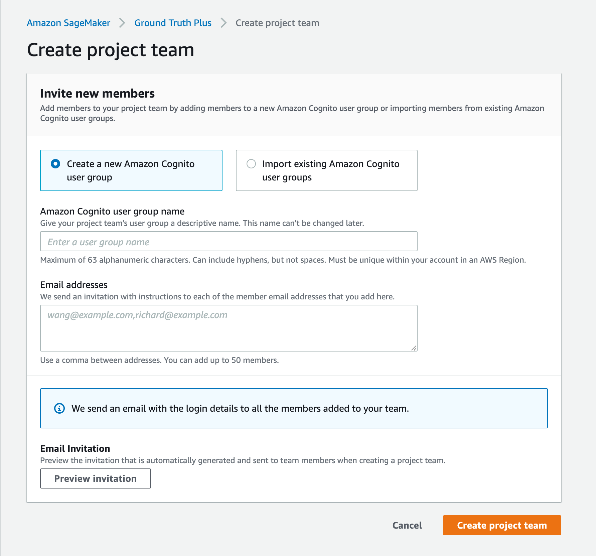
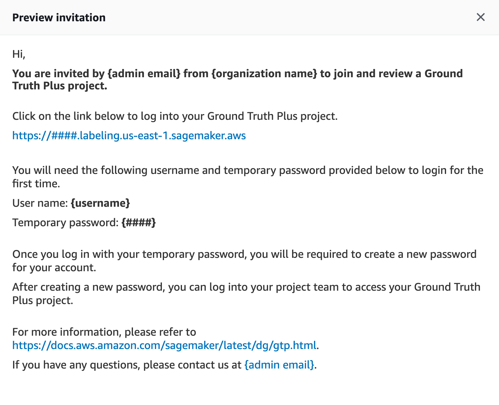

# Create a Project Team

A project team provides access to the members from your organization or team to track projects, view metrics, and review annotations.
You can create a SageMaker Ground Truth Plus project team once you have shared your data in an Amazon S3 bucket.

To add team members using Amazon Cognito, you have two options:

1.  Create a new Amazon Cognito user group
    1. Enter an **Amazon Cognito user group name**. This name cannot be changed.
    2. Enter the email addresses of up to 50 team members in the **Email addresses** field. The addresses must be separated by a comma.
    3. Choose **Create project team**.

     4. Your team members receive an email inviting them to join the SageMaker Ground Truth Plus project team as shown in the following image.

    

2.  Import team members from existing Amazon Cognito user groups.

        1. Choose a user pool that you have created. User pools require a domain and an existing user group.
         If you get an error that the domain is missing, set it in the **Domain name** options on the **App integration** page of the Amazon Cognito console for your group.
        2. Choose an app client. We recommend using a client generated by Amazon SageMaker AI.
        3. Choose a user group from your pool to import its members.
        4. Choose **Create project team**.

    You can view and manage the list of team members through the AWS console.

###### To add team members after creating the project team:

1. Choose **Invite new members** in the **Members** section.
2. Enter the email addresses of up to 50 team members in the **Email addresses** field. The addresses must be separated by a comma.
3. Choose **Invite new members**

###### To delete existing team members:

1. Choose the team member to be deleted in the **Members** section.
2. Choose **Delete**.
   Once you have added members to your project team, you can open the project portal to access your projects.
