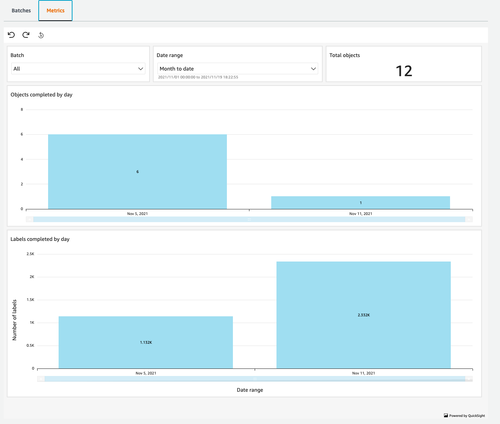

# Batch Metrics

Metrics are data about your SageMaker Ground Truth Plus project for a specific date or over a date range.

You can review metrics for all batches or choose a batch of your choice as shown in the following image.

You can review the following metrics about the batch:

**Total objects**: Total number of objects in a batch or across all batches.

**Objects completed by day**: Total numbers of objects labeled on a specific date or over a date range.

**Labels completed by day**: Total numbers of labels completed on a specific date or over a date range. An object can have more than one label.
