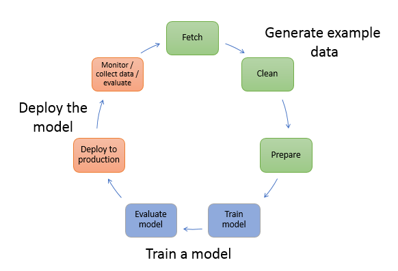

# Overview of machine learning with Amazon SageMaker AI

This section describes a typical machine learning (ML) workflow and describes how to
accomplish those tasks with Amazon SageMaker AI.

In machine learning, you _teach_ a computer to make
predictions or inferences. First, you use an algorithm and example data to train a model.
Then, you integrate your model into your application to generate inferences in real time and
at scale.

The following diagram shows the typical workflow for creating an ML model. It includes
three stages in a circular flow that we cover in more detail proceeding the diagram:

- Generate example data
- Train a model
- Deploy the model

The diagram shows how to perform the following tasks in most typical scenarios:

1. **Generate example data** – To train a model,
   you need example data. The type of data that you need depends on the business
   problem that you want the model to solve. This relates to the inferences that you
   want the model to generate. For example, if you want to create a model that predicts
   a number from an input image of a handwritten digit. To train this model, you need
   example images of handwritten numbers.

Data scientists often devote time exploring and preprocessing example data before
using it for model training. To preprocess data, you typically do the following:

    1. **Fetch the data** – You might have
     in-house example data repositories, or you might use datasets that are
     publicly available. Typically, you pull the dataset or datasets into a
     single repository.
    2. **Clean the data** – To improve model
     training, inspect the data and clean it, as needed. For example, if your
     data has a `country name` attribute with values `United
     States` and `US`, you can edit the data to be
     consistent.
    3. **Prepare or transform the data** – To
     improve performance, you might perform additional data transformations. For
     example, you might choose to combine attributes for a model that predicts
     the conditions that require de-icing an aircraft. Instead of using
     temperature and humidity attributes separately, you can combine those
     attributes into a new attribute to get a better model.

In SageMaker AI, you can preprocess example data using [SageMaker APIs](../APIReference/Welcome.md "../APIReference/Welcome.md") with the [SageMaker Python SDK](https://sagemaker.readthedocs.io/en/stable/ "https://sagemaker.readthedocs.io/en/stable/") in an
integrated development environment (IDE). With SDK for Python (Boto3) you can fetch, explore, and
prepare your data for model training. For information about data preparation,
processing, and transforming your data, see [Recommendations for choosing the right data preparation tool in
SageMaker AI](data-prep.md "data-prep.md"), [Data transformation
workloads with SageMaker Processing](processing-job.md "processing-job.md"), and [Create, store, and share features with Feature Store](feature-store.md "feature-store.md"). 2. **Train a model** – Model training includes
both training and evaluating the model, as follows:

    * **Training the model** – To train a
     model, you need an algorithm or a pre-trained base model. The algorithm you
     choose depends on a number of factors. For a built-in solution, you can use
     one of the algorithms that SageMaker provides. For a list of algorithms provided
     by SageMaker and related considerations, see [Built-in algorithms and pretrained models in Amazon SageMaker](algos.md "algos.md"). For a UI-based training solution that provides
     algorithms and models, see [SageMaker JumpStart pretrained models](studio-jumpstart.md "studio-jumpstart.md").

    You also need compute resources for training. Your resource use depends on
     the size of your training dataset and how quickly you need the results. You
     can use resources ranging from a single general-purpose instance to a
     distributed cluster of GPU instances. For more information, see [Train a Model with Amazon SageMaker](how-it-works-training.md "how-it-works-training.md").
    * **Evaluating the model** – After you
     train your model, you evaluate it to determine whether the accuracy of the
     inferences is acceptable. To train and evaluate your model, use the [SageMaker Python
     SDK](https://sagemaker.readthedocs.io/en/stable/ "https://sagemaker.readthedocs.io/en/stable/") to send requests to the model for inferences through one of
     the available IDEs. For more information about evaluating your model, see
     [Data and model quality monitoring with Amazon SageMaker Model Monitor](model-monitor.md "model-monitor.md").

3. **Deploy the model** – You traditionally
   re-engineer a model before you integrate it with your application and deploy it.
   With SageMaker AI hosting services, you can deploy your model independently, which decouples
   it from your application code. For more information, see [Deploy models for inference](deploy-model.md "deploy-model.md").
   Machine learning is a continuous cycle. After deploying a model, you monitor the
   inferences, collect more high-quality data, and evaluate the model to identify drift. You
   then increase the accuracy of your inferences by updating your training data to include the
   newly collected high-quality data. As more example data becomes available, you continue
   retraining your model to increase accuracy.
