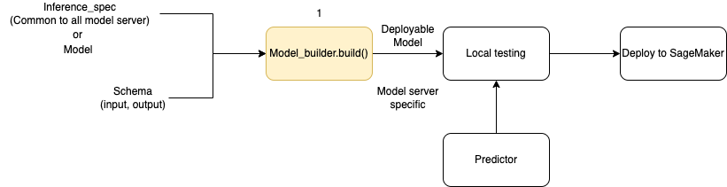
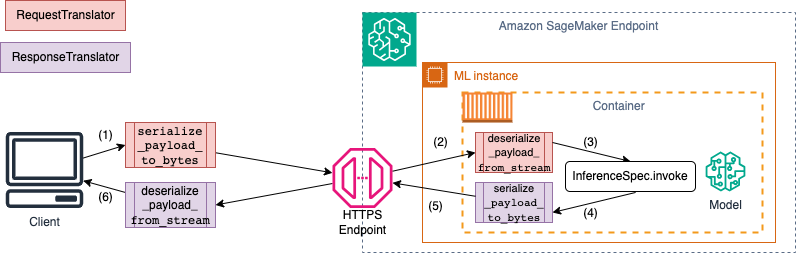

# Create a model in Amazon SageMaker AI with

ModelBuilder

Preparing your model for deployment on a SageMaker AI endpoint requires multiple steps,
including choosing a model image, setting up the endpoint configuration, coding your
serialization and deserialization functions to transfer data to and from server and
client, identifying model dependencies, and uploading them to Amazon S3. `ModelBuilder`
can reduce the complexity of initial setup and deployment to help you create a
deployable model in a single step.

`ModelBuilder` performs the following tasks for you:

- Converts machine learning models trained using various frameworks like XGBoost
  or PyTorch into deployable models in one step.
- Performs automatic container selection based on the model framework so you
  don’t have to manually specify your container. You can still bring your own container
  by passing your own URI to `ModelBuilder`.
- Handles the serialization of data on the client side before sending it to the
  server for inference and deserialization of the results returned by the server. Data is
  correctly formatted without manual processing.
- Enables automatic capture of dependencies and packages the model according to model server
  expectations. `ModelBuilder`'s automatic capture of dependencies is a
  best-effort approach to dynamically load dependencies. (We recommend that you test
  the automated capture locally and update the dependencies to meet your
  needs.)
- For large language model (LLM) use cases, optionally performs local parameter tuning of serving properties
  that can be deployed for better performance when hosting on a SageMaker AI endpoint.
- Supports most of the popular model servers and containers like TorchServe, Triton,
  DJLServing and TGI container.

## Build your model with ModelBuilder

`ModelBuilder` is a Python class that takes a framework model, such as
XGBoost or PyTorch, or a user-specified inference specification and converts it into a
deployable model. `ModelBuilder` provides a build function that generates the
artifacts for deployment. The model artifact generated is specific to the model server,
which you can also specify as one of the inputs. For more details about the
`ModelBuilder` class, see [ModelBuilder](https://sagemaker.readthedocs.io/en/stable/api/inference/model_builder.html#sagemaker.serve.builder.model_builder.ModelBuilder "https://sagemaker.readthedocs.io/en/stable/api/inference/model_builder.html#sagemaker.serve.builder.model_builder.ModelBuilder").

The following diagram illustrates the overall model creation workflow when you use
`ModelBuilder`. `ModelBuilder` accepts a model or inference specification
along with your schema to create a deployable model that you can test locally before deployment.



`ModelBuilder` can handle any customization you want to apply. However, to deploy
a framework model, the model builder expects at minimum a model, sample input and output, and the role.
In the following code example, `ModelBuilder`
is called with a framework model and an instance of `SchemaBuilder` with minimum
arguments (to infer the corresponding functions for serializing and deserializing the
endpoint input and output). No container is specified and no packaged dependencies are
passed—SageMaker AI automatically infers these resources when you build your model.

```
from sagemaker.serve.builder.model_builder import ModelBuilder
from sagemaker.serve.builder.schema_builder import SchemaBuilder

model_builder = ModelBuilder(
    model=`model`,
    schema_builder=SchemaBuilder(input, output),
    role_arn="`execution-role`",
)
```

The following code sample invokes `ModelBuilder`
with an inference specification (as an `InferenceSpec` instance) instead of a model,
with additional customization. In this case, the call to model builder includes a path to
store model artifacts and also turns on autocapture of all available
dependencies. For additional details about `InferenceSpec`,
see [Customize model loading and handling
of requests](#how-it-works-modelbuilder-creation-is "#how-it-works-modelbuilder-creation-is").

```
model_builder = ModelBuilder(
    mode=Mode.LOCAL_CONTAINER,
    model_path=`model-artifact-directory`,
    inference_spec=`your-inference-spec`,
    schema_builder=SchemaBuilder(input, output),
    role_arn=`execution-role`,
    dependencies={"auto": True}
)
```

## Define serialization and deserialization methods

When invoking a SageMaker AI endpoint, the data is sent through HTTP payloads with
different MIME types. For example, an image sent to the endpoint for inference needs to
be converted to bytes at the client side and sent through an HTTP payload to the
endpoint. When the endpoint receives the payload, it needs to deserialize the byte
string back to the data type that is expected by the model (also known as server-side
deserialization). After the model finishes prediction, the results also need to be
serialized to bytes that can be sent back through the HTTP payload to the user or the
client. Once the client receives the response byte data, it needs to perform client-side
deserialization to convert the bytes data back to the expected data format, such as
JSON. At minimum, you need to convert data for the following tasks:

1. Inference request serialization (handled by the client)
2. Inference request deserialization (handled by the server or algorithm)
3. Invoking the model against the payload and send response payload back
4. Inference response serialization (handled by the server or algorithm)
5. Inference response deserialization (handled by the client)

The following diagram shows the serialization and deserialization processes that occur
when you invoke the endpoint.



When you supply sample input and output to `SchemaBuilder`, the schema builder generates the corresponding marshalling functions for serializing and deserializing the input and output. You can further customize your serialization functions with `CustomPayloadTranslator`. But for most cases, a simple serializer such as the following would work:

```
input = "How is the demo going?"
output = "Comment la démo va-t-elle?"
schema = SchemaBuilder(input, output)
```

For further details about `SchemaBuilder`, see [SchemaBuilder](https://sagemaker.readthedocs.io/en/stable/api/inference/model_builder.html#sagemaker.serve.builder.schema_builder.SchemaBuilder "https://sagemaker.readthedocs.io/en/stable/api/inference/model_builder.html#sagemaker.serve.builder.schema_builder.SchemaBuilder").

The following code snippet outlines an example where you want to customize both serialization
and deserialization functions at the client and server sides. You can define your
own request and response translators with `CustomPayloadTranslator` and pass
these translators to `SchemaBuilder`.

By including the inputs and outputs with the translators, the model builder can
extract the data format the model expects. For example, suppose the sample input is a
raw image, and your custom translators crop the image and send the cropped image to the
server as a tensor. `ModelBuilder` needs both the raw input and any custom
preprocessing or postprocessing code to derive a method to convert data on both the
client and server sides.

```
from sagemaker.serve import CustomPayloadTranslator

# request translator
class MyRequestTranslator(CustomPayloadTranslator):
    # This function converts the payload to bytes - happens on client side
    def serialize_payload_to_bytes(self, payload: object) -> bytes:
        # converts the input payload to bytes
        ... ...
        return  //return object as bytes

    # This function converts the bytes to payload - happens on server side
    def deserialize_payload_from_stream(self, stream) -> object:
        # convert bytes to in-memory object
        ... ...
        return //return in-memory object

# response translator
class MyResponseTranslator(CustomPayloadTranslator):
    # This function converts the payload to bytes - happens on server side
    def serialize_payload_to_bytes(self, payload: object) -> bytes:
        # converts the response payload to bytes
        ... ...
        return //return object as bytes

    # This function converts the bytes to payload - happens on client side
    def deserialize_payload_from_stream(self, stream) -> object:
        # convert bytes to in-memory object
        ... ...
        return //return in-memory object
```

You pass in the sample input and output along with the previously-defined
custom translators when you create the `SchemaBuilder` object, as shown in
the following example:

```
my_schema = SchemaBuilder(
    sample_input=image,
    sample_output=output,
    input_translator=MyRequestTranslator(),
    output_translator=MyResponseTranslator()
)
```

Then you pass in the sample input and output, along with the custom translators defined previously, to the `SchemaBuilder` object.

```
my_schema = SchemaBuilder(
    sample_input=image,
    sample_output=output,
    input_translator=MyRequestTranslator(),
    output_translator=MyResponseTranslator()
)
```

The following sections explain in detail how to build your model with `ModelBuilder` and use
its supporting classes to customize the experience for your use case.

###### Topics

- [Customize model loading and handling
  of requests](#how-it-works-modelbuilder-creation-is "#how-it-works-modelbuilder-creation-is")
- [Build your model and deploy](#how-it-works-modelbuilder-creation-deploy "#how-it-works-modelbuilder-creation-deploy")
- [Bring your own container (BYOC)](#how-it-works-modelbuilder-creation-mb-byoc "#how-it-works-modelbuilder-creation-mb-byoc")
- [Using ModelBuilder in local mode](#how-it-works-modelbuilder-creation-local "#how-it-works-modelbuilder-creation-local")
- [ModelBuilder examples](#how-it-works-modelbuilder-creation-example "#how-it-works-modelbuilder-creation-example")

## Customize model loading and handling

of requests

Providing your own inference code through `InferenceSpec` offers an
additional layer of customization. With `InferenceSpec`, you can customize
how the model is loaded and how it handles incoming inference requests, bypassing its
default loading and inference handling mechanisms. This flexibility is particularly
beneficial when working with non-standard models or custom inference pipelines. You can
customize the `invoke` method to control how the model preprocesses and
postprocesses incoming requests. The `invoke` method ensures that the model
handles inference requests correctly. The following example uses
`InferenceSpec` to generate a model with the HuggingFace pipeline. For
further details about `InferenceSpec`, refer to the [InferenceSpec](https://sagemaker.readthedocs.io/en/stable/api/inference/model_builder.html#sagemaker.serve.spec.inference_spec.InferenceSpec "https://sagemaker.readthedocs.io/en/stable/api/inference/model_builder.html#sagemaker.serve.spec.inference_spec.InferenceSpec").

```
from sagemaker.serve.spec.inference_spec import InferenceSpec
from transformers import pipeline

class MyInferenceSpec(InferenceSpec):
    def load(self, model_dir: str):
        return pipeline("translation_en_to_fr", model="t5-small")

    def invoke(self, input, model):
        return model(input)

inf_spec = MyInferenceSpec()

model_builder = ModelBuilder(
    inference_spec=`your-inference-spec`,
    schema_builder=SchemaBuilder(X_test, y_pred)
)
```

The following example illustrates a more customized variation of a previous
example. A model is defined with an inference specification that has dependencies. In
this case, the code in the inference specification is dependent on the _lang-segment_ package. The argument for
`dependencies` contains a statement that directs the builder to install
_lang-segment_ using Git. Since the model builder
is directed by the user to custom install a dependency, the `auto` key is
`False` to turn off autocapture of dependencies.

```
model_builder = ModelBuilder(
    mode=Mode.LOCAL_CONTAINER,
    model_path=`model-artifact-directory`,
    inference_spec=`your-inference-spec`,
    schema_builder=SchemaBuilder(input, output),
    role_arn=`execution-role`,
    dependencies={"auto": False, "custom": ["-e git+https://github.com/luca-medeiros/lang-segment-anything.git#egg=lang-sam"],}
)
```

## Build your model and deploy

Call the `build` function to create your deployable model. This step
creates inference code (as `inference.py`) in your working directory
with the code necessary to create your schema, run serialization and deserialization of
inputs and outputs, and run other user-specified custom logic.

As an integrity check, SageMaker AI packages and pickles the necessary files for
deployment as part of the `ModelBuilder` build function. During this process,
SageMaker AI also creates HMAC signing for the pickle file and adds the secret key in the [CreateModel](../APIReference/API_CreateModel.md "../APIReference/API_CreateModel.md") API as an environment variable during `deploy` (or
`create`). The endpoint launch uses the environment variable to validate
the integrity of the pickle file.

```
# Build the model according to the model server specification and save it as files in the working directory
model = model_builder.build()
```

Deploy your model with the model’s existing `deploy` method. In this
step, SageMaker AI sets up an endpoint to host your model as it starts making predictions on
incoming requests. Although the `ModelBuilder` infers the endpoint resources needed
to deploy your model, you can override those estimates with your own parameter values.
The following example
directs SageMaker AI to deploy the model on a single `ml.c6i.xlarge` instance.
A model constructed from `ModelBuilder` enables live
logging during deployment as an added feature.

```
predictor = model.deploy(
    initial_instance_count=1,
    instance_type="ml.c6i.xlarge"
)
```

If you want more fine-grained control over the endpoint resources assigned to your
model, you can use a `ResourceRequirements` object. With the
`ResourceRequirements` object, you can request a minimum number of CPUs,
accelerators, and copies of models you want to deploy. You can also request a minimum
and maximum bound of memory (in MB). To use this feature, you need to specify your
endpoint type as `EndpointType.INFERENCE_COMPONENT_BASED`. The following example requests four accelerators,
a minimum memory size of 1024 MB, and one copy of your model to be deployed to an endpoint
of type `EndpointType.INFERENCE_COMPONENT_BASED`.

```
resource_requirements = ResourceRequirements(
    requests={
        "num_accelerators": 4,
        "memory": 1024,
        "copies": 1,
    },
    limits={},
)
predictor = model.deploy(
    mode=Mode.SAGEMAKER_ENDPOINT,
    endpoint_type=EndpointType.INFERENCE_COMPONENT_BASED,
    resources=resource_requirements,
    role="`role`"
)
```

## Bring your own container (BYOC)

If you want to bring your own container (extended from a SageMaker AI container), you can
also specify the image URI as shown in the following example. You also need to identify
the model server that corresponds to the image for `ModelBuilder` to generate
artifacts specific to the model server.

```
model_builder = ModelBuilder(
    model=model,
    model_server=ModelServer.TORCHSERVE,
    schema_builder=SchemaBuilder(X_test, y_pred),
    image_uri="123123123123.dkr.ecr.ap-southeast-2.amazonaws.com/byoc-image:xgb-1.7-1")
)
```

## Using ModelBuilder in local mode

You can deploy your model locally by using the `mode` argument to switch between
local testing and deployment to an endpoint. You need to store
the model artifacts in the working directory, as shown in the following snippet:

```
model = XGBClassifier()
model.fit(X_train, y_train)
model.save_model(model_dir + "/my_model.xgb")
```

Pass the model object, a `SchemaBuilder` instance, and set mode to `Mode.LOCAL_CONTAINER`.
When you call the `build` function, `ModelBuilder`
automatically identifies the supported framework container and scans for dependencies. The following
example demonstrates model creation with an XGBoost model in local mode.

```
model_builder_local = ModelBuilder(
    model=model,
    schema_builder=SchemaBuilder(X_test, y_pred),
    role_arn=`execution-role`,
    mode=Mode.LOCAL_CONTAINER
)
xgb_local_builder = model_builder_local.build()
```

Call the `deploy` function to deploy locally, as shown in the following snippet.
If you specify parameters for instance type or count, these arguments are ignored.

```
predictor_local = xgb_local_builder.deploy()
```

### Troubleshooting local mode

Depending on your individual local setup, you may encounter difficulties running
`ModelBuilder` smoothly in your environment. See the following
list for some issues you may face and how to resolve them.

- **Already already in use**: You may
  encounter an `Address already in use` error. In this case, it
  is possible that a Docker container is running on that port or another process
  is utilizing it. You can follow the approach outlined in
  [Linux
  documentation](https://www.cyberciti.biz/faq/what-process-has-open-linux-port/ "https://www.cyberciti.biz/faq/what-process-has-open-linux-port/") to identify the process and gracefully redirect your
  local process from port 8080 to another port or clean up the Docker instance.
- **IAM Permission Issue**: You might encounter a permission issue
  when trying to pull an Amazon ECR image or access Amazon S3. In this case, navigate to
  the execution role of the notebook or Studio Classic instance to verify the
  policy for `SageMakerFullAccess` or the respective API
  permissions.
- **EBS volume capacity issue**: If you deploy a large language
  model (LLM), you might run out of space while running Docker in local mode
  or experience space limitations for the Docker cache. In this case, you can
  try to move your Docker volume to a filesystem that has enough space. To
  move your Docker volume, complete the following steps:
  1.  Open a terminal and run `df` to display disk usage, as shown
      in the following output:

  ```
  (python3) sh-4.2$ df
  Filesystem     1K-blocks      Used Available Use% Mounted on
  devtmpfs       195928700         0 195928700   0% /dev
  tmpfs          195939296         0 195939296   0% /dev/shm
  tmpfs          195939296      1048 195938248   1% /run
  tmpfs          195939296         0 195939296   0% /sys/fs/cgroup
  /dev/nvme0n1p1 141545452 135242112   6303340  96% /
  tmpfs           39187860         0  39187860   0% /run/user/0
  /dev/nvme2n1   264055236  76594068 176644712  31% /home/ec2-user/SageMaker
  tmpfs           39187860         0  39187860   0% /run/user/1002
  tmpfs           39187860         0  39187860   0% /run/user/1001
  tmpfs           39187860         0  39187860   0% /run/user/1000
  ```

  2.  Move the default Docker directory from `/dev/nvme0n1p1` to
      `/dev/nvme2n1` so you can fully utilize the 256 GB
      SageMaker AI volume. For more details, see documentation about how to [move your Docker directory](https://www.guguweb.com/2019/02/07/how-to-move-docker-data-directory-to-another-location-on-ubuntu/ "https://www.guguweb.com/2019/02/07/how-to-move-docker-data-directory-to-another-location-on-ubuntu/").
  3.  Stop Docker with the following command:

  ```
  sudo service docker stop
  ```

  4.  Add a `daemon.json` to `/etc/docker`
      or append the following JSON blob to the existing one.

  ```
  {
      "data-root": "/home/ec2-user/SageMaker/{`created_docker_folder`}"
  }
  ```

  5.  Move the Docker directory in `/var/lib/docker` to
      `/home/ec2-user/SageMaker AI` with the following command:

  ```
  sudo rsync -aP /var/lib/docker/ /home/ec2-user/SageMaker/{`created_docker_folder`}
  ```

  6.  Start Docker with the following command:

  ```
  sudo service docker start
  ```

  7.  Clean trash with the following command:

  ```
  cd /home/ec2-user/SageMaker/.Trash-1000/files/*
  sudo rm -r *
  ```

  8.  If you are using a SageMaker notebook instance, you can follow
      the steps in the [Docker
      prep file](https://github.com/melanie531/amazon-sagemaker-pytorch-lightning-distributed-training/blob/main/prepare-docker.sh "https://github.com/melanie531/amazon-sagemaker-pytorch-lightning-distributed-training/blob/main/prepare-docker.sh") to prepare Docker for local mode.

## ModelBuilder examples

For more examples of using `ModelBuilder` to build your models, see
[ModelBuilder
sample notebooks](https://github.com/aws-samples/sagemaker-hosting/blob/main/SageMaker-Model-Builder "https://github.com/aws-samples/sagemaker-hosting/blob/main/SageMaker-Model-Builder").
