# How PCA Works

Principal Component Analysis (PCA) is a learning algorithm that reduces the
dimensionality (number of features) within a dataset while still retaining as much
information as possible.

PCA reduces dimensionality by finding a new set of features called
_components_, which are composites of the original features, but
are uncorrelated with one another. The first component accounts for the largest possible
variability in the data, the second component the second most variability, and so
on.

It is an unsupervised dimensionality reduction algorithm. In unsupervised learning,
labels that might be associated with the objects in the training dataset aren't
used.

Given the input of a matrix with rows
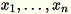
each of dimension `1 * d`, the data is partitioned into
mini-batches of rows and distributed among the training nodes (workers). Each worker
then computes a summary of its data. The summaries of the different workers are then
unified into a single solution at the end of the computation.

**Modes**

The Amazon SageMaker AI PCA algorithm uses either of two modes to calculate these summaries,
depending on the situation:

- **regular**: for datasets with sparse data and a
  moderate number of observations and features.
- **randomized**: for datasets with both a large
  number of observations and features. This mode uses an approximation algorithm.
  As the algorithm's last step, it performs the singular value decomposition on the
  unified solution, from which the principal components are then derived.

## Mode 1: Regular

The workers jointly compute both
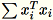
and
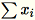
.

###### Note

Because
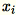
are `1 * d` row vectors,
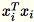
is a matrix (not a scalar). Using row vectors within the
code allows us to obtain efficient caching.

The covariance matrix is computed as
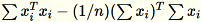
, and its top `num_components` singular vectors form
the model.

###### Note

If `subtract_mean` is `False`, we avoid computing and
subtracting

.

Use this algorithm when the dimension `d` of the vectors is small
enough so that
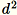
can fit in memory.

## Mode 2: Randomized

When the number of features in the input dataset is large, we use a method to
approximate the covariance metric. For every mini-batch
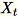
of dimension `b * d`, we randomly initialize a
`(num_components + extra_components) * b` matrix that we multiply by
each mini-batch, to create a `(num_components + extra_components) * d`
matrix. The sum of these matrices is computed by the workers, and the servers
perform SVD on the final `(num_components + extra_components) * d`
matrix. The top right `num_components` singular vectors of it are the
approximation of the top singular vectors of the input matrix.

Let
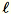

`= num_components + extra_components`. Given a mini-batch

of dimension `b * d`, the worker draws a random
matrix
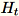
of dimension
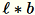
. Depending on whether the environment uses a GPU or CPU and
the dimension size, the matrix is either a random sign matrix where each entry is
`+-1` or a _FJLT_ (fast Johnson Lindenstrauss
transform; for information, see [FJLT
Transforms](https://www.cs.princeton.edu/~chazelle/pubs/FJLT-sicomp09.pdf "https://www.cs.princeton.edu/~chazelle/pubs/FJLT-sicomp09.pdf") and the follow-up papers). The worker then computes
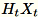
and maintains
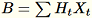
. The worker also maintains
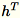
, the sum of columns of
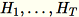
(`T` being the total number of mini-batches), and
`s`, the sum of all input rows. After processing the entire shard of
data, the worker sends the server `B`, `h`, `s`,
and `n` (the number of input rows).

Denote the different inputs to the server as
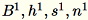
The server computes `B`, `h`,
`s`, `n` the sums of the respective inputs. It then
computes
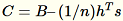
, and finds its singular value decomposition. The top-right
singular vectors and singular values of `C` are used as the approximate
solution to the problem.
