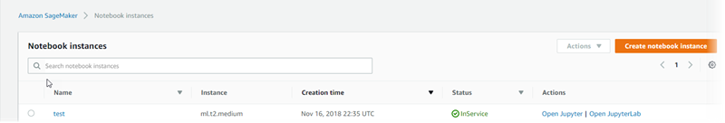

# Access Notebook Instances

###### Important

Custom IAM policies that allow Amazon SageMaker Studio or Amazon SageMaker Studio Classic to create Amazon SageMaker
resources must also grant permissions to add tags to those resources. The permission to
add tags to resources is required because Studio and Studio Classic automatically tag
any resources they create. If an IAM policy allows Studio and Studio Classic to
create resources but does not allow tagging, "AccessDenied" errors can occur when
trying to create resources. For more information, see [Provide permissions for tagging SageMaker AI
resources](security_iam_id-based-policy-examples.md#grant-tagging-permissions "security_iam_id-based-policy-examples.md#grant-tagging-permissions").

[AWS managed policies for Amazon SageMaker AI](security-iam-awsmanpol.md "security-iam-awsmanpol.md")
that give permissions to create SageMaker resources already include permissions to add tags
while creating those resources.

To access your Amazon SageMaker notebook instances, choose one of the following options:

- Use the console.

Choose **Notebook instances**. The console displays a list of
notebook instances in your account. To open a notebook instance with a standard
Jupyter interface, choose **Open Jupyter** for that instance.
To open a notebook instance with a JupyterLab interface, choose **Open
JupyterLab** for that instance.

The console uses your sign-in credentials to send a [`CreatePresignedNotebookInstanceUrl`](../APIReference/API_CreatePresignedNotebookInstanceUrl.md "../APIReference/API_CreatePresignedNotebookInstanceUrl.md") API request to
SageMaker AI. SageMaker AI returns the URL for your notebook instance, and the console opens the
URL in another browser tab and displays the Jupyter notebook dashboard.

###### Note

The URL that you get from a call to [`CreatePresignedNotebookInstanceUrl`](../APIReference/API_CreatePresignedNotebookInstanceUrl.md "../APIReference/API_CreatePresignedNotebookInstanceUrl.md") is valid only
for 5 minutes. If you try to use the URL after the 5-minute limit expires,
you are directed to the AWS Management Console sign-in page.

- Use the API.

To get the URL for the notebook instance, call the [`CreatePresignedNotebookInstanceUrl`](../APIReference/API_CreatePresignedNotebookInstanceUrl.md "../APIReference/API_CreatePresignedNotebookInstanceUrl.md") API and use
the URL that the API returns to open the notebook instance.
Use the Jupyter notebook dashboard to create and manage notebooks and to write code.
For more information about Jupyter notebooks, see [http://jupyter.org/documentation.html](http://jupyter.org/documentation.html "http://jupyter.org/documentation.html").
