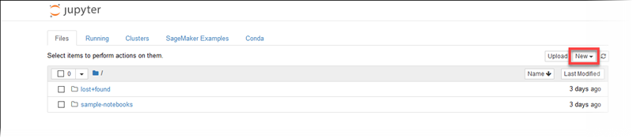

# Set the Notebook Kernel

Amazon SageMaker AI provides several kernels for Jupyter that provide support for Python 2 and 3,
Apache MXNet, TensorFlow, and PySpark. To set a kernel for a new notebook in the Jupyter
notebook dashboard, choose **New**, and then choose the kernel from the
list. For more information about the available kernels, see [Available Kernels](nbi-al2.md#nbi-al2-kernel "nbi-al2.md#nbi-al2-kernel").

You can also create a custom kernel that you can use in your notebook instance. For
information, see [External library and kernel installation](nbi-add-external.md "nbi-add-external.md").
