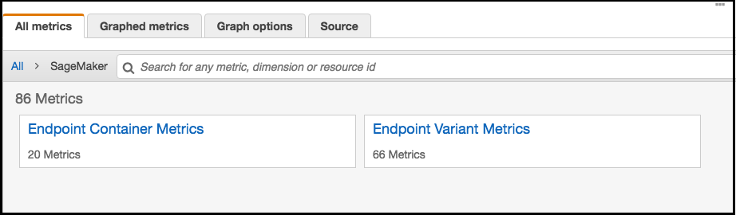
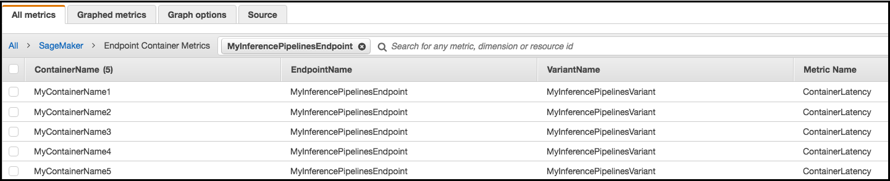

# Inference Pipeline Logs and

Metrics

Monitoring is important for maintaining the reliability, availability, and performance
of Amazon SageMaker AI resources. To monitor and troubleshoot inference pipeline performance, use
Amazon CloudWatch logs and error messages. For information about the monitoring tools that SageMaker AI
provides, see [Monitoring AWS resources in Amazon SageMaker AI](monitoring-overview.md "monitoring-overview.md").

## Use Metrics to Monitor Multi-container

Models

To monitor the multi-container models in Inference Pipelines, use Amazon CloudWatch. CloudWatch
collects raw data and processes it into readable, near real-time metrics. SageMaker AI
training jobs and endpoints write CloudWatch metrics and logs in the
`AWS/SageMaker` namespace.

The following tables list the metrics and dimensions for the following:

- Endpoint invocations
- Training jobs, batch transform jobs, and endpoint instances

A _dimension_ is a name/value pair that uniquely
identifies a metric. You can assign up to 10 dimensions to a metric. For more
information on monitoring with CloudWatch, see [Amazon SageMaker AI metrics in Amazon CloudWatch](monitoring-cloudwatch.md "monitoring-cloudwatch.md").

**Endpoint Invocation Metrics**

The `AWS/SageMaker` namespace includes the following request metrics
from calls to [`InvokeEndpoint`](../APIReference/API_InvokeEndpoint.md "../APIReference/API_InvokeEndpoint.md").

Metrics are reported at a 1-minute intervals.

| Metric                   | Description                                                                                                                                                                                                                                                                                                                                                                                                                                                                                                                                        |
| ------------------------ | -------------------------------------------------------------------------------------------------------------------------------------------------------------------------------------------------------------------------------------------------------------------------------------------------------------------------------------------------------------------------------------------------------------------------------------------------------------------------------------------------------------------------------------------------- |
| `Invocation4XXErrors`    | The number of `InvokeEndpoint` requests that the model returned a `4xx` HTTP response code for. For each `4xx` response, SageMaker AI sends a `1`. Units: None Valid statistics: `Average`, `Sum`                                                                                                                                                                                                                                                                                                                                |
| `Invocation5XXErrors`    | The number of `InvokeEndpoint` requests that the model returned a `5xx` HTTP response code for. For each `5xx` response, SageMaker AI sends a `1`. Units: None Valid statistics: `Average`, `Sum`                                                                                                                                                                                                                                                                                                                                |
| `Invocations`            | The `number of InvokeEndpoint` requests sent to a model endpoint. To get the total number of requests sent to a model endpoint, use the `Sum` statistic. Units: None Valid statistics: `Sum`, `Sample Count`                                                                                                                                                                                                                                                                                                                     |
| `InvocationsPerInstance` | The number of endpoint invocations sent to a model, normalized by `InstanceCount` in each `ProductionVariant`. SageMaker AI sends 1/`numberOfInstances` as the value for each request, where `numberOfInstances` is the number of active instances for the ProductionVariant at the endpoint at the time of the request. Units: None Valid statistics: `Sum`                                                                                                                                                               |
| `ModelLatency`           | The time the model or models took to respond. This includes the time it took to send the request, to fetch the response from the model container, and to complete the inference in the container. `ModelLatency` is the total time taken by all containers in an inference pipeline.Units: MicrosecondsValid statistics: `Average`, `Sum`, `Min`, `Max`, Sample Count                                                                                                                                                         |
| `OverheadLatency`        | The time added to the time taken to respond to a client request by SageMaker AI for overhead. `OverheadLatency` is measured from the time that SageMaker AI receives the request until it returns a response to the client, minus the `ModelLatency`. Overhead latency can vary depending on request and response payload sizes, request frequency, and authentication or authorization of the request, among other factors. Units: Microseconds Valid statistics: `Average`, `Sum`, `Min`, `Max`, `Sample Count` |
| `ContainerLatency`       | The time it took for an Inference Pipelines container to respond as viewed from SageMaker AI. `ContainerLatency` includes the time it took to send the request, to fetch the response from the model's container, and to complete inference in the container.Units: MicrosecondsValid statistics: `Average`, `Sum`, `Min`, `Max`, `Sample Count`                                                                                                                                                                                 |

**Dimensions for Endpoint Invocation Metrics**

| Dimension                                  | Description                                                                                                                  |
| ------------------------------------------ | ---------------------------------------------------------------------------------------------------------------------------- |
| `EndpointName, VariantName, ContainerName` | Filters endpoint invocation metrics for a `ProductionVariant` at the specified endpoint and for the specified variant. |

For an inference pipeline endpoint, CloudWatch lists per-container latency metrics in
your account as **Endpoint Container Metrics** and
**Endpoint Variant Metrics** in the **SageMaker AI**
namespace, as follows. The `ContainerLatency` metric appears only for
inferences pipelines.

For each endpoint and each container, latency metrics display names for the
container, endpoint, variant, and metric.

**Training Job, Batch Transform Job, and Endpoint Instance
Metrics**

The namespaces `/aws/sagemaker/TrainingJobs`,
`/aws/sagemaker/TransformJobs`, and
`/aws/sagemaker/Endpoints` include the following metrics for training
jobs and endpoint instances.

Metrics are reported at a 1-minute intervals.

| Metric                 | Description                                                                                                                                                                                                                                                                                                                                                                                                                                                                                                                                                                                                                                                                                                                                                                                                                   |
| ---------------------- | ----------------------------------------------------------------------------------------------------------------------------------------------------------------------------------------------------------------------------------------------------------------------------------------------------------------------------------------------------------------------------------------------------------------------------------------------------------------------------------------------------------------------------------------------------------------------------------------------------------------------------------------------------------------------------------------------------------------------------------------------------------------------------------------------------------------------------- |
| `CPUUtilization`       | The percentage of CPU units that are used by the containers running on an instance. The value ranges from 0% to 100%, and is multiplied by the number of CPUs. For example, if there are four CPUs, `CPUUtilization` can range from 0% to 400%. For training jobs, `CPUUtilization` is the CPU utilization of the algorithm container running on the instance. For batch transform jobs, `CPUUtilization` is the CPU utilization of the transform container running on the instance. For multi-container models, `CPUUtilization` is the sum of CPU utilization by all containers running on the instance. For endpoint variants, `CPUUtilization` is the sum of CPU utilization by all of the containers running on the instance. Units: Percent                          |
| `MemoryUtilization`    | The percentage of memory that is used by the containers running on an instance. This value ranges from 0% to 100%.For training jobs, `MemoryUtilization` is the memory used by the algorithm container running on the instance.For batch transform jobs, `MemoryUtilization` is the memory used by the transform container running on the instance.For multi-container models, `MemoryUtilization` is the sum of memory used by all containers running on the instance.For endpoint variants, `MemoryUtilization` is the sum of memory used by all of the containers running on the instance.Units: Percent                                                                                                                                                                               |
| `GPUUtilization`       | The percentage of GPU units that are used by the containers running on an instance. `GPUUtilization` ranges from 0% to 100% and is multiplied by the number of GPUs. For example, if there are four GPUs, `GPUUtilization` can range from 0% to 400%. For training jobs, `GPUUtilization` is the GPU used by the algorithm container running on the instance. For batch transform jobs, `GPUUtilization` is the GPU used by the transform container running on the instance. For multi-container models, `GPUUtilization` is the sum of GPU used by all containers running on the instance. For endpoint variants, `GPUUtilization` is the sum of GPU used by all of the containers running on the instance. Units: Percent                                                   |
| `GPUMemoryUtilization` | The percentage of GPU memory used by the containers running on an instance. GPUMemoryUtilization ranges from 0% to 100% and is multiplied by the number of GPUs. For example, if there are four GPUs, `GPUMemoryUtilization` can range from 0% to 400%. For training jobs, `GPUMemoryUtilization` is the GPU memory used by the algorithm container running on the instance. For batch transform jobs, `GPUMemoryUtilization` is the GPU memory used by the transform container running on the instance. For multi-container models, `GPUMemoryUtilization` is sum of GPU used by all containers running on the instance. For endpoint variants, `GPUMemoryUtilization` is the sum of the GPU memory used by all of the containers running on the instance. Units: Percent |
| `DiskUtilization`      | The percentage of disk space used by the containers running on an instance. DiskUtilization ranges from 0% to 100%. This metric is not supported for batch transform jobs. For training jobs, `DiskUtilization` is the disk space used by the algorithm container running on the instance. For endpoint variants, `DiskUtilization` is the sum of the disk space used by all of the provided containers running on the instance. Units: Percent                                                                                                                                                                                                                                                                                                                                                    |

**Dimensions for Training Job, Batch Transform Job, and Endpoint Instance
Metrics**

| Dimension | Description                                                                                                                                                                                                                                                                                                                                                                                                                                                                                                                                                                                                                                                                                                                                                                                                                                                                                                |
| --------- | ---------------------------------------------------------------------------------------------------------------------------------------------------------------------------------------------------------------------------------------------------------------------------------------------------------------------------------------------------------------------------------------------------------------------------------------------------------------------------------------------------------------------------------------------------------------------------------------------------------------------------------------------------------------------------------------------------------------------------------------------------------------------------------------------------------------------------------------------------------------------------------------------------------- |
| `Host`    | For training jobs, `Host` has the format `[training-job-name]/algo-[instance-number-in-cluster]`. Use this dimension to filter instance metrics for the specified training job and instance. This dimension format is present only in the `/aws/sagemaker/TrainingJobs` namespace. For batch transform jobs, `Host` has the format `[transform-job-name]/[instance-id]`. Use this dimension to filter instance metrics for the specified batch transform job and instance. This dimension format is present only in the `/aws/sagemaker/TransformJobs` namespace. For endpoints, `Host` has the format `[endpoint-name]/[ production-variant-name ]/[instance-id]`. Use this dimension to filter instance metrics for the specified endpoint, variant, and instance. This dimension format is present only in the `/aws/sagemaker/Endpoints` namespace. |

To help you debug your training jobs, endpoints, and notebook instance lifecycle
configurations, SageMaker AI also sends anything an algorithm container, a model container,
or a notebook instance lifecycle configuration sends to `stdout` or
`stderr` to Amazon CloudWatch Logs. You can use this information for debugging and
to analyze progress.

## Use Logs to Monitor an Inference

Pipeline

The following table lists the log groups and log streams SageMaker AI. sends to Amazon CloudWatch

A _log stream_ is a sequence of log events that
share the same source. Each separate source of logs into CloudWatch makes up a separate
log stream. A _log group_ is a group of log streams
that share the same retention, monitoring, and access control settings.

**Logs**

| Log Group Name                                                                                                                                                                                                                                                                                                                            | Log Stream Name                                                           |
| ----------------------------------------------------------------------------------------------------------------------------------------------------------------------------------------------------------------------------------------------------------------------------------------------------------------------------------------- | ------------------------------------------------------------------------- |
| `/aws/sagemaker/TrainingJobs`                                                                                                                                                                                                                                                                                                             | `[training-job-name]/algo-[instance-number-in-cluster]-[epoch_timestamp]` |
| `/aws/sagemaker/Endpoints/[EndpointName]`                                                                                                                                                                                                                                                                                                 | `[production-variant-name]/[instance-id]`                                 |
| `[production-variant-name]/[instance-id]`                                                                                                                                                                                                                                                                                                 |
| `[production-variant-name]/[instance-id]/[container-name provided in the SageMaker AI model] (For Inference Pipelines)` For Inference Pipelines logs, if you don't provide container names, CloudWatch uses \*\*container-1, container-2\*\*, and so on, in the order that containers are provided in the model.              |
| `/aws/sagemaker/NotebookInstances`                                                                                                                                                                                                                                                                                                        | `[notebook-instance-name]/[LifecycleConfigHook]`                          |
| `/aws/sagemaker/TransformJobs`                                                                                                                                                                                                                                                                                                            | `[transform-job-name]/[instance-id]-[epoch_timestamp]`                    |
| `[transform-job-name]/[instance-id]-[epoch_timestamp]/data-log`                                                                                                                                                                                                                                                                           |
| `[transform-job-name]/[instance-id]-[epoch_timestamp]/[container-name provided in the SageMaker AI model] (For Inference Pipelines)` For Inference Pipelines logs, if you don't provide container names, CloudWatch uses \*\*container-1, container-2\*\*, and so on, in the order that containers are provided in the model. |

###### Note

SageMaker AI creates the `/aws/sagemaker/NotebookInstances` log group when
you create a notebook instance with a lifecycle configuration. For more
information, see [Customization of a SageMaker notebook instance
using an LCC script](notebook-lifecycle-config.md "notebook-lifecycle-config.md").

For more information about SageMaker AI logging, see [CloudWatch Logs for Amazon SageMaker AI](logging-cloudwatch.md "logging-cloudwatch.md").
