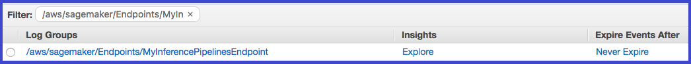
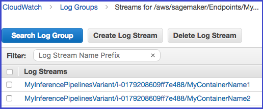

# Troubleshoot Inference

Pipelines

To troubleshoot inference pipeline issues, use CloudWatch logs and error messages. If you
are using custom Docker images in a pipeline that includes Amazon SageMaker AI built-in algorithms,
you might also encounter permissions problems. To grant the required permissions, create
an Amazon Elastic Container Registry (Amazon ECR) policy.

###### Topics

- [Troubleshoot Amazon ECR
  Permissions for Inference Pipelines](#inference-pipeline-troubleshoot-permissions "#inference-pipeline-troubleshoot-permissions")
- [Use CloudWatch Logs to Troubleshoot
  SageMaker AI Inference Pipelines](#inference-pipeline-troubleshoot-logs "#inference-pipeline-troubleshoot-logs")
- [Use Error Messages to
  Troubleshoot Inference Pipelines](#inference-pipeline-troubleshoot-errors "#inference-pipeline-troubleshoot-errors")

## Troubleshoot Amazon ECR

Permissions for Inference Pipelines

When you use custom Docker images in a pipeline that includes [SageMaker AI built-in algorithms](sagemaker-algo-docker-registry-paths.md "sagemaker-algo-docker-registry-paths.md"), you need an [Amazon ECR policy](../../../AmazonECR/latest/userguide/what-is-ecr.md "../../../AmazonECR/latest/userguide/what-is-ecr.md"). The policy allows your Amazon ECR repository to grant
permission for SageMaker AI to pull the image. The policy must add the following
permissions:

```
{
    "Version": "2008-10-17",
    "Statement": [
        {
            "Sid": "allowSageMakerToPull",
            "Effect": "Allow",
            "Principal": {
                "Service": "sagemaker.amazonaws.com"
            },
            "Action": [
                "ecr:GetDownloadUrlForLayer",
                "ecr:BatchGetImage",
                "ecr:BatchCheckLayerAvailability"
            ]
        }
    ]
}
```

## Use CloudWatch Logs to Troubleshoot

SageMaker AI Inference Pipelines

SageMaker AI publishes the container logs for endpoints that deploy an inference pipeline
to Amazon CloudWatch at the following path for each container.

```
/aws/sagemaker/Endpoints/{EndpointName}/{Variant}/{InstanceId}/{ContainerHostname}
```

For example, logs for this endpoint are published to the following log groups and
streams:

```
EndpointName: MyInferencePipelinesEndpoint
Variant: MyInferencePipelinesVariant
InstanceId: i-0179208609ff7e488
ContainerHostname: MyContainerName1 and MyContainerName2
```

```
logGroup: /aws/sagemaker/Endpoints/MyInferencePipelinesEndpoint
logStream: MyInferencePipelinesVariant/i-0179208609ff7e488/MyContainerName1
logStream: MyInferencePipelinesVariant/i-0179208609ff7e488/MyContainerName2
```

A _log stream_ is a sequence of log events that
share the same source. Each separate source of logs into CloudWatch makes up a separate
log stream. A _log group_ is a group of log streams
that share the same retention, monitoring, and access control settings.

###### To see the log groups and streams

1. Open the CloudWatch console at
   [https://console.aws.amazon.com/cloudwatch/](https://console.aws.amazon.com/cloudwatch/ "https://console.aws.amazon.com/cloudwatch/").
2. In the navigation page, choose **Logs**.
3. In **Log Groups**. filter on
   `MyInferencePipelinesEndpoint`:

 4. To see the log streams, on the CloudWatch **Log Groups** page,
choose `MyInferencePipelinesEndpoint`, and then
**Search Log Group**.



For a list of the logs that SageMaker AI publishes, see [Inference Pipeline Logs and
Metrics](inference-pipeline-logs-metrics.md "inference-pipeline-logs-metrics.md").

## Use Error Messages to

Troubleshoot Inference Pipelines

The inference pipeline error messages indicate which containers failed.

If an error occurs while SageMaker AI is invoking an endpoint, the service returns a
`ModelError` (error code 424), which indicates which container
failed. If the request payload (the response from the previous container) exceeds
the limit of 5 MB, SageMaker AI provides a detailed error message, such as:

**`Received response from MyContainerName1 with status code 200. However,
 the request payload from MyContainerName1 to MyContainerName2 is 6000000 bytes,
 which has exceeded the maximum limit of 5 MB.`**

If a container fails the ping health check while SageMaker AI is creating an endpoint, it
returns a `ClientError` and indicates all of the containers that failed
the ping check in the last health check.
