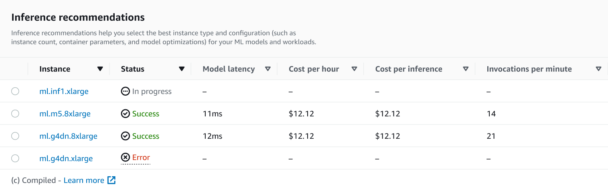

# Run a custom load test

Amazon SageMaker Inference Recommender load tests conduct extensive benchmarks based on production
requirements for latency and throughput, custom traffic patterns, and either
serverless endpoints or real-time instances (up to 10) that you select.

The following sections demonstrate how to create, describe, and stop a load test
programmatically using the AWS SDK for Python (Boto3) and the AWS CLI, or interactively using
Amazon SageMaker Studio Classic or the SageMaker AI console.

## Create a load test job

Create a load test programmatically using the AWS SDK for Python (Boto3), with the AWS CLI,
or interactively using Studio Classic or the SageMaker AI console. As with Inference Recommender inference
recommendations, specify a job name for your load test, an AWS IAM role ARN,
an input configuration, and your model package ARN from when you registered your
model with the model registry. Load tests require that you also specify a
traffic pattern and stopping conditions.

AWS SDK for Python (Boto3)
Use the `CreateInferenceRecommendationsJob` API to
create an Inference Recommender load test. Specify `Advanced` for the
`JobType` field and provide:

- A job name for your load test (`JobName`). The
  job name must be unique within your AWS Region and within
  your AWS account.
- The Amazon Resource Name (ARN) of an IAM role that
  enables Inference Recommender to perform tasks on your behalf. Define this
  for the `RoleArn` field.
- An endpoint configuration dictionary
  (`InputConfig`) where you specify the
  following:
  - For `TrafficPattern`, specify either
    the phases or stairs traffic pattern. With the
    phases traffic pattern, new users spawn every minute
    at the rate you specify. With the stairs traffic
    pattern, new users spawn at timed intervals (or
    _steps_) at a
    rate you specify. Choose one of the
    following:
    - For `TrafficType`, specify
      `PHASES`. Then, for the
      `Phases` array, specify the
      `InitialNumberOfUsers` (how many
      concurrent users to start with, with a minimum of
      1 and a maximum of 3), `SpawnRate` (the
      number of users to be spawned in a minute for a
      specific phase of load testing, with a minimum of
      0 and maximum of 3), and
      `DurationInSeconds` (how long the
      traffic phase should be, with a minimum of 120 and
      maximum of 3600).
    - For `TrafficType`, specify
      `STAIRS`. Then, for the
      `Stairs` array, specify the
      `DurationInSeconds` (how long the
      traffic phase should be, with a minimum of 120 and
      maximum of 3600), `NumberOfSteps` (how
      many intervals are used during the phase), and
      `UsersPerStep` (how many users are
      added during each interval). Note that the length
      of each step is the value of
      `DurationInSeconds / NumberOfSteps`.
      For example, if your
      `DurationInSeconds` is `600`
      and you specify `5` steps, then each
      step is 120 seconds long.

    ###### Note

    A user is defined as a system-generated
    actor that runs in a loop and invokes requests to
    an endpoint as part of Inference Recommender. For a typical
    XGBoost container running on an
    `ml.c5.large` instance, endpoints can
    reach 30,000 invocations per minute (500 tps) with
    just 15-20 users.

  - For `ResourceLimit`, specify
    `MaxNumberOfTests` (the maximum number
    of benchmarking load tests for an Inference Recommender job, with a
    minimum of 1 and a maximum of 10) and
    `MaxParallelOfTests` (the maximum
    number of parallel benchmarking load tests for an
    Inference Recommender job, with a minimum of 1 and a maximum of
    10).
  - For `EndpointConfigurations`, you can
    specify one of the following:
    - The `InstanceType` field, where
      you specify the instance type on which you want to
      run your load tests.
    - The `ServerlessConfig`, in which
      you specify your ideal values for
      `MaxConcurrency` and
      `MemorySizeInMB` for a serverless
      endpoint. For more information, see the [Serverless Inference documentation](serverless-endpoints.md "serverless-endpoints.md").

- A stopping conditions dictionary
  (`StoppingConditions`), where if any of the
  conditions are met, the Inference Recommender job stops. For this example,
  specify the following fields in the dictionary:
  - For `MaxInvocations`, specify the
    maximum number of requests per minute expected for
    the endpoint, with a minimum of 1 and a maximum of
    30,000.
  - For `ModelLatencyThresholds`, specify
    `Percentile` (the model latency
    percentile threshold) and
    `ValueInMilliseconds` (the model
    latency percentile value in milliseconds).
  - (Optional) For `FlatInvocations`, you
    can specify whether to continue the load test when
    the TPS (invocations per minute) rate flattens. A
    flattened TPS rate usually means that the endpoint
    has reached capacity. However, you might want to
    continue monitoring the endpoint under full capacity
    conditions. To continue the load test when this
    happens, specify this value as
    `Continue`. Otherwise, the default value
    is `Stop`.

```
# Create a low-level SageMaker service client.
import boto3
aws_region=`<INSERT>`
sagemaker_client=boto3.client('sagemaker', region=aws_region)

# Provide a name to your recommendation based on load testing
load_test_job_name=`"<INSERT>"`

# Provide the name of the sagemaker instance type
instance_type=`"<INSERT>"`

# Provide the IAM Role that gives SageMaker permission to access AWS services
role_arn='arn:aws:iam::`<account>:role/*`'

# Provide your model package ARN that was created when you registered your
# model with Model Registry
model_package_arn='arn:aws:sagemaker:`<region>:<account>:role/*`'

sagemaker_client.create_inference_recommendations_job(
                        JobName=load_test_job_name,
                        JobType="Advanced",
                        RoleArn=role_arn,
                        InputConfig={
                            'ModelPackageVersionArn': model_package_arn,
                            "JobDurationInSeconds": 7200,
                            'TrafficPattern' : {
                                # Replace PHASES with STAIRS to use the stairs traffic pattern
                                'TrafficType': 'PHASES',
                                'Phases': [
                                    {
                                        'InitialNumberOfUsers': 1,
                                        'SpawnRate': 1,
                                        'DurationInSeconds': 120
                                    },
                                    {
                                        'InitialNumberOfUsers': 1,
                                        'SpawnRate': 1,
                                        'DurationInSeconds': 120
                                    }
                                ]
                                # Uncomment this section and comment out the Phases object above to use the stairs traffic pattern
                                # 'Stairs' : {
                                #   'DurationInSeconds': 240,
                                #   'NumberOfSteps': 2,
                                #   'UsersPerStep': 2
                                # }
                            },
                            'ResourceLimit': {
                                        'MaxNumberOfTests': 10,
                                        'MaxParallelOfTests': 3
                                },
                            "EndpointConfigurations" : [{
                                        'InstanceType': 'ml.c5.xlarge'
                                    },
                                    {
                                        'InstanceType': 'ml.m5.xlarge'
                                    },
                                    {
                                        'InstanceType': 'ml.r5.xlarge'
                                    }]
                                    # Uncomment the ServerlessConfig and comment out the InstanceType field if you want recommendations for a serverless endpoint
                                    # "ServerlessConfig": {
                                    #     "MaxConcurrency": `value`,
                                    #     "MemorySizeInMB": `value`
                                    # }
                        },
                        StoppingConditions={
                            'MaxInvocations': 1000,
                            'ModelLatencyThresholds':[{
                                'Percentile': 'P95',
                                'ValueInMilliseconds': 100
                            }],
                            # Change 'Stop' to 'Continue' to let the load test continue if invocations flatten
                            'FlatInvocations': 'Stop'
                        }
                )
```

See the [Amazon SageMaker API
Reference Guide](../APIReference/Welcome.md "../APIReference/Welcome.md") for a full list of optional and required
arguments you can pass to
`CreateInferenceRecommendationsJob`.

AWS CLI
Use the `create-inference-recommendations-job` API to
create an Inference Recommender load test. Specify `Advanced` for the
`JobType` field and provide:

- A job name for your load test (`job-name`). The
  job name must be unique within your AWS Region and within
  your AWS account.
- The Amazon Resource Name (ARN) of an IAM role that
  enables Inference Recommender to perform tasks on your behalf. Define this
  for the `role-arn` field.
- An endpoint configuration dictionary
  (`input-config`) where you specify the
  following:
  - For `TrafficPattern`, specify either
    the phases or stairs traffic pattern. With the
    phases traffic pattern, new users spawn every minute
    at the rate you specify. With the stairs traffic
    pattern, new users spawn at timed intervals (or
    _steps_) at a
    rate you specify. Choose one of the
    following:
    - For `TrafficType`, specify
      `PHASES`. Then, for the
      `Phases` array, specify the
      `InitialNumberOfUsers` (how many
      concurrent users to start with, with a minimum of
      1 and a maximum of 3), `SpawnRate` (the
      number of users to be spawned in a minute for a
      specific phase of load testing, with a minimum of
      0 and maximum of 3), and
      `DurationInSeconds` (how long the
      traffic phase should be, with a minimum of 120 and
      maximum of 3600).
    - For `TrafficType`, specify
      `STAIRS`. Then, for the
      `Stairs` array, specify the
      `DurationInSeconds` (how long the
      traffic phase should be, with a minimum of 120 and
      maximum of 3600), `NumberOfSteps` (how
      many intervals are used during the phase), and
      `UsersPerStep` (how many users are
      added during each interval). Note that the length
      of each step is the value of
      `DurationInSeconds / NumberOfSteps`.
      For example, if your
      `DurationInSeconds` is `600`
      and you specify `5` steps, then each
      step is 120 seconds long.

    ###### Note

    A user is defined as a system-generated
    actor that runs in a loop and invokes requests to
    an endpoint as part of Inference Recommender. For a typical
    XGBoost container running on an
    `ml.c5.large` instance, endpoints can
    reach 30,000 invocations per minute (500 tps) with
    just 15-20 users.

  - For `ResourceLimit`, specify
    `MaxNumberOfTests` (the maximum number
    of benchmarking load tests for an Inference Recommender job, with a
    minimum of 1 and a maximum of 10) and
    `MaxParallelOfTests` (the maximum
    number of parallel benchmarking load tests for an
    Inference Recommender job, with a minimum of 1 and a maximum of
    10).
  - For `EndpointConfigurations`, you can
    specify one of the following:
    - The `InstanceType` field, where
      you specify the instance type on which you want to
      run your load tests.
    - The `ServerlessConfig`, in which
      you specify your ideal values for
      `MaxConcurrency` and
      `MemorySizeInMB` for a serverless
      endpoint.

- A stopping conditions dictionary
  (`stopping-conditions`), where if any of the
  conditions are met, the Inference Recommender job stops. For this example,
  specify the following fields in the dictionary:
  - For `MaxInvocations`, specify the
    maximum number of requests per minute expected for
    the endpoint, with a minimum of 1 and a maximum of
    30,000.
  - For `ModelLatencyThresholds`, specify
    `Percentile` (the model latency
    percentile threshold) and
    `ValueInMilliseconds` (the model
    latency percentile value in milliseconds).
  - (Optional) For `FlatInvocations`, you
    can specify whether to continue the load test when
    the TPS (invocations per minute) rate flattens. A
    flattened TPS rate usually means that the endpoint
    has reached capacity. However, you might want to
    continue monitoring the endpoint under full capacity
    conditions. To continue the load test when this
    happens, specify this value as
    `Continue`. Otherwise, the default value
    is `Stop`.

```
aws sagemaker create-inference-recommendations-job\
    --region `<region>`\
    --job-name `<job-name>`\
    --job-type ADVANCED\
    --role-arn arn:aws:iam::`<account>:role/*`\
    --input-config \"{
        \"ModelPackageVersionArn\": \"arn:aws:sagemaker:`<region>:<account>:role/*`\",
        \"JobDurationInSeconds\": 7200,
        \"TrafficPattern\" : {
                # Replace PHASES with STAIRS to use the stairs traffic pattern
                \"TrafficType\": \"PHASES\",
                \"Phases\": [
                    {
                        \"InitialNumberOfUsers\": 1,
                        \"SpawnRate\": 60,
                        \"DurationInSeconds\": 300
                    }
                ]
                # Uncomment this section and comment out the Phases object above to use the stairs traffic pattern
                # 'Stairs' : {
                #   'DurationInSeconds': 240,
                #   'NumberOfSteps': 2,
                #   'UsersPerStep': 2
                # }
            },
            \"ResourceLimit\": {
                \"MaxNumberOfTests\": 10,
                \"MaxParallelOfTests\": 3
            },
            \"EndpointConfigurations\" : [
                {
                    \"InstanceType\": \"ml.c5.xlarge\"
                },
                {
                    \"InstanceType\": \"ml.m5.xlarge\"
                },
                {
                    \"InstanceType\": \"ml.r5.xlarge\"
                }
                # Use the ServerlessConfig and leave out the InstanceType fields if you want recommendations for a serverless endpoint
                # \"ServerlessConfig\": {
                #     \"MaxConcurrency\": `value`,
                #     \"MemorySizeInMB\": `value`
                # }
            ]
        }\"
    --stopping-conditions \"{
        \"MaxInvocations\": 1000,
        \"ModelLatencyThresholds\":[
                {
                    \"Percentile\": \"P95\",
                    \"ValueInMilliseconds\": 100
                }
        ],
        # Change 'Stop' to 'Continue' to let the load test continue if invocations flatten
        \"FlatInvocations\": \"Stop\"
    }\"
```

Amazon SageMaker Studio Classic
Create a load test with Studio Classic.

1. In your Studio Classic application, choose the home icon (
   
   ).
2. In the left sidebar of Studio Classic, choose
   **Deployments**.
3. Choose **Inference recommender** from the
   dropdown list.
4. Choose **Create inference recommender
   job**. A new tab titled **Create
   inference recommender job** opens.
5. Select the name of your model group from the dropdown
   **Model group** field. The list
   includes all the model groups registered with the model
   registry in your account, including models registered
   outside of Studio Classic.
6. Select a model version from the dropdown **Model
   version** field.
7. Choose **Continue**.
8. Provide a name for the job in the
   **Name** field.
9. (Optional) Provide a description of your job in the
   **Description** field.
10. Choose an IAM role that grants Inference Recommender permission to
    access AWS services. You can create a role and attach the
    `AmazonSageMakerFullAccess` IAM managed
    policy to accomplish this, or you can let Studio Classic create
    a role for you.
11. Choose **Stopping Conditions** to expand
    the available input fields. Provide a set of conditions for
    stopping a deployment recommendation.
    1. Specify the maximum number of requests per minute
       expected for the endpoint in the **Max
       Invocations Per Minute** field.
    2. Specify the model latency threshold in
       microseconds in the **Model Latency
       Threshold** field. The **Model
       Latency Threshold** depicts the interval
       of time taken by a model to respond as viewed from
       Inference Recommender. The interval includes the local
       communication time taken to send the request and to
       fetch the response from the model container and the
       time taken to complete the inference in the
       container.

12. Choose **Traffic Pattern** to expand the
    available input fields.
    1. Set the initial number of virtual users by
       specifying an integer in the **Initial
       Number of Users** field.
    2. Provide an integer number for the **Spawn
       Rate** field. The spawn rate sets the
       number of users created per second.
    3. Set the duration for the phase in seconds by
       specifying an integer in the
       **Duration** field.
    4. (Optional) Add additional traffic patterns. To do
       so, choose **Add**.

13. Choose the **Additional** setting to
    reveal the **Max test duration** field.
    Specify, in seconds, the maximum time a test can take during
    a job. New jobs are not scheduled after the defined
    duration. This helps ensure jobs that are in progress are
    not stopped and that you only view completed jobs.
14. Choose **Continue**.
15. Choose **Selected Instances**.
16. In the **Instances for benchmarking**
    field, choose **Add instances to test**.
    Select up to 10 instances for Inference Recommender to use for load
    testing.
17. Choose **Additional settings**.
    1. Provide an integer that sets an upper limit on the
       number of tests a job can make for the **Max
       number of tests field**. Note that each
       endpoint configuration results in a new load
       test.
    2. Provide an integer for the **Max
       parallel** test field. This setting
       defines an upper limit on the number of load tests
       that can run in parallel.

18. Choose **Submit**.

The load test can take up to 2 hours.

###### Warning

Do not close
this
tab. If you close this tab, you
cancel the Inference Recommender load test job.

SageMaker AI console
Create a custom load test through the SageMaker AI console by doing the
following:

1. Go to the SageMaker AI console at [https://console.aws.amazon.com/sagemaker/](https://console.aws.amazon.com/sagemaker/ "https://console.aws.amazon.com/sagemaker/").
2. In the left navigation pane, choose
   **Inference**, and then choose
   **Inference recommender**.
3. On the **Inference recommender jobs**
   page, choose **Create job**.
4. For **Step 1: Model configuration**, do
   the following:
   1. For **Job type**, choose
      **Advanced recommender
      job**.
   2. If you’re using a model registered in the SageMaker AI
      model registry, then turn on the **Choose a
      model from the model registry** toggle
      and do the following:
      1. For the **Model group**
         dropdown list, choose the model group in SageMaker AI
         model registry where your model is.
      2. For the **Model version**
         dropdown list, choose the desired version of your
         model.

   3. If you’re using a model that you’ve created in
      SageMaker AI, then turn off the **Choose a model
      from the model registry** toggle and do
      the following:
      1. For the **Model name**
         field, enter the name of your SageMaker AI model.

   4. For **IAM role**, you can
      select an existing AWS IAM role that has the
      necessary permissions to create an instance
      recommendation job. Alternatively, if you don’t have
      an existing role, you can choose **Create a
      new role** to open the role creation
      pop-up, and SageMaker AI adds the necessary permissions to
      the new role that you create.
   5. For **S3 bucket for benchmarking
      payload**, enter the Amazon S3 path to your
      sample payload archive, which should contain sample
      payload files that Inference Recommender uses to benchmark your
      model on different instance types.
   6. For **Payload content type**,
      enter the MIME types of your sample payload
      data.
   7. For **Traffic pattern**,
      configure phases for the load test by doing the
      following:
      1. For **Initial number of
         users**, specify how many concurrent
         users you want to start with (with a minimum of 1
         and a maximum of 3).
      2. For **Spawn rate**, specify
         the number of users to be spawned in a minute for
         the phase (with a minimum of 0 and a maximum of
         3).
      3. For **Duration (seconds)**,
         specify how low the traffic phase should be in
         seconds (with a minimum of 120 and a maximum of
         3600).

   8. (Optional) If you turned off the **Choose
      a model from the model registry toggle**
      and specified a SageMaker AI model, then for
      **Container configuration**, do
      the following:
      1. For the **Domain** dropdown
         list, select the machine learning domain of the
         model, such as computer vision, natural language
         processing, or machine learning.
      2. For the **Framework**
         dropdown list, select the framework of your
         container, such as TensorFlow or XGBoost.
      3. For **Framework version**,
         enter the framework version of your container
         image.
      4. For the **Nearest model
         name** dropdown list, select the
         pre-trained model that mostly closely matches your
         own.
      5. For the **Task** dropdown
         list, select the machine learning task that the
         model accomplishes, such as image classification
         or regression.

   9. (Optional) For **Model compilation using
      SageMaker Neo**, you can configure the
      recommendation job for a model that you’ve compiled
      using SageMaker Neo. For **Data input
      configuration**, enter the correct input
      data shape for your model in a format similar to
      `{'input':[1,1024,1024,3]}`.
   10. Choose **Next**.

5. For **Step 2: Instances and environment
   parameters**, do the following:
   1. For **Select instances for
      benchmarking**, select up to 8 instance
      types that you want to benchmark against.
   2. (Optional) For **Environment parameter
      ranges**, you can specify environment
      parameters that help optimize your model. Specify
      the parameters as **Key** and
      **Value** pairs.
   3. Choose **Next**.

6. For **Step 3: Job parameters**, do the
   following:
   1. (Optional) For the **Job name**
      field, enter a name for your instance recommendation
      job. When you create the job, SageMaker AI appends a
      timestamp to the end of this name.
   2. (Optional) For the **Job
      description** field, enter a description
      for the job.
   3. (Optional) For the **Encryption
      key** dropdown list, choose an AWS KMS key
      by name or enter its ARN to encrypt your
      data.
   4. (Optional) For **Max number of
      tests**, enter the number of test that
      you want to run during the recommendation
      job.
   5. (Optional) For **Max parallel
      tests**, enter the maximum number of
      parallel tests that you want to run during the
      recommendation job.
   6. For **Max test duration (s)**,
      enter the maximum number of seconds you want each
      test to run for.
   7. For **Max invocations per
      minute**, enter the maximum number of
      requests per minute the endpoint can reach before
      stopping the recommendation job. After reaching this
      limit, SageMaker AI ends the job.
   8. For **P99 Model latency threshold
      (ms)**, enter the model latency
      percentile in milliseconds.
   9. Choose **Next**.

7. For **Step 4: Review job**, review your
   configurations and then choose
   **Submit**.

## Get your load test results

You can programmatically collect metrics across all load tests once the load
tests are done with AWS SDK for Python (Boto3), the AWS CLI, Studio Classic, or the SageMaker AI
console.

AWS SDK for Python (Boto3)
Collect metrics with the
`DescribeInferenceRecommendationsJob` API. Specify
the job name of the load test for the `JobName`
field:

```
load_test_response = sagemaker_client.describe_inference_recommendations_job(
                                                        JobName=load_test_job_name
                                                        )
```

Print the response object.

```
load_test_response['Status']
```

This returns a JSON response similar to the following example.
Note that this example shows the recommended instance types for
real-time inference (for an example showing serverless inference
recommendations, see the example after this one).

```
{
    'JobName': `'job-name'`,
    'JobDescription': `'job-description'`,
    'JobType': 'Advanced',
    'JobArn': 'arn:aws:sagemaker:`region`:`account-id`:inference-recommendations-job/`resource-id`',
    'Status': 'COMPLETED',
    'CreationTime': datetime.datetime(2021, 10, 26, 19, 38, 30, 957000, tzinfo=tzlocal()),
    'LastModifiedTime': datetime.datetime(2021, 10, 26, 19, 46, 31, 399000, tzinfo=tzlocal()),
    'InputConfig': {
        'ModelPackageVersionArn': 'arn:aws:sagemaker:`region`:`account-id`:model-package/`resource-id`',
        'JobDurationInSeconds': 7200,
        'TrafficPattern': {
            'TrafficType': 'PHASES'
            },
        'ResourceLimit': {
            'MaxNumberOfTests': 100,
            'MaxParallelOfTests': 100
            },
        'EndpointConfigurations': [{
            'InstanceType': 'ml.c5d.xlarge'
            }]
        },
    'StoppingConditions': {
        'MaxInvocations': 1000,
        'ModelLatencyThresholds': [{
            'Percentile': 'P95',
            'ValueInMilliseconds': 100}
            ]},
    'InferenceRecommendations': [{
        'Metrics': {
            'CostPerHour': 0.6899999976158142,
            'CostPerInference': 1.0332434612791985e-05,
            'MaximumInvocations': 1113,
            'ModelLatency': 100000
            },
    'EndpointConfiguration': {
        'EndpointName': `'endpoint-name'`,
        'VariantName': `'variant-name'`,
        'InstanceType': 'ml.c5d.xlarge',
        'InitialInstanceCount': 3
        },
    'ModelConfiguration': {
        'Compiled': False,
        'EnvironmentParameters': []
        }
    }],
    'ResponseMetadata': {
        'RequestId': `'request-id'`,
        'HTTPStatusCode': 200,
        'HTTPHeaders': {
            'x-amzn-requestid': `'x-amzn-requestid'`,
            'content-type': `'content-type'`,
            'content-length': '1199',
            'date': 'Tue, 26 Oct 2021 19:57:42 GMT'
            },
        'RetryAttempts': 0}
    }
```

The first few lines provide information about the load test job
itself. This includes the job name, role ARN, creation, and deletion
time.

The `InferenceRecommendations` dictionary contains a
list of Inference Recommender inference recommendations.

The `EndpointConfiguration` nested dictionary contains
the instance type (`InstanceType`) recommendation along
with the endpoint and variant name (a deployed AWS machine
learning model) used during the recommendation job. You can use the
endpoint and variant name for monitoring in Amazon CloudWatch Events. See [Amazon SageMaker AI metrics in Amazon CloudWatch](monitoring-cloudwatch.md "monitoring-cloudwatch.md") for more
information.

The `EndpointConfiguration` nested dictionary also
contains the instance count (`InitialInstanceCount`)
recommendation. This is the number of instances that you should
provision in the endpoint to meet the `MaxInvocations`
specified in the `StoppingConditions`. For example, if
the `InstanceType` is `ml.m5.large` and the
`InitialInstanceCount` is `2`, then you
should provision 2 `ml.m5.large` instances for your
endpoint so that it can handle the TPS specified in the
`MaxInvocations` stopping condition.

The `Metrics` nested dictionary contains information
about the estimated cost per hour (`CostPerHour`) for
your real-time endpoint in US dollars, the estimated cost per
inference (`CostPerInference`) for your real-time
endpoint, the maximum number of `InvokeEndpoint` requests
sent to the endpoint, and the model latency
(`ModelLatency`), which is the interval of time (in
microseconds) that your model took to respond to SageMaker AI. The model
latency includes the local communication times taken to send the
request and to fetch the response from the model container and the
time taken to complete the inference in the container.

The following example shows the
`InferenceRecommendations` part of the response for a
load test job that was configured to return serverless inference
recommendations:

```
"InferenceRecommendations": [
      {
         "EndpointConfiguration": {
            "EndpointName": "`value`",
            "InitialInstanceCount": `value`,
            "InstanceType": "`value`",
            "VariantName": "`value`",
            "ServerlessConfig": {
                "MaxConcurrency": `value`,
                "MemorySizeInMb": `value`
            }
         },
         "InvocationEndTime": `value`,
         "InvocationStartTime": `value`,
         "Metrics": {
            "CostPerHour": `value`,
            "CostPerInference": `value`,
            "CpuUtilization": `value`,
            "MaxInvocations": `value`,
            "MemoryUtilization": `value`,
            "ModelLatency": `value`,
            "ModelSetupTime": `value`
         },
         "ModelConfiguration": {
            "Compiled": "False",
            "EnvironmentParameters": [],
            "InferenceSpecificationName": "`value`"
         },
         "RecommendationId": "`value`"
      }
   ]
```

You can interpret the recommendations for serverless inference
similarly to the results for real-time inference, with the exception
of the `ServerlessConfig`, which tells you the values you
specified for `MaxConcurrency` and
`MemorySizeInMB` when setting up the load test.
Serverless recommendations also measure the metric
`ModelSetupTime`, which measures (in microseconds)
the time it takes to launch compute resources on a serverless
endpoint. For more information about setting up serverless
endpoints, see the [Serverless Inference
documentation](serverless-endpoints.md "serverless-endpoints.md").

AWS CLI
Collect metrics with the
`describe-inference-recommendations-job` API. Specify
the job name of the load test for the `job-name`
flag:

```
aws sagemaker describe-inference-recommendations-job --job-name `<job-name>`
```

This returns a response similar to the following example. Note
that this example shows the recommended instance types for real-time
inference (for an example showing Serverless Inference recommendations, see the
example after this one).

```
{
    'JobName': `'job-name'`,
    'JobDescription': `'job-description'`,
    'JobType': 'Advanced',
    'JobArn': 'arn:aws:sagemaker:`region`:`account-id`:inference-recommendations-job/`resource-id`',
    'Status': 'COMPLETED',
    'CreationTime': datetime.datetime(2021, 10, 26, 19, 38, 30, 957000, tzinfo=tzlocal()),
    'LastModifiedTime': datetime.datetime(2021, 10, 26, 19, 46, 31, 399000, tzinfo=tzlocal()),
    'InputConfig': {
        'ModelPackageVersionArn': 'arn:aws:sagemaker:`region`:`account-id`:model-package/`resource-id`',
        'JobDurationInSeconds': 7200,
        'TrafficPattern': {
            'TrafficType': 'PHASES'
            },
        'ResourceLimit': {
            'MaxNumberOfTests': 100,
            'MaxParallelOfTests': 100
            },
        'EndpointConfigurations': [{
            'InstanceType': 'ml.c5d.xlarge'
            }]
        },
    'StoppingConditions': {
        'MaxInvocations': 1000,
        'ModelLatencyThresholds': [{
            'Percentile': 'P95',
            'ValueInMilliseconds': 100
            }]
        },
    'InferenceRecommendations': [{
        'Metrics': {
        'CostPerHour': 0.6899999976158142,
        'CostPerInference': 1.0332434612791985e-05,
        'MaximumInvocations': 1113,
        'ModelLatency': 100000
        },
        'EndpointConfiguration': {
            'EndpointName': `'endpoint-name'`,
            'VariantName': `'variant-name'`,
            'InstanceType': 'ml.c5d.xlarge',
            'InitialInstanceCount': 3
            },
        'ModelConfiguration': {
            'Compiled': False,
            'EnvironmentParameters': []
            }
        }],
    'ResponseMetadata': {
        'RequestId': `'request-id'`,
        'HTTPStatusCode': 200,
        'HTTPHeaders': {
            'x-amzn-requestid': `'x-amzn-requestid'`,
            'content-type': `'content-type'`,
            'content-length': '1199',
            'date': 'Tue, 26 Oct 2021 19:57:42 GMT'
            },
        'RetryAttempts': 0
        }
    }
```

The first few lines provide information about the load test job
itself. This includes the job name, role ARN, creation, and deletion
time.

The `InferenceRecommendations` dictionary contains a
list of Inference Recommender inference recommendations.

The `EndpointConfiguration` nested dictionary contains
the instance type (`InstanceType`) recommendation along
with the endpoint and variant name (a deployed AWS machine
learning model) used during the recommendation job. You can use the
endpoint and variant name for monitoring in Amazon CloudWatch Events. See [Amazon SageMaker AI metrics in Amazon CloudWatch](monitoring-cloudwatch.md "monitoring-cloudwatch.md") for more
information.

The `Metrics` nested dictionary contains information
about the estimated cost per hour (`CostPerHour`) for
your real-time endpoint in US dollars, the estimated cost per
inference (`CostPerInference`) for your real-time
endpoint, the maximum number of `InvokeEndpoint` requests
sent to the endpoint, and the model latency
(`ModelLatency`), which is the interval of time (in
microseconds) that your model took to respond to SageMaker AI. The model
latency includes the local communication times taken to send the
request and to fetch the response from the model container and the
time taken to complete the inference in the container.

The following example shows the
`InferenceRecommendations` part of the response for a
load test job that was configured to return serverless inference
recommendations:

```
"InferenceRecommendations": [
      {
         "EndpointConfiguration": {
            "EndpointName": "`value`",
            "InitialInstanceCount": `value`,
            "InstanceType": "`value`",
            "VariantName": "`value`",
            "ServerlessConfig": {
                "MaxConcurrency": `value`,
                "MemorySizeInMb": `value`
            }
         },
         "InvocationEndTime": `value`,
         "InvocationStartTime": `value`,
         "Metrics": {
            "CostPerHour": `value`,
            "CostPerInference": `value`,
            "CpuUtilization": `value`,
            "MaxInvocations": `value`,
            "MemoryUtilization": `value`,
            "ModelLatency": `value`,
            "ModelSetupTime": `value`
         },
         "ModelConfiguration": {
            "Compiled": "False",
            "EnvironmentParameters": [],
            "InferenceSpecificationName": "`value`"
         },
         "RecommendationId": "`value`"
      }
   ]
```

You can interpret the recommendations for serverless inference
similarly to the results for real-time inference, with the exception
of the `ServerlessConfig`, which tells you the values you
specified for `MaxConcurrency` and
`MemorySizeInMB` when setting up the load test.
Serverless recommendations also measure the metric
`ModelSetupTime`, which measures (in microseconds)
the time it takes to launch computer resources on a serverless
endpoint. For more information about setting up serverless
endpoints, see the [Serverless Inference
documentation](serverless-endpoints.md "serverless-endpoints.md").

Amazon SageMaker Studio Classic
The recommendations populate in a new tab called
**Inference recommendations** within
Studio Classic. It can take up to 2 hours for the results to show up.
This tab contains **Results** and
**Details** columns.

The **Details** column provides information about
the load test job, such as the name given to the load test job, when
the job was created (**Creation time**), and more.
It also contains **Settings** information, such as
the maximum number of invocation that occurred per minute and
information about the Amazon Resource Names used.

The **Results** column provides **Deployment goals** and **SageMaker AI
recommendations** windows in which you can adjust the
order in which results are displayed based on deployment importance.
There are three dropdown menus in which you can provide the level of
importance of the **Cost**,
**Latency**, and
**Throughput** for your use case. For each goal
(cost, latency, and throughput), you can set the level of
importance: **Lowest Importance**, **Low
Importance**, **Moderate importance**,
**High importance**, or **Highest
importance**.

Based on your selections of importance for each goal, Inference Recommender
displays its top recommendation in the **SageMaker
recommendation** field on the right of the panel, along
with the estimated cost per hour and inference request. It also
provides Information about the expected model latency, maximum
number of invocations, and the number of instances.

In addition to the top recommendation displayed, you can also see
the same information displayed for all instances that Inference Recommender tested
in the **All runs** section.

SageMaker AI console
You can view your custom load test job results in the SageMaker AI console
by doing the following:

1. Go to the SageMaker AI console at [https://console.aws.amazon.com/sagemaker/](https://console.aws.amazon.com/sagemaker/ "https://console.aws.amazon.com/sagemaker/").
2. In the left navigation pane, choose
   **Inference**, and then choose
   **Inference recommender**.
3. On the **Inference recommender jobs**
   page, choose the name of your inference recommendation
   job.

On the details page for your job, you can view the
**Inference recommendations**, which are the
instance types SageMaker AI recommends for your model, as shown in the
following screenshot.



In this section, you can compare the instance types by various
factors such as **Model latency**, **Cost
per hour**, **Cost per inference**,
and **Invocations per minute**.

On this page, you can also view the configurations you specified
for your job. In the **Monitor** section, you can
view the Amazon CloudWatch metrics that were logged for each instance type.
To learn more about interpreting these metrics, see [Interpret results](inference-recommender-interpret-results.md "inference-recommender-interpret-results.md").
