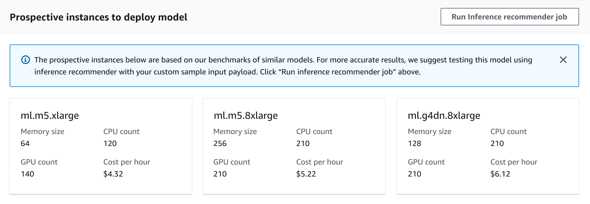

# Get instant prospective

instances

Inference Recommender can also provide you with a list of _prospective
instances_, or instance types that might be suitable for your model,
on your SageMaker AI model details page. Inference Recommender automatically performs preliminary
benchmarking against your model for you to provide the top five prospective
instances. Since these are preliminary recommendations, we recommend that you run
further instance recommendation jobs to get more accurate results.

You can view a list of prospective instances for your model either
programmatically by using the [DescribeModel](../APIReference/API_DescribeModel.md "../APIReference/API_DescribeModel.md")
API, the SageMaker Python SDK, or the SageMaker AI console.

###### Note

You won’t get prospective instances for models that you created in SageMaker AI before
this feature became available.

To view the prospective instances for your model through the console, do the
following:

1. Go to the SageMaker console at [https://console.aws.amazon.com/sagemaker/](https://console.aws.amazon.com/sagemaker/ "https://console.aws.amazon.com/sagemaker/").
2. In the left navigation pane, choose **Inference**, and
   then choose **Models**.
3. From the list of models, choose your model.
   On the details page for your model, go to the **Prospective instances to
   deploy model** section. The following screenshot shows this
   section.

In this section, you can view the prospective instances that are optimized for
cost, throughput, and latency for model deployment, along with additional
information for each instance type such as the memory size, CPU and GPU count, and
cost per hour.

If you decide that you want to benchmark a sample payload and run a full inference
recommendation job for your model, you can start a default inference recommendation
job from this page. To start a default job through the console, do the
following:

1. On your model details page in the **Prospective instances to
   deploy model section**, choose **Run Inference
   recommender job**.
2. In the dialog box that pops up, for **S3 bucket for benchmarking
   payload**, enter the Amazon S3 location where you’ve stored a sample
   payload for your model.
3. For **Payload content type**, enter the MIME types for
   your payload data.
4. (Optional) In the **Model compilation using SageMaker Neo**
   section, for the **Data input configuration**, enter a data
   shape in dictionary format.
5. Choose **Run job**.
   Inference Recommender starts the job, and you can view the job and its results from the
   **Inference recommender** list page in the SageMaker AI console.

If you want to run an advanced job and perform custom load tests, or if you want
to configure additional settings and parameters for your job, see [Run a custom load test](inference-recommender-load-test.md "inference-recommender-load-test.md").
