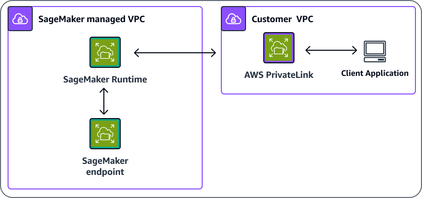
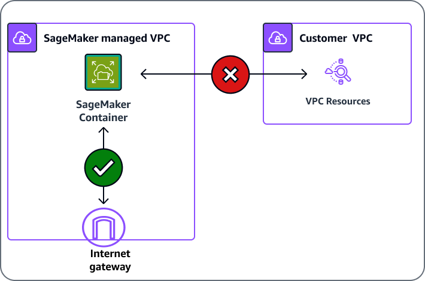
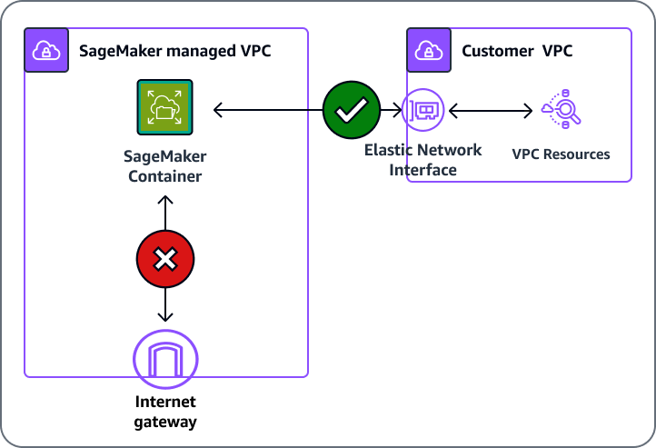
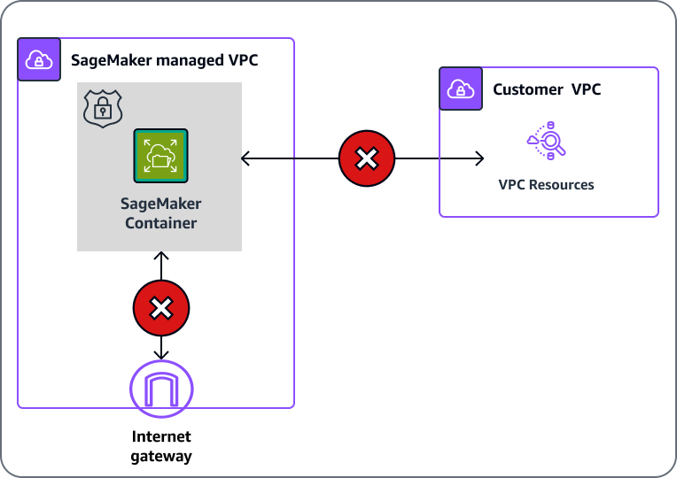

# Connect to SageMaker AI Within your VPC

You can connect directly to the SageMaker API or to Amazon SageMaker Runtime through an [interface
endpoint](../../../AmazonVPC/latest/UserGuide/vpce-interface.md "../../../AmazonVPC/latest/UserGuide/vpce-interface.md") in your virtual private cloud (VPC) instead of connecting over the
internet. When you use a VPC interface endpoint, communication between your VPC and the SageMaker AI
API or Runtime is conducted entirely and securely within an AWS network.

## Connect to SageMaker AI through a VPC interface

endpoint

The SageMaker API and SageMaker AI Runtime support [Amazon Virtual Private Cloud](../../../AmazonVPC/latest/UserGuide/VPC_Introduction.md "../../../AmazonVPC/latest/UserGuide/VPC_Introduction.md") (Amazon VPC)
interface endpoints that are powered by [AWS PrivateLink](https://aws.amazon.com/privatelink "https://aws.amazon.com/privatelink"). Each VPC endpoint is represented by one or more [Elastic Network
Interfaces](../../../AWSEC2/latest/UserGuide/using-eni.md "../../../AWSEC2/latest/UserGuide/using-eni.md") with private IP addresses in your VPC subnets. For example, an
application inside your VPC uses AWS PrivateLink to communicate with SageMaker AI Runtime. SageMaker AI
Runtime in turn communicates with the SageMaker AI endpoint. Using AWS PrivateLink allows you to
invoke your SageMaker AI endpoint from within your VPC, as shown in the following
diagram.



The VPC interface endpoint connects your VPC directly to the SageMaker API or SageMaker AI Runtime
using AWS PrivateLink without using an internet gateway, NAT device, VPN connection, or
AWS Direct Connect connection. The instances in your VPC do not need to connect to the public
internet in order to communicate with the SageMaker API or SageMaker AI Runtime.

You can create an AWS PrivateLink interface endpoint to connect to SageMaker AI or to SageMaker AI
Runtime using either the AWS Management Console or AWS Command Line Interface (AWS CLI). For instructions, see
[Access an AWS service using an interface VPC endpoint](../../../AmazonVPC/latest/UserGuide/vpce-interface.md#create-interface-endpoint "../../../AmazonVPC/latest/UserGuide/vpce-interface.md#create-interface-endpoint").

If you haven't enabled a private Domain Name System (DNS) hostname for your VPC
endpoint, _after you have created a VPC endpoint_, specify the
internet endpoint URL to the SageMaker API or SageMaker AI Runtime. Example code using AWS CLI commands
to specify the `endpoint-url` parameter follows.

```
aws sagemaker list-notebook-instances --endpoint-url `VPC_Endpoint_ID`.api.sagemaker.`Region`.vpce.amazonaws.com

aws sagemaker list-training-jobs --endpoint-url `VPC_Endpoint_ID.api`.sagemaker.`Region`.vpce.amazonaws.com

aws sagemaker-runtime invoke-endpoint --endpoint-url https://`VPC_Endpoint_ID`.runtime.sagemaker.`Region`.vpce.amazonaws.com  \
    --endpoint-name `Endpoint_Name` \
    --body "`Endpoint_Body`" \
    --content-type "`Content_Type`" \
            `Output_File`
```

If you enable private DNS hostnames for your VPC endpoint, you don't need to specify
the endpoint URL because the default hostname
(https://api.sagemaker.`Region`.amazon.com) resolves to
your VPC endpoint. Similarly, the default SageMaker AI Runtime DNS hostname
(https://runtime.sagemaker.`Region`.amazonaws.com) also
resolves to your VPC endpoint.

The SageMaker API and SageMaker AI Runtime support VPC endpoints in all AWS Regions where both
[Amazon
VPC](../../../general/latest/gr/rande.md#vpc_region "../../../general/latest/gr/rande.md#vpc_region") and [SageMaker AI](../../../general/latest/gr/rande.md#sagemaker_region "../../../general/latest/gr/rande.md#sagemaker_region") ares
available. SageMaker AI supports making calls to all of its [`Operations`](../APIReference/API_Operations.md "../APIReference/API_Operations.md") inside your VPC. If you use the
`AuthorizedUrl` from the [CreatePresignedNotebookInstanceUrl](../APIReference/API_CreatePresignedNotebookInstanceUrl.md "../APIReference/API_CreatePresignedNotebookInstanceUrl.md")
command, your traffic will go over the public internet. You can't only use a VPC endpoint to access the presigned URL, the request must go through the internet gateway.

By default, your users can share the presigned URL to people outside of your corporate network. For additional security, you must add IAM permissions to restrict the URL only be usable within your network.
For information about IAM permissions, see [How AWS PrivateLink works with IAM](../../../vpc/latest/privatelink/security_iam_service-with-iam.md "../../../vpc/latest/privatelink/security_iam_service-with-iam.md").

###### Note

When setting up a
VPC
interface endpoint for the SageMaker AI Runtime service
(https://runtime.sagemaker.``Region``.amazonaws.com),
you must ensure that the VPC interface endpoint is activated in the
Availability
Zone of your
client
in order for private DNS resolution to work. Otherwise, you may
see DNS failures when attempting to resolve the URL.

To learn more about AWS PrivateLink, see the [AWS PrivateLink documentation](../../../AmazonVPC/latest/UserGuide/VPC_Introduction.md#what-is-privatelink "../../../AmazonVPC/latest/UserGuide/VPC_Introduction.md#what-is-privatelink"). Refer to [AWS PrivateLink Pricing](https://aws.amazon.com/privatelink/pricing/ "https://aws.amazon.com/privatelink/pricing/") for the
price of VPC endpoints. To learn more about VPC and endpoints, see [Amazon VPC](https://aws.amazon.com/vpc/ "https://aws.amazon.com/vpc/"). For information about how to use
identity-based AWS Identity and Access Management policies to restrict access to the SageMaker API and SageMaker AI Runtime,
see [Control access to the SageMaker AI API by using
identity-based policies](security_iam_id-based-policy-examples.md#api-access-policy "security_iam_id-based-policy-examples.md#api-access-policy").

## Using SageMaker training and hosting with resources

inside your VPC

SageMaker AI uses your execution role to download and upload information from an Amazon S3 bucket
and Amazon Elastic Container Registry (Amazon ECR), in isolation from your training or inference container. If you
have resources that are located inside your VPC, you can still grant SageMaker AI access to
those resources. The following sections explain how to make your resources available to
SageMaker AI with or without network isolation.

### Without network isolation enabled

If you haven't set network isolation on your training job or model, SageMaker AI can
access resources using either of the following methods.

- SageMaker training and deployed inference containers can access the internet by
  default. SageMaker AI containers are able to access external services and resources
  on the public internet as part of your training and inference workloads.
  SageMaker AI containers are not able to access resources inside your VPC without a
  VPC configuration, as shown in the following illustration.



- Use a VPC configuration to communicate with resources inside your VPC
  through an elastic network interface (ENI). The communication between the
  container and the resources in your VPC takes place securely within your VPC
  network, as shown in the following illustration. In this case, you manage
  networking access to your VPC resources and internet.



### With network isolation

If you employ network isolation, the SageMaker AI container can't communicate with
resources inside your VPC or make any network calls, as shown in the following
illustration. If you provide a VPC configuration, the download and upload operations
will be run through your VPC. For more information about hosting and training with
network isolation while using a VPC, see [Network Isolation](mkt-algo-model-internet-free.md#mkt-algo-model-internet-free-isolation "mkt-algo-model-internet-free.md#mkt-algo-model-internet-free-isolation").



## Create a VPC Endpoint Policy for SageMaker AI

You can create a policy for Amazon VPC endpoints for SageMaker AI to specify the following:

- The principal that can perform actions.
- The actions that can be performed.
- The resources on which actions can be performed.

For more information, see [Controlling
Access to Services with VPC Endpoints](../../../vpc/latest/userguide/vpc-endpoints-access.md "../../../vpc/latest/userguide/vpc-endpoints-access.md") in the _Amazon VPC User
Guide_.

###### Note

VPC endpoint policies aren't supported for Federal Information Processing Standard
(FIPS) SageMaker AI runtime endpoints for [runtime_InvokeEndpoint](../APIReference/API_runtime_InvokeEndpoint.md "../APIReference/API_runtime_InvokeEndpoint.md").

The following example VPC endpoint policy specifies that all users who have access to
the VPC interface endpoint are allowed to invoke the SageMaker AI hosted endpoint named
`myEndpoint`.

```
{
  "Statement": [
      {
          "Action": "sagemaker:InvokeEndpoint",
          "Effect": "Allow",
          "Resource": "arn:aws:sagemaker:us-west-2:123456789012:endpoint/myEndpoint",
          "Principal": "*"
      }
  ]
}
```

In this example, the following are denied:

- Other SageMaker API actions, such as `sagemaker:CreateEndpoint` and
  `sagemaker:CreateTrainingJob`.
- Invoking SageMaker AI hosted endpoints other than `myEndpoint`.

###### Note

In this example, users can still take other SageMaker API actions from outside the VPC.
For information about how to restrict API calls to those from within the VPC, see
[Control access to the SageMaker AI API by using
identity-based policies](security_iam_id-based-policy-examples.md#api-access-policy "security_iam_id-based-policy-examples.md#api-access-policy").

## Create a VPC Endpoint Policy for

Amazon SageMaker Feature Store

To create a VPC Endpoint for Amazon SageMaker Feature Store, use the following endpoint template,
substituting your `VPC_Endpoint_ID.api` and
`Region`:

``VPC_Endpoint_ID.api`.featurestore-runtime.sagemaker.`Region`.vpce.amazonaws.com`

## Connect Your Private Network to Your

VPC

To call the SageMaker API and SageMaker AI Runtime through your VPC, you have to connect from an
instance that is inside the VPC or connect your private network to your VPC by using an
AWS Virtual Private Network (AWS VPN) or AWS Direct Connect. For information about AWS VPN, see [VPN
Connections](../../../vpc/latest/userguide/vpn-connections.md "../../../vpc/latest/userguide/vpn-connections.md") in the _Amazon Virtual Private Cloud User Guide_. For
information about AWS Direct Connect, see [Creating
a Connection](../../../directconnect/latest/UserGuide/create-connection.md "../../../directconnect/latest/UserGuide/create-connection.md") in the _AWS Direct Connect User
Guide_.
