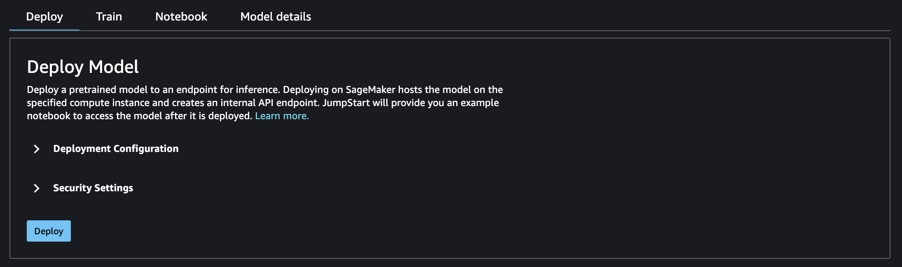
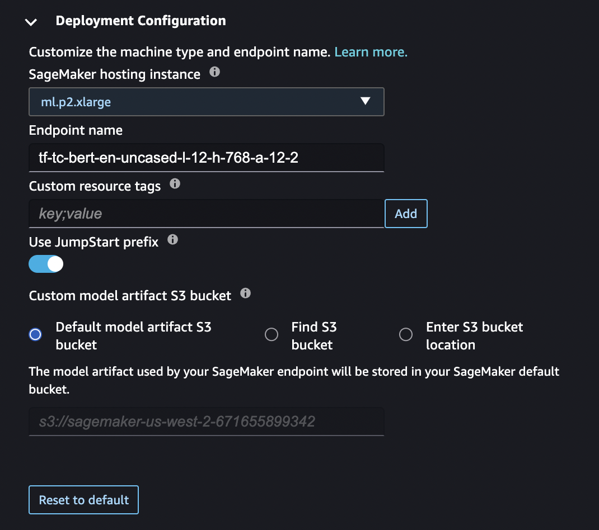
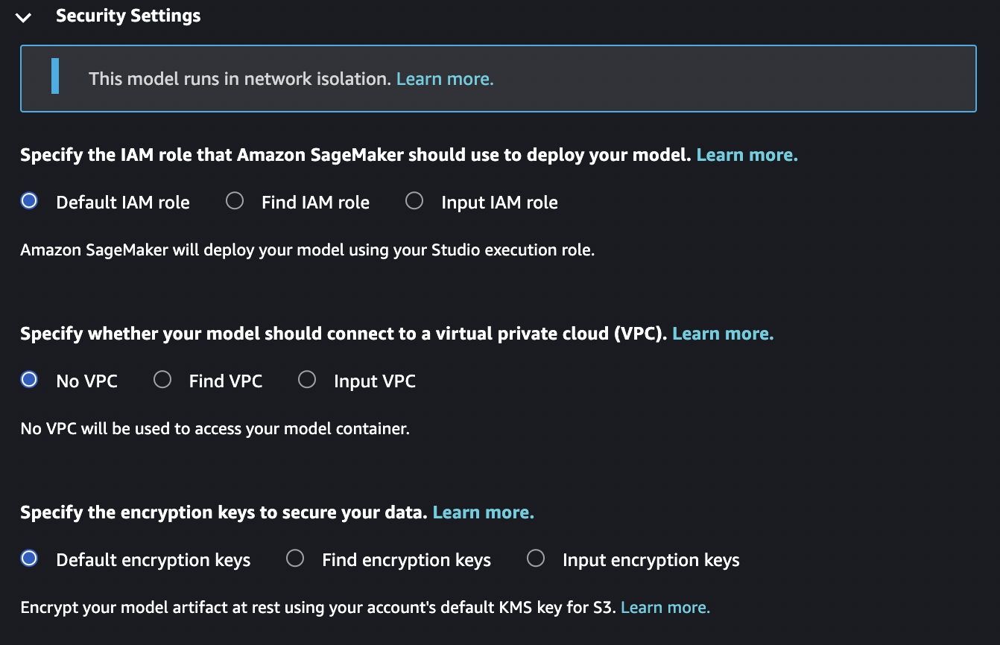
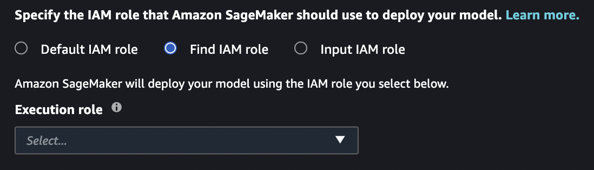
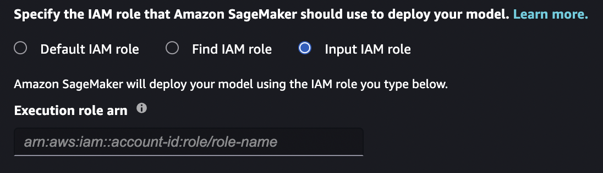
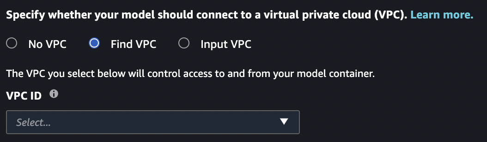
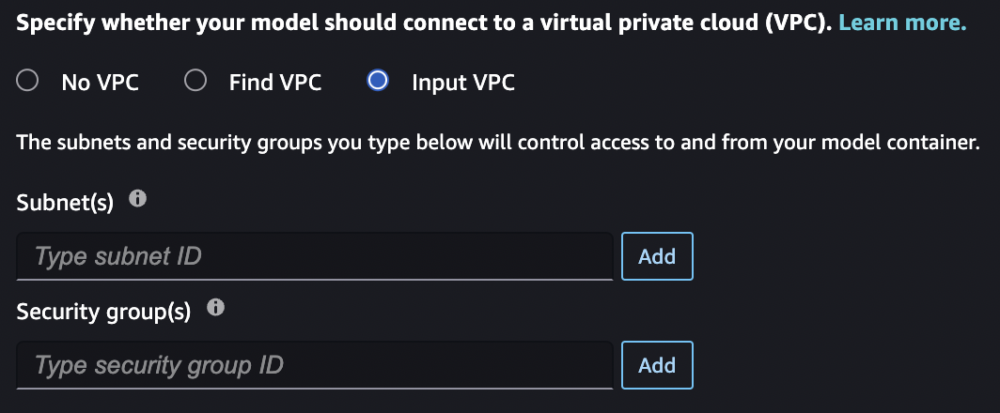
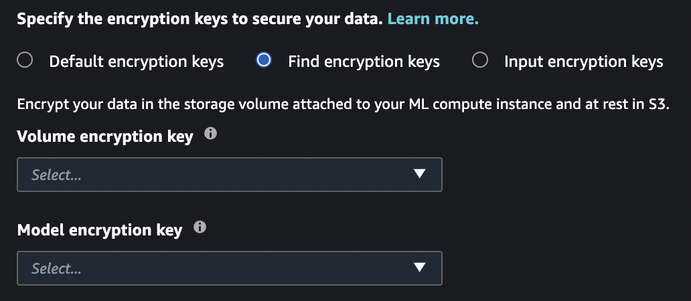
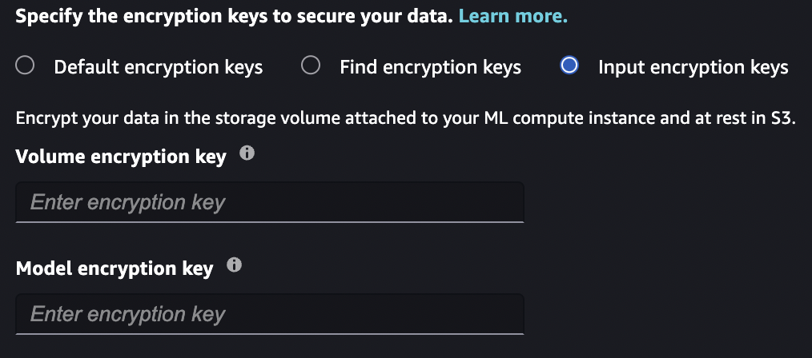

# Deploy a Model

When you deploy a model from JumpStart, SageMaker AI hosts the model and deploys an endpoint
that you can use for inference. JumpStart also provides an example notebook that you can use
to access the model after it's deployed.

###### Important

As of November 30, 2023, the previous Amazon SageMaker Studio experience is now named
Amazon SageMaker Studio Classic. The following section is specific to using the Studio Classic application. For
information about using the updated Studio experience, see [Amazon SageMaker Studio](studio-updated.md "studio-updated.md").

Studio Classic is still maintained for existing
workloads but is no longer available for onboarding. You can only stop or delete existing Studio Classic
applications and cannot create new ones. We recommend that you [migrate your workload to the new Studio experience](studio-updated-migrate.md "studio-updated-migrate.md").

###### Note

Fore more information on JumpStart model deployment in Studio, see [Deploy a
model in Studio](jumpstart-foundation-models-use-studio-updated-deploy.md "jumpstart-foundation-models-use-studio-updated-deploy.md")

## Model deployment configuration

After you choose a model, the model's tab opens. In the **Deploy
Model** pane, choose **Deployment Configuration** to configure
your model deployment.



The default instance type for deploying a model depends on the model. The instance
type is the hardware that the training job runs on. In the following example, the
`ml.p2.xlarge` instance is the default for this particular BERT model.

You can also change the endpoint name, add `key;value` resource tags,
activate or deactive the `jumpstart-` prefix for any JumpStart resources
related to the model, and specify an Amazon S3 bucket for storing model artifacts used by your
SageMaker AI endpoint.



Choose **Security Settings** to specify the AWS Identity and Access Management (IAM ) role,
Amazon Virtual Private Cloud (Amazon VPC), and encryption keys for the model.



## Model deployment security

When you deploy a model with JumpStart, you can specify an IAM role, Amazon VPC, and
encryption keys for the model. If you don't specify any values for these entries: The
default IAM role is your Studio Classic runtime role; default encryption is used; no Amazon VPC
is used.

### IAM role

You can select an IAM role that is passed as part of training jobs and hosting
jobs. SageMaker AI uses this role to access training data and model artifacts. If you don't
select an IAM role, SageMaker AI deploys the model using your Studio Classic runtime role. For
more information about IAM roles, see [AWS Identity and Access Management for Amazon SageMaker AI](security-iam.md "security-iam.md").

The role that you pass must have access to the resources that the model needs, and
must include all of the following.

- For training jobs: [CreateTrainingJob API: Execution Role Permissions](sagemaker-roles.md#sagemaker-roles-createtrainingjob-perms "sagemaker-roles.md#sagemaker-roles-createtrainingjob-perms").
- For hosting jobs: [CreateModel API: Execution Role Permissions](sagemaker-roles.md#sagemaker-roles-createmodel-perms "sagemaker-roles.md#sagemaker-roles-createmodel-perms").

###### Note

You can scope down the Amazon S3 permissions granted in each of the following roles.
Do this by using the ARN of your Amazon Simple Storage Service (Amazon S3) bucket and the JumpStart Amazon S3
bucket.

```
[
    {
      "Effect": "Allow",
      "Action": [
        "s3:GetObject",
        "s3:ListBucket"
      ],
      "Resource": [
        "arn:aws:s3:::jumpstart-cache-prod-`<region>`/*",
        "arn:aws:s3:::jumpstart-cache-prod-`<region>`",
        "arn:aws:s3:::`<bucket>`/*"
      ]
    },
    {
      "Effect": "Allow",
      "Action": [
           "cloudwatch:PutMetricData",
           "logs:CreateLogStream",
          "logs:PutLogEvents",
          "logs:CreateLogGroup",
          "logs:DescribeLogStreams",
          "ecr:GetAuthorizationToken"
      ],
      "Resource": [
        "*"
      ]
    },
    {
      "Effect": "Allow",
      "Action": [
        "ecr:BatchGetImage",
        "ecr:BatchCheckLayerAvailability",
        "ecr:GetDownloadUrlForLayer"
      ],
      "Resource": [
        "*"
      ]
    },
  ]
}
```

**Find IAM role**

If you select this option, you must select an existing IAM role from the
dropdown list.



**Input IAM role**

If you select this option, you must manually enter the ARN for an existing IAM
role. If your Studio Classic runtime role or Amazon VPC block the `iam:list*` call,
you must use this option to use an existing IAM role.



### Amazon VPC

All JumpStart models run in network isolation mode. After the model container is
created, no more calls can be made. You can select an Amazon VPC that is passed as part of
training jobs and hosting jobs. SageMaker AI uses this Amazon VPC to push and pull resources from
your Amazon S3 bucket. This Amazon VPC is different from the Amazon VPC that limits access to the
public internet from your Studio Classic instance. For more information about the
Studio Classic Amazon VPC, see [Connect Studio notebooks in
a VPC to external resources](studio-notebooks-and-internet-access.md "studio-notebooks-and-internet-access.md").

The Amazon VPC that you pass does not need access to the public internet, but it does
need access to Amazon S3. The Amazon VPC endpoint for Amazon S3 must allow access to at least the
following resources that the model needs.

```
{
  "Effect": "Allow",
  "Action": [
    "s3:GetObject",
    "s3:PutObject",
    "s3:ListMultipartUploadParts",
    "s3:ListBucket"
  ],
  "Resources": [
    "arn:aws:s3:::jumpstart-cache-prod-`<region>`/*",
    "arn:aws:s3:::jumpstart-cache-prod-`<region>`",
    "arn:aws:s3:::`bucket`/*"
  ]
}
```

If you do not select an Amazon VPC, no Amazon VPC is used.

**Find VPC**

If you select this option, you must select an existing Amazon VPC from the dropdown
list. After you select an Amazon VPC, you must select a subnet and security group for your
Amazon VPC. For more information about subnets and security groups, see [Overview of VPCs
and subnets](../../../vpc/latest/userguide/VPC_Subnets.md "../../../vpc/latest/userguide/VPC_Subnets.md").



**Input VPC**

If you select this option, you must manually select the subnet and security group
that compose your Amazon VPC. If your Studio Classic runtime role or Amazon VPC blocks the
`ec2:list*` call, you must use this option to select the subnet and
security group.



### Encryption keys

You can select an AWS KMS key that is passed as part of training jobs and hosting
jobs. SageMaker AI uses this key to encrypt the Amazon EBS volume for the container, and the
repackaged model in Amazon S3 for hosting jobs and the output for training jobs. For more
information about AWS KMS keys, see [AWS KMS keys](../../../kms/latest/developerguide/concepts.md#kms_keys "../../../kms/latest/developerguide/concepts.md#kms_keys").

The key that you pass must trust the IAM role that you pass. If you do not
specify an IAM role, the AWS KMS key must trust your Studio Classic runtime role.

If you do not select an AWS KMS key, SageMaker AI provides default encryption for the data
in the Amazon EBS volume and the Amazon S3 artifacts.

**Find encryption keys**

If you select this option, you must select existing AWS KMS keys from the dropdown
list.



**Input encryption keys**

If you select this option, you must manually enter the AWS KMS keys. If your
Studio Classic execution role or Amazon VPC block the `kms:list*` call, you must use
this option to select existing AWS KMS keys.



## Configure default values for JumpStart models

You can configure default values for parameters such as IAM roles, VPCs, and
KMS keys to pre-populate for JumpStart model deployment and training. After configuring
default values, the Studio Classic UI automatically provides your specified security settings
and tags to JumpStart models to simplify deployment and training workflows.
Administrators and end-users can initialize default values specified in a configuration
file in YAML format.

By default, the SageMaker Python SDK uses two configuration files: one for the
administrator and one for the user. Using the admininistrator configuration file,
administrators can define a set of default values. End-users can override values set in
the administrator configuration file and set additional default values using the end-user
configuration file. For more information, see [Default configuration file location](https://sagemaker.readthedocs.io/en/stable/overview.html#default-configuration-file-location "https://sagemaker.readthedocs.io/en/stable/overview.html#default-configuration-file-location").

The following code sample lists the default locations of the configuration files when
using the SageMaker Python SDK in Amazon SageMaker Studio Classic.

```
# Location of the admin config file
/etc/xdg/sagemaker/config.yaml

# Location of the user config file
/root/.config/sagemaker/config.yaml
```

Values specified in the user configuration file override values set in the
administrator configuration file. The configuration file is unique to each user profile
within an Amazon SageMaker AI domain. The user profile's Studio Classic application is directly associated
with the user profile. For more information, see [Domain user profiles](domain-user-profile.md "domain-user-profile.md").

Administrators can optionally set configuration defaults for JumpStart model training and
deployment through `JupyterServer` lifecycle configurations. For more
information, see [Create and Associate a Lifecycle Configuration with Amazon SageMaker Studio Classic](studio-lcc-create.md "studio-lcc-create.md").

Your configuration file should adhere to the SageMaker Python SDK [configuration file structure](https://sagemaker.readthedocs.io/en/stable/overview.html#configuration-file-structure "https://sagemaker.readthedocs.io/en/stable/overview.html#configuration-file-structure"). Note that specific fields in the
`TrainingJob`, `Model`, and
`EndpointConfig` configurations apply to JumpStart model training and deployment
default values.

```
SchemaVersion: '1.0'
SageMaker:
  TrainingJob:
    OutputDataConfig:
      KmsKeyId: `example-key-id`
    ResourceConfig:
      # Training configuration - Volume encryption key
      VolumeKmsKeyId: `example-key-id`
    # Training configuration form - IAM role
    RoleArn: arn:aws:iam::`123456789012`:role/SageMakerExecutionRole
    VpcConfig:
      # Training configuration - Security groups
      SecurityGroupIds:
      - `sg-1`
      - `sg-2`
      # Training configuration - Subnets
      Subnets:
      - `subnet-1`
      - `subnet-2`
    # Training configuration - Custom resource tags
    Tags:
    - Key: `Example-key`
      Value: `Example-value`
  Model:
    EnableNetworkIsolation: `true`
    # Deployment configuration - IAM role
    ExecutionRoleArn: arn:aws:iam::`123456789012`:role/SageMakerExecutionRole
    VpcConfig:
      # Deployment configuration - Security groups
      SecurityGroupIds:
      - `sg-1`
      - `sg-2`
      # Deployment configuration - Subnets
      Subnets:
      - `subnet-1`
      - `subnet-2`
  EndpointConfig:
    AsyncInferenceConfig:
      OutputConfig:
        KmsKeyId: `example-key-id`
    DataCaptureConfig:
      # Deployment configuration - Volume encryption key
      KmsKeyId: `example-key-id`
    KmsKeyId: `example-key-id`
    # Deployment configuration - Custom resource tags
    Tags:
    - Key: `Example-key`
      Value: `Example-value`
```
