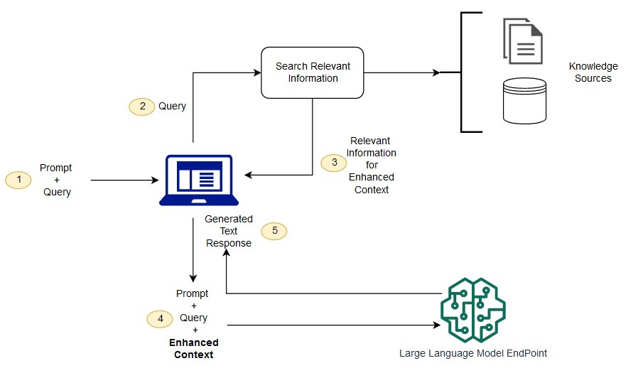

# Retrieval Augmented

Generation

Foundation models are usually trained offline, making the model agnostic to any
data that is created after the model was trained. Additionally, foundation models
are trained on very general domain corpora, making them less effective for
domain-specific tasks. You can use Retrieval Augmented Generation (RAG) to retrieve
data from outside a foundation model and augment your prompts by adding the relevant
retrieved data in context. For more information about RAG model architectures, see
[Retrieval-Augmented Generation for
Knowledge-Intensive NLP Tasks](https://arxiv.org/abs/2005.11401 "https://arxiv.org/abs/2005.11401").

With RAG, the external data used to augment your prompts can come from multiple
data sources, such as a document repositories, databases, or APIs. The first step is
to convert your documents and any user queries into a compatible format to perform
relevancy search. To make the formats compatible, a document collection, or
knowledge library, and user-submitted queries are converted to numerical
representations using embedding language models. _Embedding_ is the process by which text is given numerical
representation in a vector space. RAG model architectures compare the embeddings of
user queries within the vector of the knowledge library. The original user prompt is
then appended with relevant context from similar documents within the knowledge
library. This augmented prompt is then sent to the foundation model. You can update
knowledge libraries and their relevant embeddings asynchronously.

The retrieved document should be large enough to contain useful context to help
augment the prompt, but small enough to fit into the maximum sequence length of the
prompt. You can use task-specific JumpStart models, such as the General Text Embeddings
(GTE) model from Hugging Face, to provide the embeddings for your
prompts and knowledge library documents. After comparing the prompt and document
embeddings to find the most relevant documents, construct a new prompt with the
supplemental context. Then, pass the augmented prompt to a text generation model of
your choosing.

## Example

notebooks

For more information on RAG foundation model solutions, see the following
example notebooks:

- [Retrieval-Augmented Generation: Question Answering using LangChain
  and Cohere’s Generate and Embedding Models from SageMaker
  JumpStart](https://sagemaker-examples.readthedocs.io/en/latest/introduction_to_amazon_algorithms/jumpstart-foundation-models/question_answering_retrieval_augmented_generation/question_answering_Cohere+langchain_jumpstart.html "https://sagemaker-examples.readthedocs.io/en/latest/introduction_to_amazon_algorithms/jumpstart-foundation-models/question_answering_retrieval_augmented_generation/question_answering_Cohere+langchain_jumpstart.html")
- [Retrieval-Augmented Generation: Question Answering using LLama-2,
  Pinecone and Custom Dataset](https://sagemaker-examples.readthedocs.io/en/latest/introduction_to_amazon_algorithms/jumpstart-foundation-models/question_answering_retrieval_augmented_generation/question_answering_pinecone_llama-2_jumpstart.html "https://sagemaker-examples.readthedocs.io/en/latest/introduction_to_amazon_algorithms/jumpstart-foundation-models/question_answering_retrieval_augmented_generation/question_answering_pinecone_llama-2_jumpstart.html")
- [Retrieval-Augmented Generation: Question Answering based on Custom
  Dataset with Open-sourced LangChain Library](https://sagemaker-examples.readthedocs.io/en/latest/introduction_to_amazon_algorithms/jumpstart-foundation-models/question_answering_retrieval_augmented_generation/question_answering_langchain_jumpstart.html "https://sagemaker-examples.readthedocs.io/en/latest/introduction_to_amazon_algorithms/jumpstart-foundation-models/question_answering_retrieval_augmented_generation/question_answering_langchain_jumpstart.html")
- [Retrieval-Augmented Generation: Question Answering based on Custom
  Dataset](https://sagemaker-examples.readthedocs.io/en/latest/introduction_to_amazon_algorithms/jumpstart-foundation-models/question_answering_retrieval_augmented_generation/question_answering_jumpstart_knn.html "https://sagemaker-examples.readthedocs.io/en/latest/introduction_to_amazon_algorithms/jumpstart-foundation-models/question_answering_retrieval_augmented_generation/question_answering_jumpstart_knn.html")
- [Retrieval-Augmented Generation: Question Answering using Llama-2
  and Text Embedding Models](https://sagemaker-examples.readthedocs.io/en/latest/introduction_to_amazon_algorithms/jumpstart-foundation-models/question_answering_retrieval_augmented_generation/question_answering_text_embedding_llama-2_jumpstart.html "https://sagemaker-examples.readthedocs.io/en/latest/introduction_to_amazon_algorithms/jumpstart-foundation-models/question_answering_retrieval_augmented_generation/question_answering_text_embedding_llama-2_jumpstart.html")
- [Amazon SageMaker JumpStart - Text Embedding and Sentence Similarity](https://sagemaker-examples.readthedocs.io/en/latest/introduction_to_amazon_algorithms/jumpstart-foundation-models/question_answering_retrieval_augmented_generation/text-embedding-sentence-similarity.html "https://sagemaker-examples.readthedocs.io/en/latest/introduction_to_amazon_algorithms/jumpstart-foundation-models/question_answering_retrieval_augmented_generation/text-embedding-sentence-similarity.html")

You can clone the [Amazon SageMaker AI examples repository](https://github.com/aws/amazon-sagemaker-examples/tree/main/introduction_to_amazon_algorithms/jumpstart-foundation-models "https://github.com/aws/amazon-sagemaker-examples/tree/main/introduction_to_amazon_algorithms/jumpstart-foundation-models") to run the available JumpStart foundation
model examples in the Jupyter environment of your choice within Studio. For
more information on applications that you can use to create and access Jupyter in
SageMaker AI, see [Applications supported in Amazon SageMaker Studio](studio-updated-apps.md "studio-updated-apps.md").
