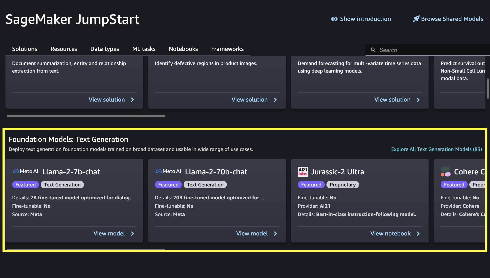

# Use foundation models in

Amazon SageMaker Studio Classic

You can fine-tune and deploy both publicly available and proprietary JumpStart
foundation models through the Studio Classic UI.

###### Important

As of November 30, 2023, the previous Amazon SageMaker Studio experience is now named
Amazon SageMaker Studio Classic. The following section is specific to using the Studio Classic application. For
information about using the updated Studio experience, see [Amazon SageMaker Studio](studio-updated.md "studio-updated.md").

Studio Classic is still maintained for existing
workloads but is no longer available for onboarding. You can only stop or delete existing Studio Classic
applications and cannot create new ones. We recommend that you [migrate your workload to the new Studio experience](studio-updated-migrate.md "studio-updated-migrate.md").

To get started with Studio Classic, see [Launch Amazon SageMaker Studio Classic](studio-launch.md "studio-launch.md").

After opening Amazon SageMaker Studio Classic, choose **Models, notebooks,
solutions** in the SageMaker JumpStart section of the navigation pane. Then,
scroll down to find either the **Foundation Models: Text
Generation** or **Foundation Models: Image
Generation** section depending on your use case.

You can choose **View model** on a suggested foundation model
card, or choose **Explore All Models** to see all available
foundation models for either text generation or image generation. If you choose to
see all available models, you can further filter available models by task, data
type, content type, or framework. You can also search for a model name directly in
the **Search** bar. If you need guidance on selecting a model, see
[Available foundation models](jumpstart-foundation-models-latest.md "jumpstart-foundation-models-latest.md").

###### Important

Some foundation models require explicit acceptance of an end-user license
agreement (EULA). For more information, see [EULA acceptance
in Amazon SageMaker Studio](jumpstart-foundation-models-choose.md#jumpstart-foundation-models-choose-eula-studio "jumpstart-foundation-models-choose.md#jumpstart-foundation-models-choose-eula-studio").

After you choose **View model** for the foundation model of your
choice in Studio Classic, you can deploy the model. For more information, see [Deploy a Model](jumpstart-deploy.md "jumpstart-deploy.md").

You can also choose **Open notebook** in the **Run in
notebook** section to run an example notebook for the foundation model
directly in Studio Classic.

###### Note

To deploy a proprietary foundation model in Studio Classic, you must first
subscribe to the model in AWS Marketplace. The AWS Marketplace link is provided in the associated
example notebook within Studio Classic.

If the model is fine-tunable, you can also fine-tune the model. For more
information, see [Fine-Tune a Model](jumpstart-fine-tune.md "jumpstart-fine-tune.md"). For a list of which JumpStart foundation
models are fine-tunable, see [Foundation models and
hyperparameters for fine-tuning](jumpstart-foundation-models-fine-tuning.md "jumpstart-foundation-models-fine-tuning.md").
