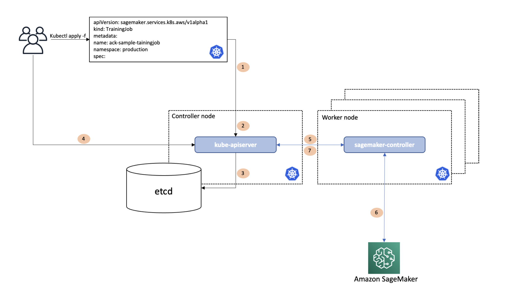
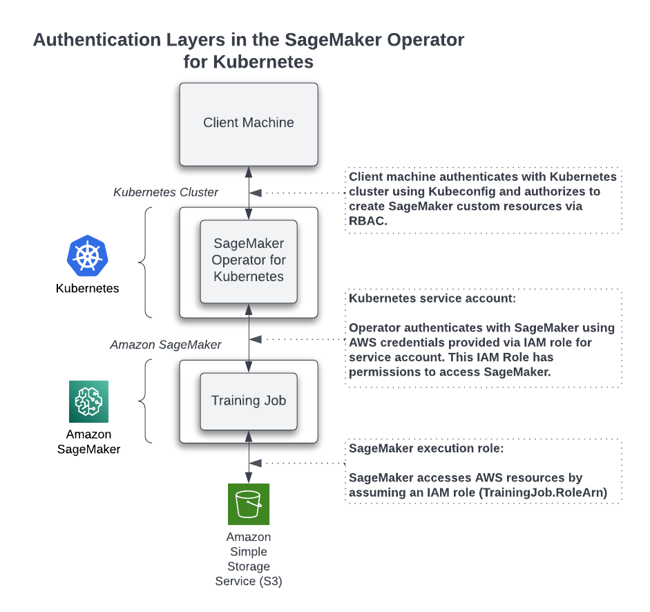

# SageMaker AI Operators for Kubernetes

SageMaker AI Operators for Kubernetes make it easier for developers and data scientists using
Kubernetes to train, tune, and deploy machine learning (ML) models in SageMaker AI. You can install
these SageMaker AI Operators on your Kubernetes cluster in Amazon Elastic Kubernetes Service (Amazon EKS) to create SageMaker AI jobs
natively using the Kubernetes API and command-line Kubernetes tools such as
`kubectl`. This guide shows how to set up and use the operators to run model
training, hyperparameter tuning, or inference (real-time and batch) on SageMaker AI from a Kubernetes
cluster. The procedures and guidelines in this chapter assume that you are familiar with
Kubernetes and its basic commands.

###### Important

We are stopping the development and technical
support of the original version of [SageMaker Operators for Kubernetes](https://github.com/aws/amazon-sagemaker-operator-for-k8s/tree/master "https://github.com/aws/amazon-sagemaker-operator-for-k8s/tree/master").

If you are currently using version `v1.2.2`
or below of [SageMaker Operators for Kubernetes](https://github.com/aws/amazon-sagemaker-operator-for-k8s/tree/master "https://github.com/aws/amazon-sagemaker-operator-for-k8s/tree/master"), we recommend migrating your resources to the
[ACK service controller for Amazon SageMaker](https://github.com/aws-controllers-k8s/sagemaker-controller "https://github.com/aws-controllers-k8s/sagemaker-controller").
The ACK service controller is a new generation of SageMaker Operators for Kubernetes based on
[AWS Controllers for Kubernetes (ACK)](https://aws-controllers-k8s.github.io/community/ "https://aws-controllers-k8s.github.io/community/").

For information on the migration steps, see [Migrate resources to the latest
Operators](kubernetes-sagemaker-operators-migrate.md "kubernetes-sagemaker-operators-migrate.md").

For answers to frequently asked
questions on the end of support of the original version of SageMaker Operators for
Kubernetes, see [Announcing the End of Support
of the Original Version of SageMaker AI
Operators for Kubernetes](kubernetes-sagemaker-operators-eos-announcement.md "kubernetes-sagemaker-operators-eos-announcement.md")

###### Note

There is no additional charge to use these operators. You do incur charges for any SageMaker AI
resources that you use through these operators.

## What is an operator?

A Kubernetes operator is an application controller managing applications on behalf of a
Kubernetes user. Controllers of the control plane encompass various control loops listening to
a central state manager (ETCD) to regulate the state of the application they control. Examples
of such applications include the [Cloud-controller-manager](https://kubernetes.io/docs/concepts/architecture/cloud-controller/ "https://kubernetes.io/docs/concepts/architecture/cloud-controller/") and `kube-controller-manager`. Operators typically provide a higher-level
abstraction than raw Kubernetes API, making it easier for users to deploy and manage
applications. To add new capabilities to Kubernetes, developers can extend the Kubernetes API
by creating a **custom resource** that contains their
application-specific or domain-specific logic and components. Operators in Kubernetes allow
users to natively invoke these custom resources and automate associated workflows.

### How does AWS Controllers for

Kubernetes (ACK) work?

The SageMaker AI Operators for Kubernetes allow you to manage jobs in SageMaker AI from your Kubernetes
cluster. The latest version of SageMaker AI Operators for Kubernetes is based on AWS Controllers
for Kubernetes (ACK). ACK includes a common controller runtime, a code generator, and a set
of AWS service-specific controllers, one of which is the SageMaker AI controller.

The following diagram illustrates how ACK works.

In this diagram, a Kubernetes user wants to run model training on SageMaker AI from within the
Kubernetes cluster using the Kubernetes API. The user issues a call to `kubectl
 apply`, passing in a file that describes a Kubernetes custom resource describing the
SageMaker training job. `kubectl apply` passes this file, called a manifest, to the
Kubernetes API server running in the Kubernetes controller node (Step _1_ in the workflow diagram). The Kubernetes API server
receives the manifest with the SageMaker training job specification and determines whether the
user has permissions to create a custom resource of kind
`sageMaker.services.k8s.aws/TrainingJob`, and whether the custom resource is
properly formatted (Step _2_). If the user is
authorized and the custom resource is valid, the Kubernetes API server writes (Step
_3_) the custom resource to its etcd data store and
then responds back (Step _4_) to the user that the
custom resource has been created. The SageMaker AI controller, which is running on a Kubernetes
worker node within the context of a normal Kubernetes Pod, is notified (Step _5_) that a new custom resource of kind
`sageMaker.services.k8s.aws/TrainingJob` has been created. The SageMaker AI controller
then communicates (Step _6_) with the SageMaker API,
calling the SageMaker AI `CreateTrainingJob` API to create the training job in AWS.
After communicating with the SageMaker API, the SageMaker AI controller calls the Kubernetes API server
to update (Step _7_) the custom resource’s status
with information it received from SageMaker AI. The SageMaker AI controller therefore provides the same
information to the developers that they would have received using the AWS SDK.

### Permissions overview

The operators access SageMaker AI resources on your behalf.
The IAM role that the operator assumes to interact with AWS resources differs from the credentials
you use to access the Kubernetes cluster.
The role also differs from the role that AWS assumes when running your machine learning jobs.

The following image explains the various authentication layers.

