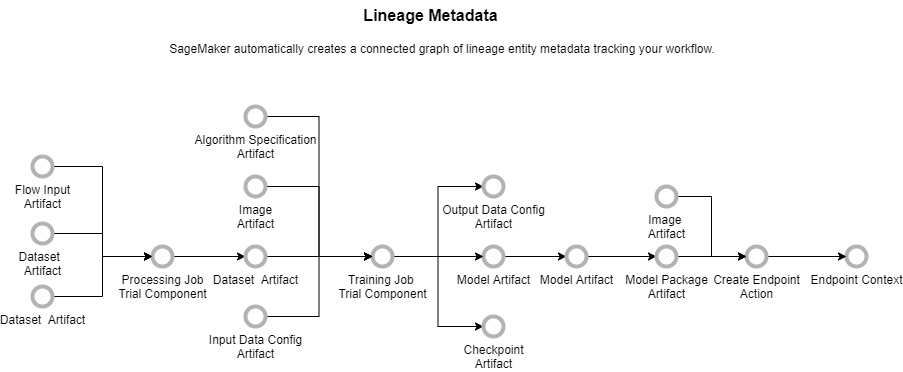

# Amazon SageMaker ML Lineage Tracking

###### Important

As of November 30, 2023, the previous Amazon SageMaker Studio experience is now named
Amazon SageMaker Studio Classic. The following section is specific to using the Studio Classic application. For
information about using the updated Studio experience, see [Amazon SageMaker Studio](studio-updated.md "studio-updated.md").

Studio Classic is still maintained for existing
workloads but is no longer available for onboarding. You can only stop or delete existing Studio Classic
applications and cannot create new ones. We recommend that you [migrate your workload to the new Studio experience](studio-updated-migrate.md "studio-updated-migrate.md").

Amazon SageMaker ML Lineage Tracking creates and stores information about the steps of a machine
learning (ML) workflow from data preparation to model deployment. With the tracking information,
you can reproduce the workflow steps, track model and dataset lineage, and establish model
governance and audit standards.

SageMaker AI’s Lineage Tracking feature works in the backend to track all the metadata associated
with your model training and deployment workflows. This includes your training jobs, datasets
used, pipelines, endpoints, and the actual models. You can query the lineage service at any
point to find the exact artifacts used to train a model. Using those artifacts, you can recreate
the same ML workflow to reproduce the model as long as you have access to the exact dataset that
was used. A trial component tracks the training job. This trial component has all the parameters
used as part of the training job. If you don’t need to rerun the entire workflow, you can
reproduce the training job to derive the same model.

With SageMaker AI Lineage Tracking data scientists and model builders can do the following:

- Keep a running history of model discovery experiments.
- Establish model governance by tracking model lineage artifacts for auditing and
  compliance verification.
  The following diagram shows an example lineage graph that Amazon SageMaker AI automatically creates in
  an end-to-end model training and deployment ML workflow.

###### Topics

- [Lineage Tracking Entities](lineage-tracking-entities.md "lineage-tracking-entities.md")
- [Amazon SageMaker AI–Created Tracking
  Entities](lineage-tracking-auto-creation.md "lineage-tracking-auto-creation.md")
- [Manually Create Tracking Entities](lineage-tracking-manual-creation.md "lineage-tracking-manual-creation.md")
- [Querying Lineage Entities](querying-lineage-entities.md "querying-lineage-entities.md")
- [Tracking Cross-Account Lineage](xaccount-lineage-tracking.md "xaccount-lineage-tracking.md")
