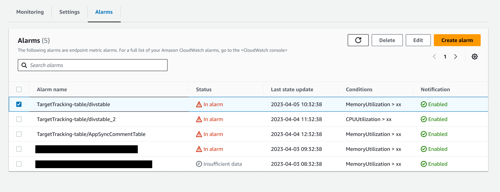

# Create and view alarms

From the **Alarms** tab on your endpoint details page, you can
view and create simple static threshold metric alarms, where you specify a threshold
value for a metric. If the metric breaches the threshold value, the alarm goes into
the `ALARM` state. For more information about CloudWatch alarms, see [Using Amazon CloudWatch
alarms](../../../AmazonCloudWatch/latest/monitoring/AlarmThatSendsEmail.md "../../../AmazonCloudWatch/latest/monitoring/AlarmThatSendsEmail.md").

In the **Endpoint summary** section, you can view the
**Alarms** field, which tells you how many alarms are currently
active on your endpoint.

To view which alarms are in the `ALARM` state, choose the
**Alarms** tab. The **Alarms** tab shows you a
full list of your endpoint alarms, along with details about their status and
conditions. The following screenshot shows a list of alarms in this section that
have been configured for an endpoint.

An alarm’s status can be `In alarm`, `OK`, or
`Insufficient data` if there isn’t enough metrics data being
collected.

To create a new alarm for your endpoint, do the following:

1. In the **Alarms** tab, choose **Create
   alarm**.
2. The **Create alarm** page opens. For **Alarm
   name**, enter a name for the alarm.
3. (Optional) Enter a description for the alarm.
4. For **Metric**, choose the CloudWatch metric that you want the
   alarm to track.
5. For **Variant name**, choose the endpoint model variant
   that you want to monitor.
6. For **Statistic**, choose one of the available statistics
   for the metric you selected.
7. For **Period**, choose the time period to use for
   calculating each statistical value. For example, if you choose the Average
   statistic and a 5 minute period, each data point monitored by the alarm is
   the average of the metric’s data points at 5 minute intervals.
8. For **Evaluation periods**, enter the number of data
   points that you want the alarm to consider when evaluating whether to enter
   the alarm state or not.
9. For **Condition**, choose the conditional that you want
   to use for your alarm threshold.
10. For **Threshold value**, enter the desired value for your
    threshold.
11. (Optional) For **Notification**, you can choose
    **Add notification** to create or specify an Amazon SNS
    topic that receives a notification when your alarm state changes.
12. Choose **Create alarm**.
    After creating your alarm, you can return to the **Alarms** tab
    to view its status at any time. From this section, you can also select the alarm and
    either **Edit** or **Delete** it.
