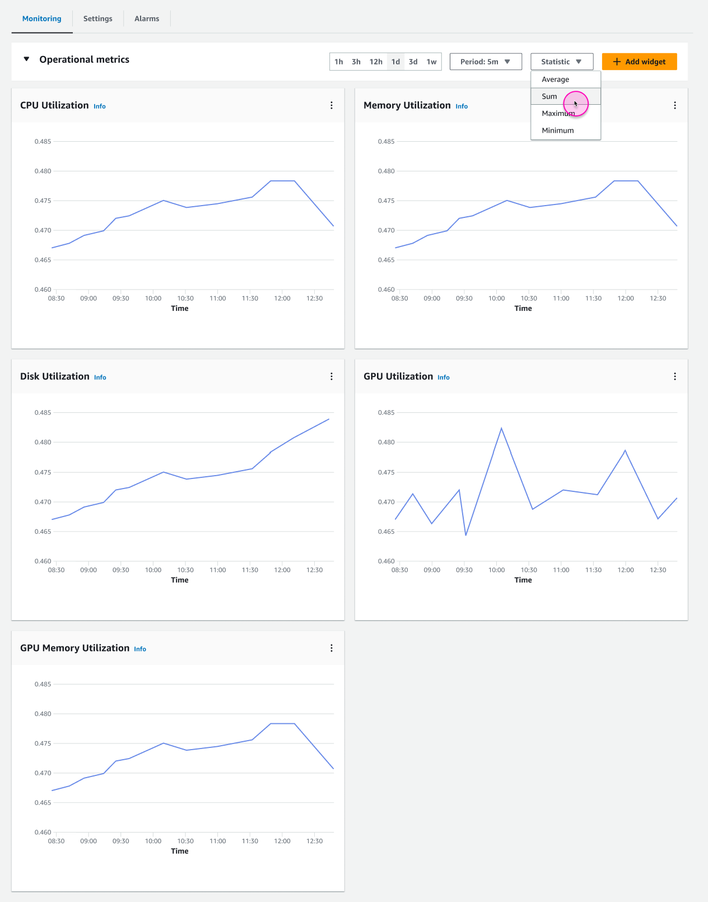

# Endpoints monitoring

After creating a SageMaker AI Hosting endpoint, you can monitor your endpoint using
Amazon CloudWatch, which collects raw data and processes it into readable, near real-time
metrics. Using these metrics, you can access historical information and gain a
better perspective on how your endpoint is performing. For more information, see the
_[Amazon CloudWatch User
Guide](../../../AmazonCloudWatch/latest/monitoring.md "../../../AmazonCloudWatch/latest/monitoring.md")_.

From the **Monitoring** tab on the endpoint details page, you can
view CloudWatch metrics data that has been collected from your endpoint.

The **Monitoring** tab includes the following sections:

- **Operational metrics**: View metrics that track the
  utilization of your endpoint’s resources, such as CPU Utilization and Memory
  Utilization.
- **Invocation metrics**: View metrics that track the
  number, health, and status of `InvokeEndpoint` requests coming to
  your endpoint, such as Invocation Model Errors and Model Latency.
- **Health metrics**: View metrics that track your
  endpoint’s overall health, such as Invocation Failures and Notification
  Failures.
  For detailed descriptions of each metric, see [Monitor SageMaker AI with
  CloudWatch](monitoring-cloudwatch.md "monitoring-cloudwatch.md").

The following screenshot shows the **Operational metrics**
section for a serverless endpoint.

You can adjust the **Period** and **Statistic** that you want to track for the metrics in a
given section, as well as the length of time for which you want to view metrics
data. You can also add and remove metric widgets from the view for each section by
choosing **Add widget**. In the **Add widget** dialog box, you can select and deselect the metrics that
you want to see.

The metrics that are available may depend on your endpoint type. For example,
serverless endpoints have some metrics that aren’t available for real-time
endpoints. For more specific metrics information by endpoint type, see the following
pages:

- [Monitor a
  serverless endpoint](serverless-endpoints-monitoring.md "serverless-endpoints-monitoring.md")
- [Monitor an
  asynchronous endpoint](async-inference-monitor.md "async-inference-monitor.md")
- [CW Metrics for Multi-Model Endpoint Deployments](multi-model-endpoint-cloudwatch-metrics.md "multi-model-endpoint-cloudwatch-metrics.md")
- [Inference
  Pipeline Logs and Metrics](inference-pipeline-logs-metrics.md "inference-pipeline-logs-metrics.md")
