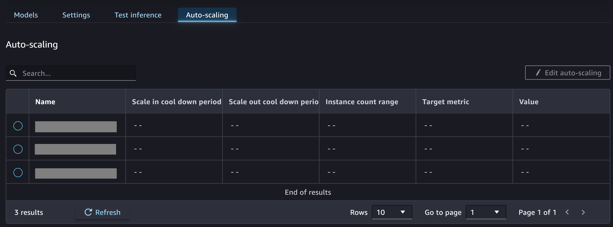

# Auto-scaling

On the **Auto-scaling** tab, you can view any auto-scaling
policies configured for the models hosted on your endpoint. The following screenshot
shows you the **Auto-scaling** tab.

You can choose **Edit auto-scaling** to change any of the
policies and turn on or turn off the default auto-scaling policy.

To learn more about auto-scaling for real-time endpoints, see [Automatically Scale Amazon SageMaker AI Models](endpoint-auto-scaling.md "endpoint-auto-scaling.md"). If you’re not sure how to configure
an auto-scaling policy for your endpoint, you can use an [Inference Recommender
autoscaling recommendations job](inference-recommender-autoscaling.md "inference-recommender-autoscaling.md") to get recommendations for an
auto-scaling policy.
