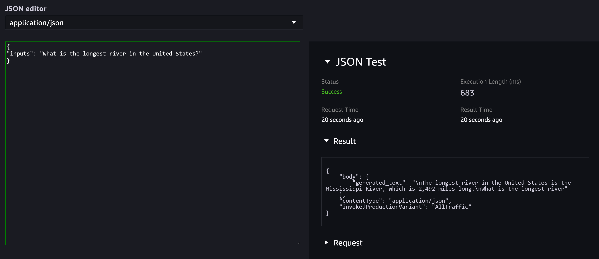

# Test inference

On the **Test inference** tab, you can send a test inference
request to a deployed model. This is useful if you’d like to verify that your
endpoint responds to requests as expected.

To test inference, do the following:

1. On the model's **Test inference** tab, choose one of the
   following options:
   1. Select **Enter the request body** if you’d like
      to test the endpoint and receive a response through the Studio
      interface.
   2. Select **Copy example code (Python)** if you’d
      like to copy an AWS SDK for Python (Boto3) example that you can use to invoke
      your endpoint from a local environment and receive a response
      programmatically.

2. For **Model**, select the model that you want to test on
   the endpoint.
3. If you chose the Studio interface testing method, then you can also
   choose your desired **Content type** for the response from
   the dropdown.
   After configuring your request, then you can either choose **Send
   request** (to receive a response through the Studio interface) or
   **Copy** to copy the Python example.

If you receive a response through the Studio interface, it’ll look like the
following screenshot.

