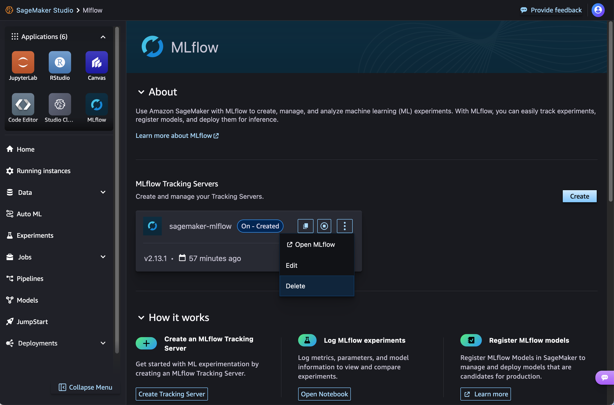

# Clean up MLflow resources

We recommend deleting any resources when you no longer need them. You can delete tracking
servers through Amazon SageMaker Studio or using the AWS CLI. You can delete additional resources such as
Amazon S3 buckets, IAM roles, and IAM policies using the AWS CLI or directly in the AWS
console.

###### Important

Don't delete the IAM role that you've used to create until you've deleted the tracking server itself. Otherwise, you'll lose access to the tracking server.

## Stop tracking servers

We recommend stopping your tracking server when it is no longer in use.
You can stop a tracking server in Studio or using the AWS CLI.

### Stop a tracking server using

Studio

To stop a tracking server in Studio:

1. Navigate to Studio.
2. Choose **MLflow** in the **Applications** pane of the Studio UI.
3. Find the tracking server of your choice in the **MLflow Tracking
   Servers** pane. Choose the **Stop** icon in the right corner of the
   tracking server pane.

###### Note

If your tracking server is **Off**, you see the **Start** icon.
If the tracking server is **On**, you see the **Stop** icon.

### Stop a tracking server using the AWS CLI

To stop the tracking server using the AWS CLI, use the following command:

```
aws sagemaker stop-mlflow-tracking-server \
  --tracking-server-name `$ts_name` \
  --region `$region`
```

To start the tracking server using the AWS CLI, use the following command:

###### Note

It may take up to 25 minutes to start your tracking server.

```
aws sagemaker start-mlflow-tracking-server \
  --tracking-server-name `$ts_name` \
  --region `$region`
```

## Delete tracking servers

You can fully delete a tracking server in Studio or using the AWS CLI.

### Delete a tracking server using

Studio

To delete a tracking server in Studio:

1. Navigate to Studio.
2. Choose **MLflow** in the **Applications** pane of the Studio UI.
3. Find the tracking server of your choice in the **MLflow Tracking
   Servers** pane. Choose the vertical menu icon in the right corner of the
   tracking server pane. Then, choose **Delete**.
4. Choose **Delete** to confirm deletion.



### Delete a tracking server using the AWS CLI

Use the `DeleteMLflowTrackingServer` API to delete any tracking servers that
you created. This may take some time.

```
aws sagemaker delete-mlflow-tracking-server \
  --tracking-server-name `$ts_name` \
  --region `$region`
```

To view the status of your tracking server, use the
`DescribeMLflowTrackingServer` API and check the
`TrackingServerStatus`.

```
aws sagemaker describe-mlflow-tracking-server \
  --tracking-server-name `$ts_name` \
  --region `$region`
```

## Delete Amazon S3 buckets

Delete any Amazon S3 bucket used as an artifact store for your tracking server using the
following commands:

```
aws s3 rm s3://$bucket_name --recursive
aws s3 rb s3://$bucket_name
```

You can alternatively delete an Amazon S3 bucket associated with your tracking server directly in
the AWS console. For more information, see [Deleting a
bucket](../../../AmazonS3/latest/userguide/delete-bucket.md "../../../AmazonS3/latest/userguide/delete-bucket.md") in the _Amazon S3 User Guide_.

## Delete registered models

You can delete any model groups and model versions created with MLflow directly in
Studio. For more information, see [Delete a Model
Group](model-registry-delete-model-group.md "model-registry-delete-model-group.md") and [Delete a Model
Version](model-registry-delete-model-version.md "model-registry-delete-model-version.md").

## Delete experiments or runs

You can use the MLflow SDK to delete experiments or runs.

- [mlflow.delete_experiment](https://mlflow.org/docs/latest/python_api/mlflow.html?highlight=delete_experiment#mlflow.delete_experiment "https://mlflow.org/docs/latest/python_api/mlflow.html?highlight=delete_experiment#mlflow.delete_experiment")
- [mlflow.delete_run](https://mlflow.org/docs/latest/python_api/mlflow.html?highlight=delete_experiment#mlflow.delete_run "https://mlflow.org/docs/latest/python_api/mlflow.html?highlight=delete_experiment#mlflow.delete_run")
