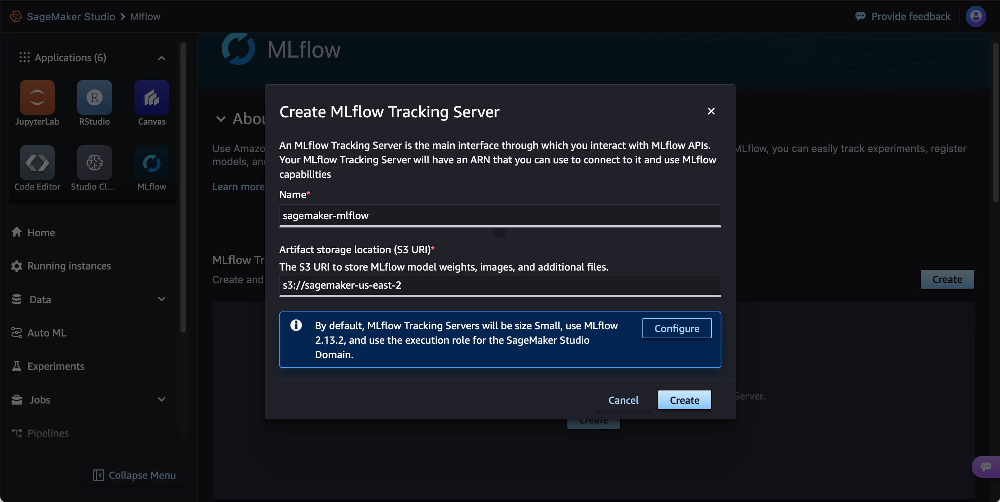

# Create a tracking server using Studio

You can create a tracking server from the SageMaker Studio MLflow UI. If you created your
SageMaker Studio domain following the **Set up for organizations** workflow, the service role
for your SageMaker Studio domain has sufficient permissions to serve as the SageMaker AI IAM service roles and
the tracking server IAM service role.

Create a tracking server from the SageMaker Studio MLflow UI with the following steps:

1. Navigate to Studio from the SageMaker AI console. Be sure that you are using
   the new Studio experience and have updated from Studio Classic. For more information, see
   [Migration from Amazon SageMaker Studio Classic](studio-updated-migrate.md "studio-updated-migrate.md").
2. Choose **MLflow** in the **Applications** pane of the Studio UI.
3. **(Optional)** If have not already created a Tracking
   Server or if you need to create a new one, you can choose **Create**.
   Then provide a unique tracking server name and S3 URI for artifact
   storage and create a tracking server. You can optionally choose **Configure** for more granular tracking server customization.
4. Choose **Create** in the **MLflow
   Tracking Servers** pane. The Studio domain IAM service role is used for the
   tracking server IAM service role.
5. Provide a unique name for your tracking server and an Amazon S3 URI for your tracking
   server artifact store. Your tracking server and the Amazon S3 bucket must be in the **same AWS Region**.

###### Important

When you provide the Amazon S3 URI for your artifact store, ensure the Amazon S3 bucket is in
the same AWS Region as your tracking server. **Cross-region
artifact storage is not supported**. 6. **(Optional)** Choose **Configure** to
change default settings such as tracking server size, tags, and the IAM service role. 7. Choose **Create**.

###### Note

It may take up to 25 minutes to complete
tracking server creation. If the tracking server takes over 25 minutes to create, check that
you have the necessary IAM permissions. For more information on IAM permissions, see
[Set up IAM permissions for MLflow](mlflow-create-tracking-server-iam.md "mlflow-create-tracking-server-iam.md"). When you successfully create a
tracking server, it automatically starts. 8. After creating your tracking server, you can launch the MLflow UI. For more information, see
[Launch the MLflow UI using a presigned URL](mlflow-launch-ui.md "mlflow-launch-ui.md").

