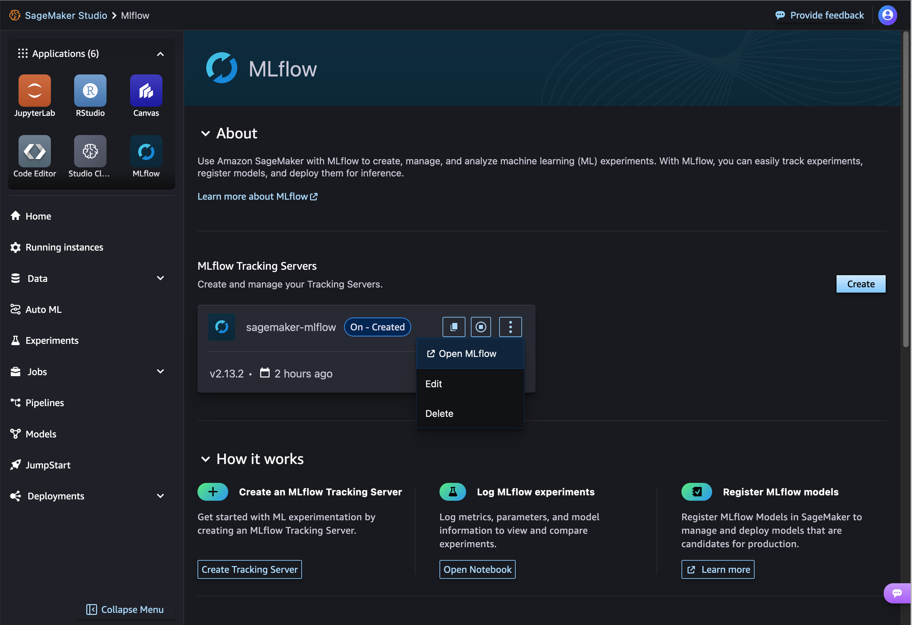
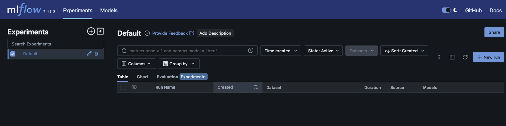

# Launch the MLflow UI using a presigned URL

You can access the MLflow UI to view your experiments using a presigned URL. You can launch
the MLflow UI either through Studio or using the AWS CLI in a terminal of your choice.

## Launch the MLflow UI using Studio

After creating your tracking server, you can launch the MLflow UI directly from Studio.

1. Navigate to Studio from the SageMaker AI console. Be sure that you are using the new
   Studio experience and have updated from Studio Classic. For more information, see [Migration from Amazon SageMaker Studio Classic](studio-updated-migrate.md "studio-updated-migrate.md").
2. Choose **MLflow** in the **Applications** pane of the Studio UI.
3. **(Optional)** If have not already created a tracking
   server or if you need to create a new one, you can choose **Create**.
   Then provide a unique tracking server name and S3 URI for artifact storage and create a
   tracking server. You can optionally choose **Configure** for more
   granular tracking server customization.
4. Find the tracking server of your choice in the **MLflow Tracking
   Servers** pane. If the tracking server is **Off**,
   start the tracking server.
5. Choose the vertical menu icon in the right corner of the tracking server pane. Then,
   choose **Open MLflow**. This launches a presigned URL in a
   new tab in your current browser.



## Launch the MLflow UI using the AWS CLI

You can access the MLflow UI to view your experiments using a presigned URL.

Within your terminal, use the `create-presigned-mlflow-tracking-server-url` API
to generate a presigned URL.

```
aws sagemaker create-presigned-mlflow-tracking-server-url \
  --tracking-server-name `$ts_name` \
  --session-expiration-duration-in-seconds `1800` \
  --expires-in-seconds `300` \
  --region `$region`
```

The output should look similar to the following:

```
{
    "AuthorizedUrl": "https://`unique-key`.`us-west-2`.experiments.sagemaker.aws.a2z.com/auth?authToken=`example_token`"
}
```

Copy the entire presigned URL into the browser of your choice. You can use a new tab or a
new private window. Press `q` to exit the prompt.

The `--session-expiration-duration-in-seconds` parameter determines the length
of time that your MLflow UI session remains valid. The session duration time is the amount of
time that the MLflow UI can be loaded in the browser before a new presigned URL must be
created. The minimum session duration is 30 minutes (1800 seconds) and the maximum session
duration is 12 hours (43200 seconds). The default session duration is 12 hours if no other
duration is specified.

The `--expires-in-seconds parameter` determines the length of time that your
presigned URL remains valid. The minimum URL expiration length is 5 seconds and the maximum
URL expiration length is 5 minutes (300 seconds). The default URL expiration length is 300
seconds. The presigned URL can be used only once.

The window should look similar to the following.


