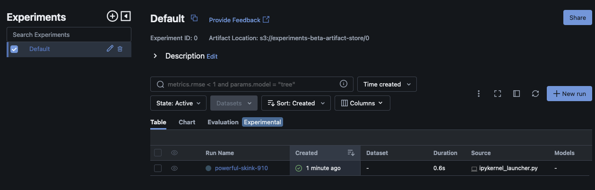
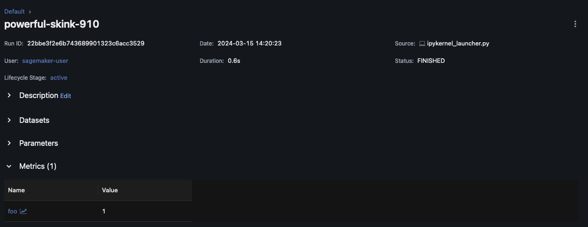
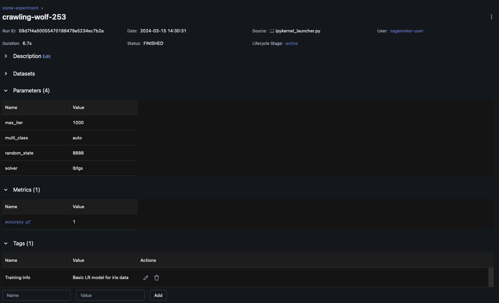
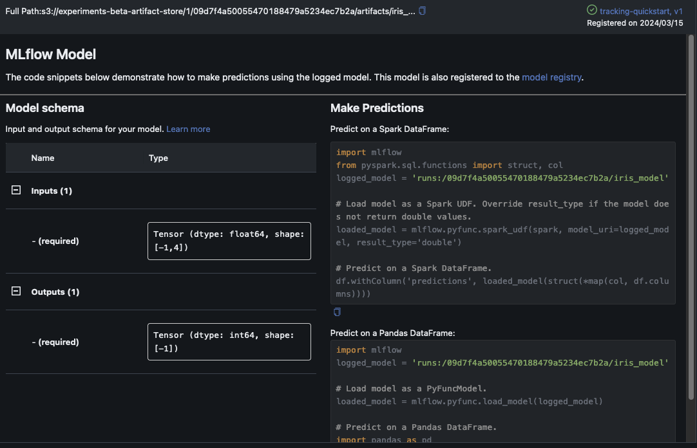

# Log metrics, parameters, and MLflow models during training

After connecting to your MLflow Tracking Server, you can use the MLflow SDK to log
metrics, parameters, and MLflow models.

## Log training metrics

Use `mlflow.log_metric` within an MLflow training run to track metrics. For more information about logging metrics using MLflow, see `mlflow.log_metric`.

```
with mlflow.start_run():
    mlflow.log_metric(`"foo"`, `1`)

print(mlflow.search_runs())
```

This script should create an experiment run and print
out an output similar to the following:

```
run_id experiment_id status artifact_uri ... tags.mlflow.source.name tags.mlflow.user tags.mlflow.source.type tags.mlflow.runName
0 607eb5c558c148dea176d8929bd44869 0 FINISHED s3://dddd/0/607eb5c558c148dea176d8929bd44869/a... ... file.py user-id LOCAL experiment-code-name
```

Within the MLflow UI, this example
should look similar to the following:



Choose **Run Name** to see more run details.



## Log parameters and models

###### Note

The following example requires your environment to have `s3:PutObject`
permissions. This permission should be associated with the IAM Role that the MLflow SDK
user assumes when they log into or federate into their AWS account. For more information,
see [User and role policy examples](../../../AmazonS3/latest/userguide/example-policies-s3.md "../../../AmazonS3/latest/userguide/example-policies-s3.md").

The following example takes you through a basic model training workflow using SKLearn
and shows you how to track that model in an MLflow experiment run. This example logs
parameters, metrics, and model artifacts.

```
import mlflow

from mlflow.models import infer_signature

import pandas as pd
from sklearn import datasets
from sklearn.model_selection import train_test_split
from sklearn.linear_model import LogisticRegression
from sklearn.metrics import accuracy_score, precision_score, recall_score, f1_score

# This is the ARN of the MLflow Tracking Server you created
mlflow.set_tracking_uri(`your-tracking-server-arn`)
mlflow.set_experiment(`"some-experiment"`)

# Load the Iris dataset
X, y = datasets.load_iris(return_X_y=True)

# Split the data into training and test sets
X_train, X_test, y_train, y_test = train_test_split(X, y, test_size=0.2, random_state=42)

# Define the model hyperparameters
params = {"solver": "lbfgs", "max_iter": 1000, "multi_class": "auto", "random_state": 8888}

# Train the model
lr = LogisticRegression(**params)
lr.fit(X_train, y_train)

# Predict on the test set
y_pred = lr.predict(X_test)

# Calculate accuracy as a target loss metric
accuracy = accuracy_score(y_test, y_pred)

# Start an MLflow run and log parameters, metrics, and model artifacts
with mlflow.start_run():
    # Log the hyperparameters
    mlflow.log_params(`params`)

    # Log the loss metric
    mlflow.log_metric(`"accuracy"`, `accuracy`)

    # Set a tag that we can use to remind ourselves what this run was for
    mlflow.set_tag(`"Training Info"`, `"Basic LR model for iris data"`)

    # Infer the model signature
    signature = infer_signature(X_train, lr.predict(X_train))

    # Log the model
    model_info = mlflow.sklearn.log_model(
        sk_model=`lr`,
        name=`"iris_model"`, # Changed from artifact_path to name for MLflow 3.0
        signature=`signature`,
        input_example=`X_train`,
        registered_model_name=`"tracking-quickstart"`,
    )
```

Within the MLflow UI, choose the experiment name in
the left navigation pane to explore all associated runs. Choose the **Run Name** to see more information about each run. For this example, your
experiment run page for this run should look similar to the following.



This example logs the logistic regression model. Within the MLflow UI, you should also
see the logged model artifacts.


