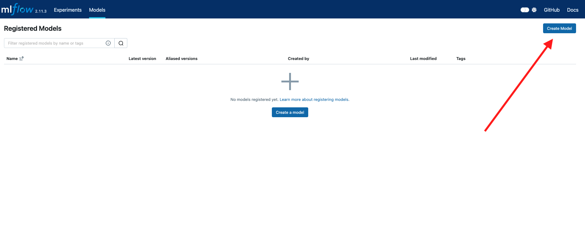
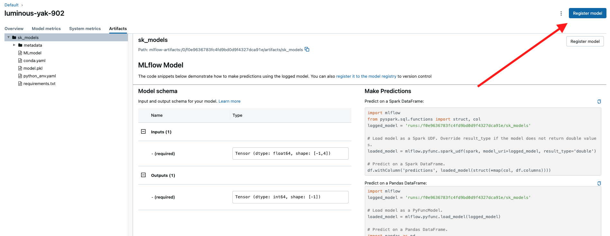
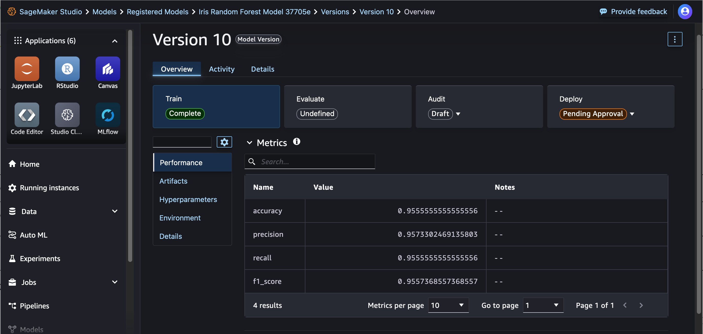

# Automatically register SageMaker AI models with SageMaker Model Registry

You can log MLflow models and automatically register them with SageMaker Model Registry
using either the Python SDK or directly through the MLflow UI.

###### Note

Do not use spaces in a model name. While MLflow supports model names with spaces,
SageMaker AI Model Package does not. The auto-registration process fails if you use spaces in
your model name.

## Register models using the SageMaker Python SDK

Use `create_registered_model` within your MLflow client to automatically
create a model package group in SageMaker AI that corresponds to an existing MLflow model of
your choice.

SageMaker Python SDK v3

```
import mlflow
from mlflow import MlflowClient

mlflow.set_tracking_uri(`arn`)

client = MlflowClient()

mlflow_model_name = `'AutoRegisteredModel'`
client.create_registered_model(mlflow_model_name, tags={`"key1"`: `"value1"`})
```

SageMaker Python SDK v2 (Legacy)

```
import mlflow

from mlflow.models import infer_signature

import pandas as pd
from sklearn import datasets
from sklearn.model_selection import train_test_split
from sklearn.linear_model import LogisticRegression
from sklearn.metrics import accuracy_score, precision_score, recall_score, f1_score

# This is the ARN of the MLflow Tracking Server you created
mlflow.set_tracking_uri(`your-tracking-server-arn`)
mlflow.set_experiment(`"some-experiment"`)

# Load the Iris dataset
X, y = datasets.load_iris(return_X_y=True)

# Split the data into training and test sets
X_train, X_test, y_train, y_test = train_test_split(X, y, test_size=0.2, random_state=42)

# Define the model hyperparameters
params = {"solver": "lbfgs", "max_iter": 1000, "multi_class": "auto", "random_state": 8888}

# Train the model
lr = LogisticRegression(**params)
lr.fit(X_train, y_train)

# Predict on the test set
y_pred = lr.predict(X_test)

# Calculate accuracy as a target loss metric
accuracy = accuracy_score(y_test, y_pred)

# Start an MLflow run and log parameters, metrics, and model artifacts
with mlflow.start_run():
    # Log the hyperparameters
    mlflow.log_params(`params`)

    # Log the loss metric
    mlflow.log_metric(`"accuracy"`, `accuracy`)

    # Set a tag that we can use to remind ourselves what this run was for
    mlflow.set_tag(`"Training Info"`, `"Basic LR model for iris data"`)

    # Infer the model signature
    signature = infer_signature(X_train, lr.predict(X_train))

    # Log the model
    model_info = mlflow.sklearn.log_model(
        sk_model=`lr`,
        name=`"iris_model"`, # Changed from artifact_path to name for MLflow 3.0
        signature=`signature`,
        input_example=`X_train`,
        registered_model_name=`"tracking-quickstart"`,
    )
```

Use `mlflow.register_model()` to automatically register a model with the
SageMaker Model Registry during model training. When registering the MLflow model, a
corresponding model package group and model package version are created in SageMaker AI.

SageMaker Python SDK v3

```
import mlflow.sklearn
from mlflow.models import infer_signature
from sklearn.datasets import make_regression
from sklearn.ensemble import RandomForestRegressor

mlflow.set_tracking_uri(arn)
params = {"n_estimators": 3, "random_state": 42}
X, y = make_regression(n_features=4, n_informative=2, random_state=0, shuffle=False)

# Log MLflow entities
with mlflow.start_run() as run:
    rfr = RandomForestRegressor(**params).fit(X, y)
    signature = infer_signature(X, rfr.predict(X))
    mlflow.log_params(params)
    mlflow.sklearn.log_model(rfr, artifact_path="sklearn-model", signature=signature)

model_uri = f"runs:/{run.info.run_id}/sklearn-model"
mv = mlflow.register_model(model_uri, "RandomForestRegressionModel")

print(f"Name: {mv.name}")
print(f"Version: {mv.version}")
```

SageMaker Python SDK v2 (Legacy)

```
import mlflow

from mlflow.models import infer_signature

import pandas as pd
from sklearn import datasets
from sklearn.model_selection import train_test_split
from sklearn.linear_model import LogisticRegression
from sklearn.metrics import accuracy_score, precision_score, recall_score, f1_score

# This is the ARN of the MLflow Tracking Server you created
mlflow.set_tracking_uri(`your-tracking-server-arn`)
mlflow.set_experiment(`"some-experiment"`)

# Load the Iris dataset
X, y = datasets.load_iris(return_X_y=True)

# Split the data into training and test sets
X_train, X_test, y_train, y_test = train_test_split(X, y, test_size=0.2, random_state=42)

# Define the model hyperparameters
params = {"solver": "lbfgs", "max_iter": 1000, "multi_class": "auto", "random_state": 8888}

# Train the model
lr = LogisticRegression(**params)
lr.fit(X_train, y_train)

# Predict on the test set
y_pred = lr.predict(X_test)

# Calculate accuracy as a target loss metric
accuracy = accuracy_score(y_test, y_pred)

# Start an MLflow run and log parameters, metrics, and model artifacts
with mlflow.start_run():
    # Log the hyperparameters
    mlflow.log_params(`params`)

    # Log the loss metric
    mlflow.log_metric(`"accuracy"`, `accuracy`)

    # Set a tag that we can use to remind ourselves what this run was for
    mlflow.set_tag(`"Training Info"`, `"Basic LR model for iris data"`)

    # Infer the model signature
    signature = infer_signature(X_train, lr.predict(X_train))

    # Log the model
    model_info = mlflow.sklearn.log_model(
        sk_model=`lr`,
        name=`"iris_model"`, # Changed from artifact_path to name for MLflow 3.0
        signature=`signature`,
        input_example=`X_train`,
        registered_model_name=`"tracking-quickstart"`,
    )
```

## Register models using the MLflow UI

You can alternatively register a model with the SageMaker Model Registry directly in
the MLflow UI. Within the **Models** menu in the MLflow UI, choose
**Create Model**. Any models newly created in this way are added to the
SageMaker Model Registry.



After logging a model during experiment tracking, navigate to the run page in the
MLflow UI. Choose the **Artifacts** pane and choose **Register
model** in the upper right corner to register the model version in both MLflow
and SageMaker Model Registry.



## View registered models in Studio

Within the SageMaker Studio landing page, choose **Models** on the left navigation pane to view your registered models. For
more information on getting started with Studio, see [Launch
Amazon SageMaker Studio](studio-updated-launch.md "studio-updated-launch.md").


