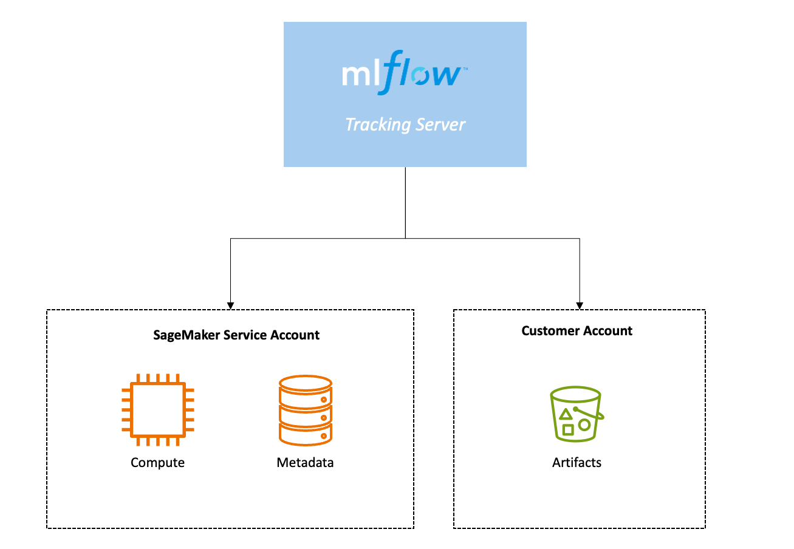

# Accelerate generative AI development using managed MLflow on Amazon SageMaker AI

Fully managed MLflow 3.0 on Amazon SageMaker AI enables you to accelerate generative AI by making it easier to track experiments and monitor performance of models
and AI applications using a single tool.

**Generative AI development with MLflow 3.0**

As customers across industries accelerate their generative AI development, they require capabilities to track experiments, observe behavior, and evaluate performance of models and AI applications.
Data scientists and developers lack tools for analyzing the performance of models and AI applications from experimentation to production, making it hard to root cause
and resolve issues. Teams spend more time integrating tools than improving their models or generative AI applications.

Training or fine-tuning generative AI and machine learning is an iterative process that requires experimenting
with various combinations of data, algorithms, and parameters, while observing their impact on model accuracy. The iterative nature of experimentation results
in numerous model training runs and versions, making it challenging to track the best performing models and their configurations.
The complexity of managing and comparing iterative training runs increases with GenAI, where experimentation involves not only fine-tuning models but also
exploring creative and diverse outputs. Researchers must adjust hyperparameters, select suitable model architectures, and curate diverse datasets to optimize
both the quality and creativity of the generated content. Evaluating generative AI models requires both quantitative and qualitative metrics,
adding another layer of complexity to the experimentation process. Experimentation tracking capabilities in MLflow 3.0 on Amazon SageMaker AI enables you to track,
organize, view, analyze, and compare iterative ML experimentation to gain comparative insights and register and deploy your best performing models.

Tracing capabilities in fully managed MLflow 3.0 enables you to record the inputs, outputs, and metadata at every step of a generative AI application,
helping you to quickly identify the source of bugs or unexpected behaviors. By maintaining records of each model and application version,
fully managed MLflow 3.0 offers traceability to connect AI responses to their source components, allowing you to quickly trace an issue directly
to the specific code, data, or parameters that generated it. This dramatically reduces troubleshooting time and enables teams to focus more on innovation.

## MLflow integrations

Use MLflow while training and evaluating models to find the best candidates for your use
case. You can compare model performance, parameters, and metrics across experiments in the
MLflow UI, keep track of your best models in the MLflow Model Registry, automatically register
them as a SageMaker AI model, and deploy registered models to SageMaker AI endpoints.

**Amazon SageMaker AI with MLflow**

Use MLflow to track and manage the experimentation phase of the machine learning (ML)
lifecycle with AWS integrations for model development, management, deployment, and tracking.

**Amazon SageMaker Studio**

Create and manage tracking servers, run notebooks to create experiments, and access the
MLflow UI to view and compare experiment runs all through Studio.

**SageMaker Model Registry**

Manage model versions and catalog models for production by automatically registering
models from MLflow Model Registry to SageMaker Model Registry. For more information, see [Automatically register SageMaker AI models with SageMaker Model Registry](mlflow-track-experiments-model-registration.md "mlflow-track-experiments-model-registration.md").

**SageMaker AI Inference**

Prepare your best models for deployment on a SageMaker AI endpoint using
`ModelBuilder`. For more information, see [Deploy MLflow models with ModelBuilder](mlflow-track-experiments-model-deployment.md "mlflow-track-experiments-model-deployment.md").

**AWS Identity and Access Management**

Configure access to MLflow using role-based access control (RBAC) with IAM. Write IAM
identity policies to authorize the MLflow APIs that can be called by a client of an MLflow
tracking server. All MLflow REST APIs are represented as IAM actions under the
`sagemaker-mlflow` service prefix. For more information, see [Set up IAM permissions for MLflow](mlflow-create-tracking-server-iam.md "mlflow-create-tracking-server-iam.md").

**AWS CloudTrail**

View logs in AWS CloudTrail to help you enable operational and risk auditing, governance,
and compliance of your AWS account. For more information, see [AWS CloudTrail logs](#mlflow-create-tracking-server-cloudtrail "#mlflow-create-tracking-server-cloudtrail").

**Amazon EventBridge**

Automate the model review and deployment lifecycle using MLflow events captured by Amazon EventBridge. For more information, see [Amazon EventBridge events](#mlflow-create-tracking-server-eventbridge "#mlflow-create-tracking-server-eventbridge").

## Supported AWS Regions

Amazon SageMaker AI with MLflow is generally available in all AWS commercial [Regions](regions-quotas.md "regions-quotas.md") where
Amazon SageMaker Studio is available, except the China Regions and AWS GovCloud (US) Regions. SageMaker AI
with MLflow is available using only the AWS CLI in the Europe (Zurich), Asia Pacific (Hyderabad),
Asia Pacific (Melbourne), and Canada West (Calgary) AWS Regions.

Tracking servers are launched in a single availability zone within their specified Region.

## How it works

An MLflow Tracking Server has three main components: compute, backend metadata storage, and
artifact storage. The compute that hosts the tracking server and the backend metadata storage
are securely hosted in the SageMaker AI service account. The artifact storage lives in an Amazon S3
bucket in your own AWS account.

A tracking server has an ARN. You can use this ARN to connect the MLflow SDK to your
Tracking Server and start logging your training runs to MLflow.

Read on for more information about the following key concepts:

- [Backend metadata storage](#mlflow-create-tracking-server-backend-store "#mlflow-create-tracking-server-backend-store")
- [Artifact storage](#mlflow-create-tracking-server-artifact-store "#mlflow-create-tracking-server-artifact-store")
- [MLflow Tracking Server sizes](#mlflow-create-tracking-server-sizes "#mlflow-create-tracking-server-sizes")
- [Tracking server versions](#mlflow-create-tracking-server-versions "#mlflow-create-tracking-server-versions")
- [AWS CloudTrail logs](#mlflow-create-tracking-server-cloudtrail "#mlflow-create-tracking-server-cloudtrail")
- [Amazon EventBridge events](#mlflow-create-tracking-server-eventbridge "#mlflow-create-tracking-server-eventbridge")

### Backend metadata storage

When you create an MLflow Tracking Server, a [backend store](https://mlflow.org/docs/latest/tracking/backend-stores.html "https://mlflow.org/docs/latest/tracking/backend-stores.html"),
which persists various metadata for each [Run](https://mlflow.org/docs/latest/tracking.html#runs "https://mlflow.org/docs/latest/tracking.html#runs"), such as run ID, start
and end times, parameters, and metrics, is automatically configured within the SageMaker AI
service account and fully managed for you.

### Artifact storage

To provide MLflow with persistent storage for metadata for each run, such as model
weights, images, model files, and data files for your experiment runs, you must create an
artifact store using Amazon S3. The artifact store must be set up within your AWS account and you must
explicitly give MLflow access to Amazon S3 in order to access your artifact store. For more
information, see [Artifact Stores](https://mlflow.org/docs/latest/tracking.html#artifact-stores "https://mlflow.org/docs/latest/tracking.html#artifact-stores") in the MLflow documentation.

###### Note

SageMaker AI MLflow has a 200 MB download size limit.

### MLflow Tracking Server sizes

You can optionally specify the size of your tracking server in the Studio UI or with
the AWS CLI parameter `--tracking-server-size`. You can choose between
`"Small"`, `"Medium"`, and `"Large"`. The default MLflow
tracking server configuration size is `"Small"`. You can choose a size depending on
the projected use of the tracking server such as the volume of data logged, number of users,
and frequency of use.

We recommend using a small tracking server for teams of up to 25 users, a medium tracking
server for teams of up to 50 users, and a large tracking server for teams of up to 100 users.
We assume that all users will make concurrent requests to your MLflow Tracking Server to make
these recommendations. You should select the tracking server size based on your expected usage
pattern and the TPS (Transactions Per Second) supported by each tracking server.

###### Note

The nature of your workload and the type of requests that you make to the tracking server dictate the TPS you see.

| Tracking server size                                                                         | Sustained TPS                                                                                                                      | Burst TPS                                                                                                                                                                                                                                                                                                                                                                                                                                                                                                                                                                                                                                                                                                                                                                                                                                                                                                                                                                                                                                                                                                                                                                                                                                                                                                                                                                                                                                                                                                                                                                                                                                                                                                                                                                                                                                                                                                                                                                                                                                                                                                                                                                                                                                                                                                                                                                                                                                                                                                                                                                                                                                                                                                                                                                                                                                                                                                                                                                                                                                                                                                                                                                                                                                                                                                                                                                                                                                                                                                                                                                                                                                                                                                                                                                                                                                                                                                                                                                                                                                                                                                                                                                                                                                                                                                                                                                                                                                                                                                                                                                                                                                                                                                                                                                                                                                                                                                                                                                                                                                                                                                          |
| -------------------------------------------------------------------------------------------- | ---------------------------------------------------------------------------------------------------------------------------------- | ------------------------------------------------------------------------------------------------------------------------------------------------------------------------------------------------------------------------------------------------------------------------------------------------------------------------------------------------------------------------------------------------------------------------------------------------------------------------------------------------------------------------------------------------------------------------------------------------------------------------------------------------------------------------------------------------------------------------------------------------------------------------------------------------------------------------------------------------------------------------------------------------------------------------------------------------------------------------------------------------------------------------------------------------------------------------------------------------------------------------------------------------------------------------------------------------------------------------------------------------------------------------------------------------------------------------------------------------------------------------------------------------------------------------------------------------------------------------------------------------------------------------------------------------------------------------------------------------------------------------------------------------------------------------------------------------------------------------------------------------------------------------------------------------------------------------------------------------------------------------------------------------------------------------------------------------------------------------------------------------------------------------------------------------------------------------------------------------------------------------------------------------------------------------------------------------------------------------------------------------------------------------------------------------------------------------------------------------------------------------------------------------------------------------------------------------------------------------------------------------------------------------------------------------------------------------------------------------------------------------------------------------------------------------------------------------------------------------------------------------------------------------------------------------------------------------------------------------------------------------------------------------------------------------------------------------------------------------------------------------------------------------------------------------------------------------------------------------------------------------------------------------------------------------------------------------------------------------------------------------------------------------------------------------------------------------------------------------------------------------------------------------------------------------------------------------------------------------------------------------------------------------------------------------------------------------------------------------------------------------------------------------------------------------------------------------------------------------------------------------------------------------------------------------------------------------------------------------------------------------------------------------------------------------------------------------------------------------------------------------------------------------------------------------------------------------------------------------------------------------------------------------------------------------------------------------------------------------------------------------------------------------------------------------------------------------------------------------------------------------------------------------------------------------------------------------------------------------------------------------------------------------------------------------------------------------------------------------------------------------------------------------------------------------------------------------------------------------------------------------------------------------------------------------------------------------------------------------------------------------------------------------------------------------------------------------------------------------------------------------------------------------------------------------------------------------------------------------------------------ | -------------------------------------------------------------------------------------------------- | ---------------------------------------------------------------------------------------------------------------------------------- |
| Small                                                                                        | Up to 25                                                                                                                           | Up to 50                                                                                                                                                                                                                                                                                                                                                                                                                                                                                                                                                                                                                                                                                                                                                                                                                                                                                                                                                                                                                                                                                                                                                                                                                                                                                                                                                                                                                                                                                                                                                                                                                                                                                                                                                                                                                                                                                                                                                                                                                                                                                                                                                                                                                                                                                                                                                                                                                                                                                                                                                                                                                                                                                                                                                                                                                                                                                                                                                                                                                                                                                                                                                                                                                                                                                                                                                                                                                                                                                                                                                                                                                                                                                                                                                                                                                                                                                                                                                                                                                                                                                                                                                                                                                                                                                                                                                                                                                                                                                                                                                                                                                                                                                                                                                                                                                                                                                                                                                                                                                                                                                                           |
| Medium                                                                                       | Up to 50                                                                                                                           | Up to 100                                                                                                                                                                                                                                                                                                                                                                                                                                                                                                                                                                                                                                                                                                                                                                                                                                                                                                                                                                                                                                                                                                                                                                                                                                                                                                                                                                                                                                                                                                                                                                                                                                                                                                                                                                                                                                                                                                                                                                                                                                                                                                                                                                                                                                                                                                                                                                                                                                                                                                                                                                                                                                                                                                                                                                                                                                                                                                                                                                                                                                                                                                                                                                                                                                                                                                                                                                                                                                                                                                                                                                                                                                                                                                                                                                                                                                                                                                                                                                                                                                                                                                                                                                                                                                                                                                                                                                                                                                                                                                                                                                                                                                                                                                                                                                                                                                                                                                                                                                                                                                                                                                          |
| Large                                                                                        | Up to 100                                                                                                                          | Up to 200                                                                                                                                                                                                                                                                                                                                                                                                                                                                                                                                                                                                                                                                                                                                                                                                                                                                                                                                                                                                                                                                                                                                                                                                                                                                                                                                                                                                                                                                                                                                                                                                                                                                                                                                                                                                                                                                                                                                                                                                                                                                                                                                                                                                                                                                                                                                                                                                                                                                                                                                                                                                                                                                                                                                                                                                                                                                                                                                                                                                                                                                                                                                                                                                                                                                                                                                                                                                                                                                                                                                                                                                                                                                                                                                                                                                                                                                                                                                                                                                                                                                                                                                                                                                                                                                                                                                                                                                                                                                                                                                                                                                                                                                                                                                                                                                                                                                                                                                                                                                                                                                                                          | ### Tracking server versions The following MLflow versions are available to use with SageMaker AI: |
| MLflow version                                                                               | Python version                                                                                                                     |                                                                                                                                                                                                                                                                                                                                                                                                                                                                                                                                                                                                                                                                                                                                                                                                                                                                                                                                                                                                                                                                                                                                                                                                                                                                                                                                                                                                                                                                                                                                                                                                                                                                                                                                                                                                                                                                                                                                                                                                                                                                                                                                                                                                                                                                                                                                                                                                                                                                                                                                                                                                                                                                                                                                                                                                                                                                                                                                                                                                                                                                                                                                                                                                                                                                                                                                                                                                                                                                                                                                                                                                                                                                                                                                                                                                                                                                                                                                                                                                                                                                                                                                                                                                                                                                                                                                                                                                                                                                                                                                                                                                                                                                                                                                                                                                                                                                                                                                                                                                                                                                                                                    | ---                                                                                                | ---                                                                                                                                |
| [MLflow 3.0](https://mlflow.org/releases/3 "https://mlflow.org/releases/3") (latest version) | [Python 3.9](https://www.python.org/downloads/release/python-390/ "https://www.python.org/downloads/release/python-390/") or later |                                                                                                                                                                                                                                                                                                                                                                                                                                                                                                                                                                                                                                                                                                                                                                                                                                                                                                                                                                                                                                                                                                                                                                                                                                                                                                                                                                                                                                                                                                                                                                                                                                                                                                                                                                                                                                                                                                                                                                                                                                                                                                                                                                                                                                                                                                                                                                                                                                                                                                                                                                                                                                                                                                                                                                                                                                                                                                                                                                                                                                                                                                                                                                                                                                                                                                                                                                                                                                                                                                                                                                                                                                                                                                                                                                                                                                                                                                                                                                                                                                                                                                                                                                                                                                                                                                                                                                                                                                                                                                                                                                                                                                                                                                                                                                                                                                                                                                                                                                                                                                                                                                                    | [MLflow 2.16](https://mlflow.org/releases/2.16.0 "https://mlflow.org/releases/2.16.0")             | [Python 3.8](https://www.python.org/downloads/release/python-380/ "https://www.python.org/downloads/release/python-380/") or later |
| [MLflow 2.13](https://mlflow.org/releases/2.13.0 "https://mlflow.org/releases/2.13.0")       | [Python 3.8](https://www.python.org/downloads/release/python-380/ "https://www.python.org/downloads/release/python-380/") or later | The latest version of the tracking server has the latest features, security patches, and bug fixes. When you create a new tracking server, we recommend using the latest version. For more information about creating a tracking server, see [MLflow Tracking Servers](mlflow-create-tracking-server.md "mlflow-create-tracking-server.md"). MLflow tracking servers use semantic versioning. Versions are in the following format: ``major-version`.`minor-version`.`patch-version``. The latest features, such as new UI elements and API functionality, are in the minor-version. ### AWS CloudTrail logs AWS CloudTrail automatically logs activity related to your MLflow Tracking Server. The following control plane API calls are logged in CloudTrail:  • CreateMlflowTrackingServer  • DescribeMlflowTrackingServer  • UpdateMlflowTrackingServer  • DeleteMlflowTrackingServer  • ListMlflowTrackingServers  • CreatePresignedMlflowTrackingServer  • StartMlflowTrackingServer  • StopMlflowTrackingServer AWS CloudTrail also automatically logs activity related to your MLflow data plane. The following data plane API calls are logged in CloudTrail. For event names, add the prefix `Mlflow` (for example, `MlflowCreateExperiment`).  • CreateExperiment  • CreateModelVersion  • CreateRegisteredModel  • CreateRun  • DeleteExperiment  • DeleteModelVersion  • DeleteModelVersionTag  • DeleteRegisteredModel  • DeleteRegisteredModelAlias  • DeleteRegisteredModelTag  • DeleteRun  • DeleteTag  • GetDownloadURIForModelVersionArtifacts  • GetExperiment  • GetExperimentByName  • GetLatestModelVersions  • GetMetricHistory  • GetModelVersion  • GetModelVersionByAlias  • GetRegisteredModel  • GetRun  • ListArtifacts  • LogBatch  • LogInputs  • LogMetric  • LogModel  • LogParam  • RenameRegisteredModel  • RestoreExperiment  • RestoreRun  • SearchExperiments  • SearchModelVersions  • SearchRegisteredModels  • SearchRuns  • SetExperimentTag  • SetModelVersionTag  • SetRegisteredModelAlias  • SetRegisteredModelTag  • SetTag  • TransitionModelVersionStage  • UpdateExperiment  • UpdateModelVersion  • UpdateRegisteredModel  • UpdateRun  • FinalizeLoggedModel  • GetLoggedModel  • DeleteLoggedModel  • SearchLoggedModels  • SetLoggedModelTags  • DeleteLoggedModelTag  • ListLoggedModelArtifacts  • LogLoggedModelParams  • LogOutputs For more information about CloudTrail, see the _[AWS CloudTrail User Guide](../../../awscloudtrail/latest/userguide/cloudtrail-user-guide.md "../../../awscloudtrail/latest/userguide/cloudtrail-user-guide.md")_. ### Amazon EventBridge events Use EventBridge to route events from using MLflow with SageMaker AI to consumer applications across your organization. The following events are emitted to EventBridge:  • "SageMaker Tracking Server Creating"  • "SageMaker Tracking Server Created“  • "SageMaker Tracking Server Create Failed"  • "SageMaker Tracking Server Updating"  • "SageMaker Tracking Server Updated"  • "SageMaker Tracking Server Update Failed"  • "SageMaker Tracking Server Deleting"  • "SageMaker Tracking Server Deleted"  • "SageMaker Tracking Server Delete Failed"  • "SageMaker Tracking Server Starting"  • "SageMaker Tracking Server Started"  • "SageMaker Tracking Server Start Failed"  • "SageMaker Tracking Server Stopping"  • "SageMaker Tracking Server Stopped"  • "SageMaker Tracking Server Stop Failed"  • "SageMaker Tracking Server Maintenance In Progress"  • "SageMaker Tracking Server Maintenance Complete"  • "SageMaker Tracking Server Maintenance Failed"  • "SageMaker MLFlow Tracking Server Creating Run"  • "SageMaker MLFlow Tracking Server Creating RegisteredModel"  • "SageMaker MLFlow Tracking Server Creating ModelVersion"  • "SageMaker MLFlow Tracking Server Transitioning ModelVersion Stage"  • "SageMaker MLFlow Tracking Server Setting Registered Model Alias" For more information about EventBridge, see the _[Amazon EventBridge User Guide](../../../eventbridge/latest/userguide/eb-what-is.md "../../../eventbridge/latest/userguide/eb-what-is.md")_. ###### Topics  • [MLflow Tracking Servers](mlflow-create-tracking-server.md "mlflow-create-tracking-server.md")  • [Launch the MLflow UI using a presigned URL](mlflow-launch-ui.md "mlflow-launch-ui.md")  • [Integrate MLflow with your environment](mlflow-track-experiments.md "mlflow-track-experiments.md")  • [MLflow tutorials using example Jupyter notebooks](mlflow-tutorials.md "mlflow-tutorials.md")  • [Troubleshoot common setup issues](mlflow-troubleshooting.md "mlflow-troubleshooting.md")  • [Clean up MLflow resources](mlflow-cleanup.md "mlflow-cleanup.md")  • [Amazon SageMaker Experiments in Studio Classic](experiments.md "experiments.md") |
