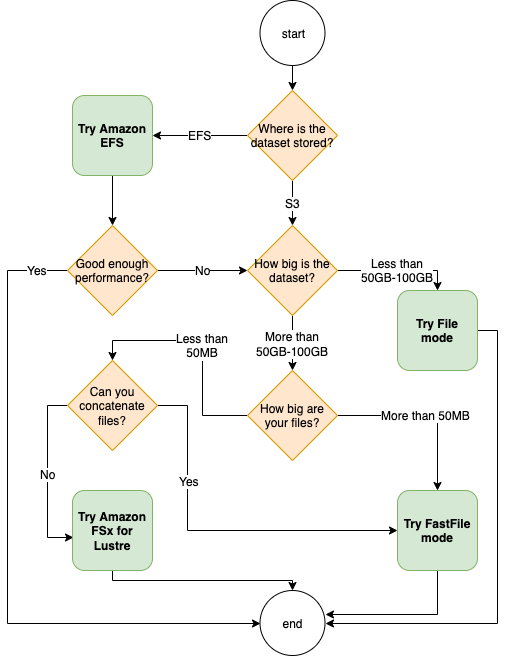

# Choosing an input mode and a

storage unit

The best data source for your training job depends on workload characteristics such as the
size of the dataset, the file format, the average size of files, the training duration, a
sequential or random data loader read pattern, and how fast your model can consume the
training data. The following best practices provide guidelines to get started with the most
suitable input mode and data storage service for your use case.



## When to use Amazon EFS

If your dataset is stored in Amazon Elastic File System, you might have a preprocessing or annotations
application that uses Amazon EFS for storage. You can run a training job configured with a data
channel that points to the Amazon EFS file system. For more information, see [Speed up training on Amazon SageMaker AI using Amazon FSx for Lustre and Amazon EFS file systems](https://aws.amazon.com/blogs/machine-learning/speed-up-training-on-amazon-sagemaker-using-amazon-efs-or-amazon-fsx-for-lustre-file-systems/ "https://aws.amazon.com/blogs/machine-learning/speed-up-training-on-amazon-sagemaker-using-amazon-efs-or-amazon-fsx-for-lustre-file-systems/"). If
you cannot achieve better performance, check your optimization options following the [Amazon Elastic File System performance guide](../../../efs/latest/ug/performance.md#performance-overview "../../../efs/latest/ug/performance.md#performance-overview") or consider using different input modes or data
storage.

## Use file mode for

small datasets

If the dataset is stored in Amazon Simple Storage Service and its overall volume is relatively small (for
example, less than 50-100 GB), try using file mode. The overhead of downloading a 50 GB
dataset can vary based on the total number of files. For example, it takes about 5 minutes
if a dataset is chunked into 100 MB shards. Whether this startup overhead is acceptable
primarily depends on the overall duration of your training job, because a longer training
phase means a proportionally smaller download phase.

## Serializing many small

files

If your dataset size is small (less than 50-100 GB), but is made up of many small files
(less than 50 MB per file), the file mode download overhead grows, because each file needs
to be downloaded individually from Amazon Simple Storage Service to the training instance volume. To reduce this
overhead and data traversal time in general, consider serializing groups of such small files
into fewer larger file containers (such as 150 MB per file) by using file formats, such as
[TFRecord](https://www.tensorflow.org/tutorials/load_data/tfrecord "https://www.tensorflow.org/tutorials/load_data/tfrecord") for
TensorFlow, [WebDataset](https://webdataset.github.io/webdataset/ "https://webdataset.github.io/webdataset/") for
PyTorch, and [RecordIO](https://mxnet.apache.org/versions/1.8.0/api/faq/recordio "https://mxnet.apache.org/versions/1.8.0/api/faq/recordio") for MXNet.

## When to use fast file

mode

For larger datasets with larger files (more than 50 MB per file), the first option is to
try fast file mode, which is more straightforward to use than FSx for Lustre because it doesn't
require creating a file system, or connecting to a VPC. Fast file mode is ideal for large
file containers (more than 150 MB), and might also do well with files more than 50 MB.
Because fast file mode provides a POSIX interface, it supports random reads (reading
non-sequential byte-ranges). However, this is not the ideal use case, and your throughput
might be lower than with the sequential reads. However, if you have a relatively large and
computationally intensive ML model, fast file mode might still be able to saturate the
effective bandwidth of the training pipeline and not result in an IO bottleneck. You'll need
to experiment and see. To switch from file mode to fast file mode (and back), just add (or
remove) the `input_mode='FastFile'` parameter while defining your input channel
using the SageMaker Python SDK:

```
sagemaker.inputs.TrainingInput(S3_INPUT_FOLDER,  input_mode = 'FastFile')
```

## When to use

Amazon FSx for Lustre

If your dataset is too large for file mode, has many small files that you can't
serialize easily, or uses a random read access pattern, FSx for Lustre is a good option to
consider. Its file system scales to hundreds of gigabytes per second (GB/s) of throughput
and millions of IOPS, which is ideal when you have many small files. However, note that
there might be the cold start issue due to lazy loading and the overhead of setting up and
initializing the FSx for Lustre file system.

###### Tip

To learn more, see [Choose the best data source for your Amazon SageMaker training job](https://aws.amazon.com/blogs/machine-learning/choose-the-best-data-source-for-your-amazon-sagemaker-training-job/ "https://aws.amazon.com/blogs/machine-learning/choose-the-best-data-source-for-your-amazon-sagemaker-training-job/"). This AWS machine
learning blog further discusses case studies and performance benchmark of data sources and
input modes.
