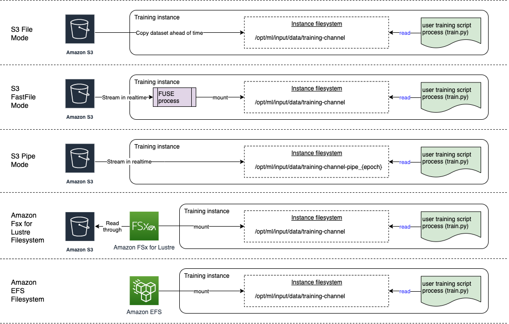

# Setting up training jobs to access datasets

When creating a training job, you specify the location of training datasets in a data
storage of your choice and the data input mode for the job. Amazon SageMaker AI supports Amazon Simple Storage Service (Amazon S3),
Amazon Elastic File System (Amazon EFS), and Amazon FSx for Lustre. You can choose one of the input modes to stream the
dataset in real time or download the whole dataset at the start of the training job.

###### Note

Your dataset must reside in the same AWS Region as the training job.

## SageMaker AI input modes and AWS cloud

storage options

This section provides an overview of the file input modes supported by SageMaker for data
stored in Amazon EFS and Amazon FSx for Lustre.

- _File mode_ presents a file system view of the
  dataset to the training container. This is the default input mode if you don't explicitly
  specify one of the other two options. If you use file mode, SageMaker AI downloads the training
  data from the storage location to a local directory in the Docker container. Training
  starts after the full dataset has been downloaded. In file mode, the training instance
  must have enough storage space to fit the entire dataset. File mode download speed depends
  on the size of dataset, the average size of files, and the number of files. You can
  configure the dataset for file mode by providing either an Amazon S3 prefix,
  manifest file, or augmented manifest file. You should use an S3 prefix when all your
  dataset files are located within a common S3 prefix. File mode is compatible with [SageMaker AI local
  mode](https://sagemaker.readthedocs.io/en/stable/overview.html#local-mode "https://sagemaker.readthedocs.io/en/stable/overview.html#local-mode") (starting a SageMaker training container interactively in seconds). For
  distributed training, you can shard the dataset across multiple instances with the
  `ShardedByS3Key` option.
- _Fast file mode_ provides file system access to an
  Amazon S3 data source while leveraging the performance advantage of pipe mode. At the start of
  training, fast file mode identifies the data files but does not download them. Training
  can start without waiting for the entire dataset to download. This means that the training
  startup takes less time when there are fewer files in the Amazon S3 prefix provided.

In contrast to pipe mode, fast file mode works with random access to the data.
However, it works best when data is read sequentially. Fast file mode doesn't support
augmented manifest files.

Fast file mode exposes S3 objects using a POSIX-compliant file system interface, as if
the files are available on the local disk of your training instance. It streams S3 content
on demand as your training script consumes data. This means that your dataset no longer
needs to fit into the training instance storage space as a whole, and you don't need to
wait for the dataset to be downloaded to the training instance before training starts.
Fast file currently supports S3 prefixes only (it does not support manifest and augmented
manifest). Fast file mode is compatible with SageMaker AI local mode.

###### Note

Using Fast File mode might lead to increased CloudTrail costs due to additional logging
of:

    + Amazon S3 data events (if enabled in CloudTrail).
    + AWS KMS decryption events when accessing Amazon S3 objects encrypted with AWS KMS
     keys.
    + Management events related to AWS KMS operations.Review your CloudTrail configuration and monitoring costs if you have CloudTrail logging enabled for these event types.

- _Pipe mode_ streams data directly from an Amazon S3 data
  source. Streaming can provide faster start times and better throughput than file
  mode.

When you stream the data directly, you can reduce the size of the Amazon EBS volumes used
by the training instance. Pipe mode needs only enough disk space to store the final model
artifacts.

It is another streaming mode that is largely replaced by the newer and simpler-to-use
fast file mode. In pipe mode, data is pre-fetched from Amazon S3 at high concurrency and
throughput, and streamed into a named pipe, which also known as a First-In-First-Out
(FIFO) pipe for its behavior. Each pipe may only be read by a single process. A SageMaker AI
specific extension to TensorFlow conveniently [integrates Pipe mode into the native TensorFlow data loader](https://sagemaker.readthedocs.io/en/stable/frameworks/tensorflow/using_tf.html#training-with-pipe-mode-using-pipemodedataset "https://sagemaker.readthedocs.io/en/stable/frameworks/tensorflow/using_tf.html#training-with-pipe-mode-using-pipemodedataset") for streaming text,
TFRecords, or RecordIO file formats. Pipe mode also supports managed sharding and
shuffling of data.

- _Amazon S3 Express One Zone_ is a high-performance, single
  Availability Zone storage class that can deliver consistent, single-digit millisecond data
  access for the most latency-sensitive applications including SageMaker model training.
  Amazon S3 Express One Zone allows customers to collocate their object storage and compute resources in a
  single AWS Availability Zone, optimizing both compute performance and costs with
  increased data processing speed. To further increase access speed and support hundreds of
  thousands of requests per second, data is stored in a new bucket type, an Amazon S3 directory
  bucket.

SageMaker AI model training supports high-performance Amazon S3 Express One Zone directory buckets as a data
input location for file mode, fast file mode, and pipe mode. To use Amazon S3 Express One Zone, input the
location of the Amazon S3 Express One Zone directory bucket instead of an Amazon S3 bucket. Provide the ARN
for the IAM role with the required access control and permissions policy. Refer to [AmazonSageMakerFullAccesspolicy](../../../aws-managed-policy/latest/reference/AmazonSageMakerFullAccess.md "../../../aws-managed-policy/latest/reference/AmazonSageMakerFullAccess.md") for details. You can only encrypt your SageMaker AI
output data in directory buckets with server-side encryption with Amazon S3 managed keys (SSE-S3).
Server-side encryption with AWS KMS keys (SSE-KMS) is not currently supported for storing SageMaker AI
output data in directory buckets. For more information, see
[Amazon S3 Express One Zone](../../../AmazonS3/latest/userguide/s3-express-one-zone.md "../../../AmazonS3/latest/userguide/s3-express-one-zone.md").

- Amazon FSx for Lustre – FSx for Lustre can scale to hundreds of gigabytes of throughput
  and millions of IOPS with low-latency file retrieval. When starting a training job, SageMaker AI
  mounts the FSx for Lustre file system to the training instance file system, then starts your
  training script. Mounting itself is a relatively fast operation that doesn't depend on the
  size of the dataset stored in FSx for Lustre.

To access FSx for Lustre, your training job must connect to an Amazon Virtual Private Cloud (VPC), which
requires DevOps setup and involvement. To avoid data transfer costs, the file system uses
a single Availability Zone, and you need to specify a VPC subnet which maps to this
Availability Zone ID when running the training job.

- Amazon EFS – To use Amazon EFS as a data source, the data must already reside in Amazon EFS
  prior to training. SageMaker AI mounts the specified Amazon EFS file system to the training instance,
  then starts your training script. Your training job must connect to a VPC to access
  Amazon EFS.

###### Tip

To learn more about how to specify your VPC configuration to SageMaker AI estimators, see
[Use File Systems as Training Inputs](https://sagemaker.readthedocs.io/en/stable/overview.html?highlight=VPC#use-file-systems-as-training-inputs "https://sagemaker.readthedocs.io/en/stable/overview.html?highlight=VPC#use-file-systems-as-training-inputs") in the _SageMaker AI
Python SDK documentation_.
