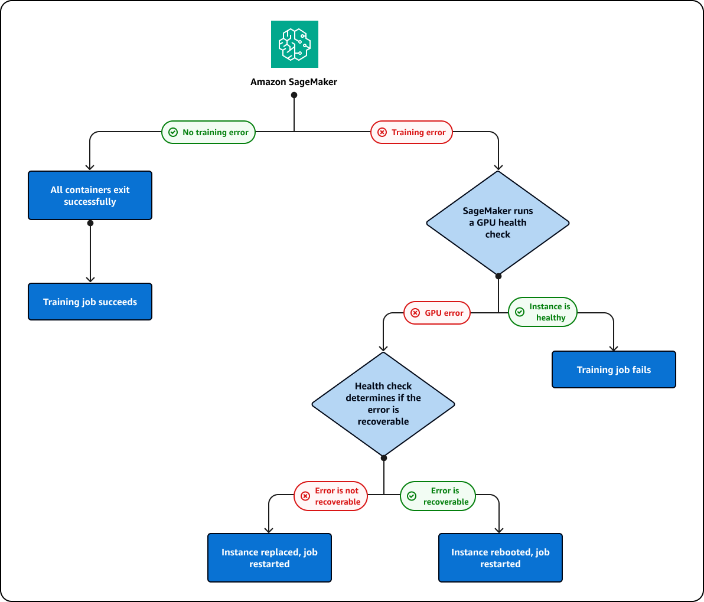

# Cluster repairs for GPU errors

If you are running a training job that fails on a GPU, SageMaker AI will run a GPU health check to see whether the failure
is related to a GPU issue. SageMaker AI takes the following actions based on the health check results:

- If the error is recoverable, and can be fixed by rebooting the instance or resetting the GPU, SageMaker AI will reboot
  the instance.
- If the error is not recoverable, and caused by a GPU that needs to be replaced, SageMaker AI will replace
  the instance.
  The instance is either replaced or rebooted as part of a SageMaker AI cluster repair process. During this process, you will see
  the following message in your training job status:

`Repairing training cluster due to hardware failure`

SageMaker AI will attempt to repair the cluster up to `10` times. If the cluster
repair is successful, SageMaker AI will automatically restart the training job from the previous
checkpoint. If the cluster repair fails, the training job will also fail. You are not
billed for the cluster repair process. Cluster repairs will not initiate unless your
training job fails. If a GPU issue is detected for a warmpool cluster, the cluster will
enter into repair mode to either reboot or replace the faulty instance. After repair,
the cluster can still be used as a warmpool cluster.

The previously described cluster and instance repair process is depicted in the following diagram:

