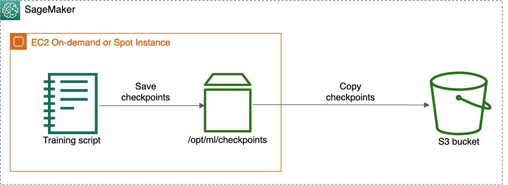

# Enable checkpointing

After you enable checkpointing, SageMaker AI saves checkpoints to Amazon S3 and syncs your training
job with the checkpoint S3 bucket. You can use either S3 general purpose or S3
directory buckets for your checkpoint S3 bucket.


The following example shows how to configure checkpoint paths when you construct a
SageMaker AI estimator. To enable checkpointing, add the `checkpoint_s3_uri` and
`checkpoint_local_path` parameters to your estimator.

The following example template shows how to create a generic SageMaker AI estimator and enable
checkpointing. You can use this template for the supported algorithms by specifying the
`image_uri` parameter. To find Docker image URIs for algorithms with
checkpointing supported by SageMaker AI, see
[Docker
Registry Paths and Example Code](../dg-ecr-paths/sagemaker-algo-docker-registry-paths.md "../dg-ecr-paths/sagemaker-algo-docker-registry-paths.md").
You can also replace
`estimator` and `Estimator` with other SageMaker AI frameworks'
estimator parent classes and estimator classes, such as `TensorFlow`, `PyTorch`, `MXNet`, `HuggingFace` and `XGBoost`.

```
import sagemaker
from sagemaker.`estimator` import `Estimator`

bucket=sagemaker.Session().default_bucket()
base_job_name="`sagemaker-checkpoint-test`"
checkpoint_in_bucket="`checkpoints`"

# The S3 URI to store the checkpoints
checkpoint_s3_bucket="s3://{}/{}/{}".format(bucket, base_job_name, checkpoint_in_bucket)

# The local path where the model will save its checkpoints in the training container
checkpoint_local_path="/opt/ml/checkpoints"

estimator = `Estimator`(
    ...
    image_uri="`<ecr_path>`/`<algorithm-name>`:`<tag>`" # Specify to use built-in algorithms
    output_path=bucket,
    base_job_name=base_job_name,

    # Parameters required to enable checkpointing
    checkpoint_s3_uri=checkpoint_s3_bucket,
    checkpoint_local_path=checkpoint_local_path
)
```

The following two parameters specify paths for checkpointing:

- `checkpoint_local_path` – Specify the local path where the
  model saves the checkpoints periodically in a training container. The default
  path is set to `'/opt/ml/checkpoints'`. If you are using other
  frameworks or bringing your own training container, ensure that your training
  script's checkpoint configuration specifies the path to
  `'/opt/ml/checkpoints'`.

###### Note

We recommend specifying the local paths as
`'/opt/ml/checkpoints'` to be consistent with the default
SageMaker AI checkpoint settings. If you prefer to specify your own local path, make
sure you match the checkpoint saving path in your training script and the
`checkpoint_local_path` parameter of the SageMaker AI
estimators.

- `checkpoint_s3_uri` – The URI to an S3 bucket where
  the checkpoints are stored in real time. You can specify either an S3 general
  purpose or S3 directory bucket to store your checkpoints. For more information on
  S3 directory buckets, see [Directory
  buckets](../../../AmazonS3/latest/userguide/directory-buckets-overview.md "../../../AmazonS3/latest/userguide/directory-buckets-overview.md") in the _Amazon Simple Storage Service User
  Guide_.
  To find a complete list of SageMaker AI estimator parameters, see the [Estimator API](https://sagemaker.readthedocs.io/en/stable/api/training/estimators.html#sagemaker.estimator.Estimator "https://sagemaker.readthedocs.io/en/stable/api/training/estimators.html#sagemaker.estimator.Estimator") in the _[Amazon SageMaker Python SDK](https://sagemaker.readthedocs.io/en/stable "https://sagemaker.readthedocs.io/en/stable")
  documentation_.
